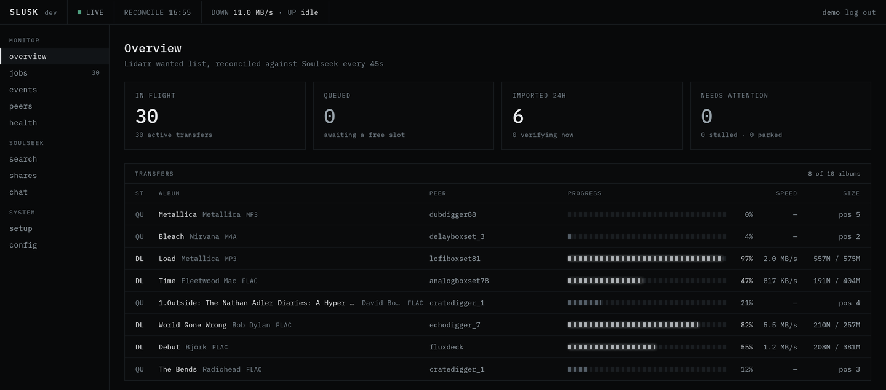
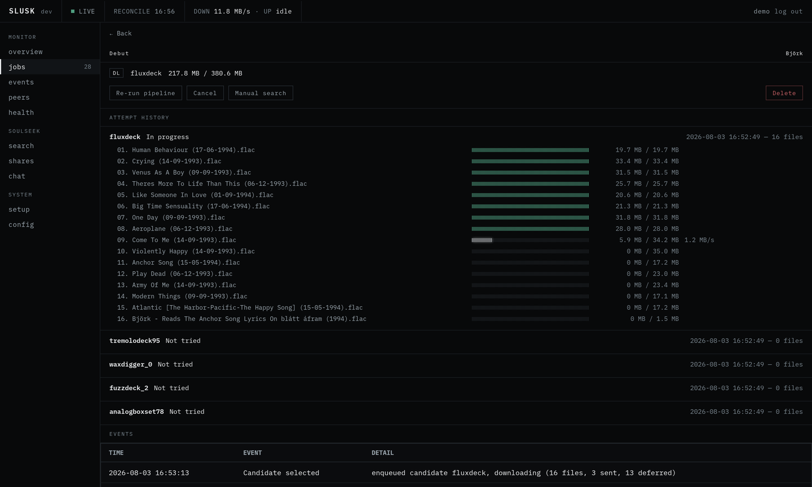
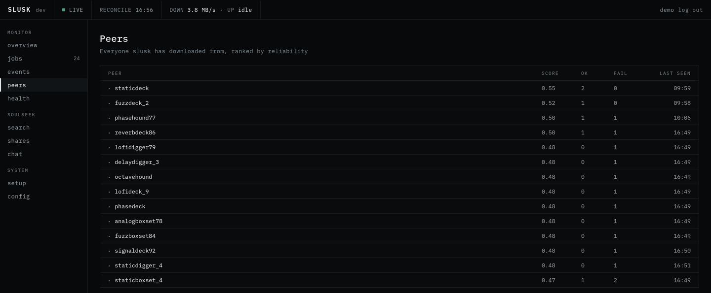

# slusk

A bridge between [Lidarr](https://lidarr.audio/) and [Soulseek](https://www.slsknet.org/).

slusk polls Lidarr for wanted albums, searches Soulseek for them, downloads the
candidates that look best, and hands finished albums back to Lidarr for import. It speaks
the Soulseek protocol itself, so it needs no
[slskd](https://github.com/slskd/slskd) — though it can still drive one if you already
run it.

It also works the other way round: search Soulseek yourself from the dashboard, pick the
peer and the files, and let the same pipeline download them.

And it gives back: slusk shares folders and uploads to other peers itself, though you
have to switch it on — see [Sharing and uploads](#sharing-and-uploads).

Installing it is a compose file and a config file. `docker-compose.example.yml` brings
its own Postgres along, so there is no database to set up separately.

Licensed under [AGPL-3.0-or-later](LICENSE).

## Screenshots



Every album slusk is working on, what state it is in, and how each transfer is doing.



One job in detail. The peer that was picked, every file it is pulling, and the other
candidates still in reserve if this one gives up.



Who slusk has downloaded from, and how well that went. This history feeds back into
picking the next candidate.

Peer names in these screenshots are pseudonymised — they are other people's Soulseek
accounts, and they have not agreed to appear here. Everything else is a real run.

## How it compares to soularr + slskd

[soularr](https://github.com/mrusse/soularr) solves the same problem and is the reason
this project exists. Every row below was checked against soularr's current source rather
than its reputation.

| | soularr + slskd | slusk |
|---|---|---|
| Pipeline state | re-derived from Lidarr and slskd on every run; nothing tracks a transfer the script itself was watching when it died | a state machine in Postgres (`album_jobs`), so a restart picks up in-flight jobs instead of stranding them |
| Soulseek client | slskd required | its own Soulseek client, no slskd needed; slskd still supported for those already running it |
| Dashboard | edits the config, tails the log, lists failed imports; job and transfer state you watch in slskd's UI | jobs, candidates, peers, events, throughput and writable settings in one place |
| Candidate choice | sequential filters plus a filename-similarity ratio | weighted scoring over format, bitrate, file count and peer reliability, including a decayed per-artist history of which peers actually delivered |
| Manual downloads | none; Lidarr's wanted list is the only input | search Soulseek yourself, pick the peer and files, optionally identify the result against MusicBrainz first |
| Processes | slskd, plus soularr's own interval loop and its web UI | one binary, plus the Postgres the compose file brings with it |
| Licence | GPL-3.0 | AGPL-3.0-or-later |

## Setup

### Prerequisites

- Lidarr, reachable from the container, and its API key.
- Docker with Compose.
- slskd and its API key — unless you use the native Soulseek backend, in which case you
  need Soulseek account credentials instead.
- Postgres. The compose file below bundles one; point it at your own if you'd rather.

### 1. Copy the compose file and the config

```bash
cp docker-compose.example.yml docker-compose.yml
mkdir -p config && cp config.example.toml config/config.toml
```

`docker-compose.example.yml` is the only compose file in the repo, and every deployment
variant it supports — the slskd backend, external Postgres, an existing arr network,
gluetun with VPN port forwarding, building from source — is a commented block at the
bottom of it. Your `docker-compose.yml` copy is gitignored, so local edits stay yours.

Both example files are set up for the native Soulseek backend, and they are meant to be
read together: the download path and peer port in one have to match the other. There is
one value you **must** edit in the compose file before the first start — the host side of
the downloads bind mount, which has no sensible default because Lidarr has to be able to
see it too. It is left pointing at `/host/downloads` and configured to fail the `up` with
a clear message rather than let Docker quietly create it for you.

`config/config.toml` must be a **directory** mount, not a single-file mount, if you want
to edit settings from the dashboard: slusk writes the file back with an atomic rename,
which a bind-mounted single file cannot survive. Mounting one file read-only still
works and simply makes settings read-only in the UI.

### 2. Fill in the config

`config.example.toml` is in three parts. **Part 1 is everything that is required** — fill
that in and you are done; the rest of the file is commented out and shows you what you
could override, not what you have to. In practice that means your Lidarr URL and API key,
your Soulseek credentials, and a download path Lidarr can also see. `store.dsn` already
matches the Postgres the compose file brings, so leave it alone unless you point slusk at
your own instance.

**Configuration is strict.** slusk rejects unknown keys at startup with
`unknown config keys: ...` and has no silent defaults for required fields. A typo in a
key name stops the container rather than being quietly ignored. That is deliberate, and
worth knowing before a startup failure looks like a bug.

Strictness checks that a value is present and well-formed, not that it means anything. A
leftover `CHANGEME` is a perfectly valid non-empty string, so slusk starts and then fails
at login instead. Replace every one of them before the first start.

Keep `config/config.toml` out of source control. It holds API keys.

### 3. Choose a backend

`pipeline.backend` decides how slusk reaches Soulseek:

- `"soulseek"` — **the recommended setting, and what both example files ship.** slusk's
  own client connects to the Soulseek server directly and no slskd is involved at all.
  Requires a `[soulseek]` section; the `[slskd]` section becomes unnecessary, and is
  commented out in the example accordingly.
- `"slskd"` — slskd does the searching and transferring. Requires the `[slskd]` section.
  Worth choosing if you already run slskd and want to keep it. slusk's slskd adapter is
  experimental. Both example files carry a matching option block for it; switching means
  uncommenting both, not just the config one.

`pipeline.backend` is **required and has no default.** Leaving it out is a startup error,
not a silent choice — it decides which client performs every search and transfer, which
is too consequential to inherit from a key you never wrote.

The native client is the newer of the two and the one under active development — it is
also what this project's own pre-merge test lab exercises by default, so in practice it
sees more real Soulseek traffic than the slskd path does. The slskd adapter is a much
smaller, more static piece of code: it does everything the pipeline asks of it, but it
carries a fraction of the test coverage and gets no new feature work. Neither of those
is a claim that the native client is finished; it is the honest ordering of which path
is better exercised.

With the native backend, slusk writes the completed downloads itself, so
`paths.slskd_complete_dir` must be a **writable** volume shared with Lidarr at the path
Lidarr expects. With the slskd backend it only ever reads that path.

The native backend also needs incoming peer connections to reach it. Forward
`soulseek.listen_addr`'s port — the published host port **must equal** the container
port, because there is no separate "advertised port" concept and a mismatched mapping
advertises a port nobody can reach. If you route Soulseek through a VPN instead, see
[Running the native backend behind gluetun](#running-the-native-backend-behind-gluetun).

### 4. Start it

```bash
docker compose up -d
```

Then open `http://localhost:9090`. The first visit asks you to create an account.

### 5. Machine access, and `observ.auth_token`

`/healthz`, `/readyz` and the dashboard shell are public. Everything else — the API,
`/status`, `/metrics` — needs either a browser session or `observ.auth_token`.

The token is optional and exists for non-browser clients: `curl`, a Prometheus scrape,
the Vite dev proxy. Leave it blank to disable machine access entirely. Generate one with
`openssl rand -hex 32`, send it as `Authorization: Bearer <token>`, and keep it out of
URLs and logs. `/metrics` accepts the token only — never a session cookie — so blanking
it breaks an existing Prometheus scrape.

Terminate TLS at a trusted reverse proxy before exposing the listener beyond a private
network. The proxy must preserve `Host`, discard any client-supplied
`X-Forwarded-Proto`, and set exactly one trusted value; that header also decides whether
the session cookie is marked `Secure`.

### 6. Updating

```bash
docker compose pull && docker compose up -d
```

Images live at `ghcr.io/hyzr-dev/slusk` and come in two channels:

| Tag | What it is |
|---|---|
| `latest` | the newest build that has been **promoted** — it ran on the maintainer's own instance first. The default, and what you want. |
| `edge` | every build from `main`, promoted or not. Newer, less soaked. |
| `vX.Y.Z` | one exact build, pinned forever. |

`latest` therefore lags `edge`, on purpose. Set `SLUSK_TAG=edge` in a `.env` file next
to your compose file if you want changes as they land — worth doing if you have reported
a bug and want to check the fix, less so otherwise.

Read the [release notes](https://github.com/hyzr-dev/slusk/releases) before a
`latest` upgrade. Config validation is strict: a release that adds a required key will
stop the container from starting until you add it, and the notes are where that is
announced.

### Running the native backend behind gluetun

Soulseek needs peers to be able to open connections *to* you, which is the awkward part
of putting it behind a VPN: you need a provider and a gluetun setup that supports port
forwarding, and the port you get is assigned dynamically rather than chosen.

slusk handles that by asking gluetun what the port is. Set `[soulseek.gluetun]` in the
config and it fetches `GET {control_url}/v1/portforward` and listens on the port gluetun
reports. Only the port half of `soulseek.listen_addr` is replaced — the host half is
still used — so the static port you configured is ignored in this mode.

```toml
[soulseek.gluetun]
control_url = "http://127.0.0.1:8000"
api_key = "CHANGEME"
poll_interval = "5m"   # optional; this is the default
```

This only works if slusk shares gluetun's network namespace, so that `127.0.0.1` reaches
the control server and inbound peer connections arrive on the forwarded port. In compose
that means `network_mode: "service:gluetun"` on the slusk service, no `ports:` section of
its own, and 9090 published on the gluetun service instead. The compose file has the
whole thing as a commented block.

`network_mode: "service:<name>"` is **not supported by Docker Swarm.** This is a plain
`docker compose` arrangement only.

Two things worth knowing before you debug it at 2am:

- **gluetun ≥ v3.40 requires auth configuration on its own side** for the
  `/v1/portforward` route. Without it every fetch gets 401 forever and slusk never starts
  listening. Grant the route to the same key you put in `soulseek.gluetun.api_key`; on
  older gluetun no auth is needed and the key is simply unused. slusk names the config
  key in the error when it sees a 401 or 403, so the log will say which knob to turn.
- **The port is re-fetched every `poll_interval` (5m by default), not only at startup.**
  If gluetun's forwarded port changes while slusk is running — a reconnect, a server
  change — slusk binds a new listener on the new port, tells the Soulseek server about it
  without waiting for a reconnect, and logs the change. Connections already established
  are not broken by the swap, so an in-flight transfer survives it. Until the next poll
  lands, though, slusk is listening on a port nothing reaches: `poll_interval` is the
  upper bound on how long that window lasts, so shorten it if your provider rotates
  aggressively.
- **A failed poll never tears down a working listener.** A control server that is down,
  answers 401, or reports port 0 is logged and otherwise ignored — none of those are
  evidence that the port slusk is bound to has stopped working. The same goes for a new
  port slusk cannot bind: it stays where it is and retries on the next poll.

Starting slusk and gluetun together is fine. A control server that isn't up yet, or a
gluetun that reports port 0 because forwarding hasn't been established, are both treated
as transient: slusk retries with exponential backoff (from 5s, capped at 10 minutes,
each attempt bounded at 5s) and logs a warning per attempt until it gets a real port.

### If you lock yourself out

There is deliberately no password reset and no password change, and there is exactly one
account, permanently — the setup window closes for good once the first account is
created, and nothing in the UI can add a second user.

The only way back in is to delete the account and run first-time setup again:

```sql
DELETE FROM users;
```

That is safe. `user_sessions.user_id` cascades on delete, so active sessions go with it,
and no other table references `users` — none of your pipeline data is touched. After it,
slusk reports setup as required again and the dashboard asks for a new account.

## Manual downloads

The dashboard is not only a window onto the automatic pipeline. From `/search` you can
search Soulseek directly, browse what peers are offering, and create a job from a
specific peer and file selection. That job then runs through the same download stage as
everything else, with the same retries and the same visibility.

Before creating the job you can identify a result against MusicBrainz — it resolves the
canonical artist and album, lists the editions of a release group with their track
counts so you can judge whether a folder is actually complete, and tells you whether the
release is already in your Lidarr library. This needs a `[musicbrainz]` section in the
config; without one, identification is simply unavailable.

Import is the one place a manual job differs. slusk imports a completed manual download
into Lidarr only when it can resolve it to an album already in your library, via the
MusicBrainz id attached at creation. If there is no id, or Lidarr doesn't know that
release, the job ends as `NOT_IMPORTED` and the files stay on disk for you to deal with.
The dashboard can add an *artist* to Lidarr for you, but nothing in the manual flow
creates library entries on its own.

## Sharing and uploads

slusk uploads. It shares the folders you configure back to the network, answers browse
and search requests from other peers, and serves files with real upload slots and a
queue.
Sharing is opt-in, and nothing is shared until you configure it — until then slusk tells
the server you are sharing nothing.

The dashboard's settings page is the way to add a folder. If the config file is mounted
read-only, add it there instead:

```toml
[[soulseek.shared_folders]]
name = "Library"
path = "/music/library"
```

Shares are scanned at startup. After adding or removing files on disk, rescan without a
restart with `SIGHUP` or `POST /api/shares/rescan`. The dashboard's shares and uploads
pages show what is indexed, what peers are pulling right now, and what has been uploaded.

## Architecture

The pipeline is five stages, each its own goroutine on its own interval:

```
WantedSync → Discovery → Selecting → Downloading → Importing
```

`WantedSync` refreshes the wanted list from Lidarr. `Discovery` searches Soulseek, ranks
the results and caches them as candidates. `Selecting` activates the next cached
candidate for a job, or backs the job off when its cache is exhausted or stale.
`Downloading` transfers the files, keeping only a few in flight per peer so a peer's own
queue limit doesn't reject the burst. `Importing` hands the finished folder to Lidarr and
confirms the import actually landed.

No stage imports another. The `album_jobs` table is the only contact surface between
them, which means the state of the entire system is a query:

```sql
SELECT state, count(*) FROM album_jobs GROUP BY state;
```

`job_events` holds the per-job history behind that snapshot.

Adapters — Lidarr, slskd, the native Soulseek client — map their wire types to a
protocol-neutral domain at the boundary, so a backend can be swapped without touching
the pipeline.

`CLAUDE.md` goes deeper, including the local PR lab in `testenv/` that runs the whole
stack against real Soulseek searches.

## Building from source

Go 1.26.3 and Node 22.

```bash
make build   # builds the web UI, then the binary
make test    # go test ./... && npm test
```

To build the container instead, replace the `image:` line in your compose file with
`build: .` and run `docker compose up -d --build`.
