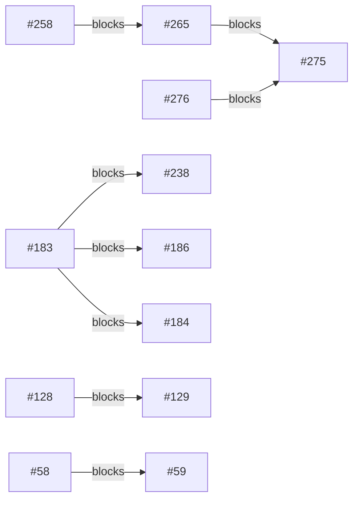

# Backlog triage — 2026-07-30 (second run)

## Header

- Baseline: **green** on all three legs (`go test ./...`, `node --test scripts/triage/*.test.mjs`, `cd web && npm test`). goGreen=true, webGreen=true, triageGreen=true. No unknown failures, no known noise seen.
- Tree status after baseline: clean (empty `treeStatus`).
- Commit: `25f97c6c1f5c72e150eecd1ea098e684911eac1b`
- Judged vs cached: **23 judged, 18 reused from cache** (41 open issues). The previous run's `state.json` was at `21e772a`; 24 files changed between there and HEAD.
- Unassessed: 0. Unassessable: 0. Unschedulable: 0.
- Follow-ups filed after this run (so the findings below are tracked, not just recorded here): comments on **#292**, **#267**, **#291** and **#212** carrying the browser evidence; and three new issues against the triage tooling itself — **#298** (cache blind to a third issue's status), **#299** (`conflicts()` over-serializes same-side contract pairs), **#300** (browser filter admits `kind === 'test'`). The open backlog is therefore **44** as of filing, not the 41 this run triaged.
- Browser coverage: 6 issues eligible (frontend + a `reproCheck` + not a feature request). The workflow's own Browser phase returned **BLOCKED on all four** it attempted (#295, #292, #291, #212) because the lab was not running. **A second verification pass was then run by hand against a live lab** — see the note below. Final verdicts: **4 ISSUES_FOUND** (#295, #292, #267, #212), **1 PASS** (#242), **1 not verified** (#291).

### Provenance of the browser verdicts — read before trusting them

This capability never starts the PR lab, and the workflow's Browser phase correctly refused
to. The maintainer then explicitly instructed a lab start and a re-verification, so the
verdicts below come from a **hand-driven pass outside the workflow**, against
`./testenv/lab.sh up` on this same commit, with a Vite dev server on a dedicated port.

That makes them stronger evidence than the workflow could produce on its own, but it also
means they are **not reproducible by re-running the workflow** — a future run with no lab
will return BLOCKED again. The lab held 150 seeded jobs with real Soulseek transfers in
flight. One job (`id=2`) was cancelled deliberately to force a finished-state transition
for #291; no other state was mutated.

### Cache note — one judgement was force-invalidated by hand

#294 was `fresh` under both automatic axes (its content digest was unchanged, and `internal/store/candidates.go` did not move), but its cached evidence read: *"Issue #287 (still open), which would make Overview trust `updated_at` as a DONE-job completion timestamp, is what turns this into an actual bug."* #287 has since merged (`0985269`). The dependency ran through a third issue's open/closed status, which neither invalidation axis observes, so #294 was moved into `stale` deliberately and re-judged.

The re-judge returned `none` again, but on fresh reasoning rather than a prediction: `InsertCandidates`' only caller (`internal/pipeline/discovery.go:285`) is reached only for jobs fetched in `StateWanted`, so the merged Overview finished-window query at `internal/store/dashboard.go:397-405` still cannot be fed a renewed `updated_at`. Same verdict, different standing. **This is a gap in the invalidation rule worth noting:** a judgement whose severity is conditional on another issue's status has no automatic trigger to re-run it.

**The same gap bit a second judgement, found only by the live pass.** #292's judgement narrowed the issue to a single panel on the grounds that the finished-row list "isn't actually clickable" — true when written, falsified by #287 merging. Its digest and its `touches` are both unchanged, so it would have cache-hit indefinitely. Since there is no honest way to mark a judgement stale (fabricating a digest would be worse), **#292's entry has been removed from `state.json` entirely** — `invalidate()` treats a missing entry as stale (`!cached → movedIssue`), so the next run re-judges it from scratch. `state.json` therefore holds **40** judgements for 41 open issues, deliberately. Both incidents share one root cause: an issue's severity can depend on a *third* issue's status, and nothing observes that.

## Requires your decision

Issues flagging `needsDecision` on at least one axis, by issue number descending:

| Issue | configKey | migration | architecture | Impact |
|---|---|---|---|---|
| #279 | yes | yes | yes | none |
| #272 |  |  | yes | cosmetic |
| #267 |  |  | yes | cosmetic |
| #186 |  |  | yes | degraded |
| #184 | yes | yes | yes | none |

#184 and #279 are the two carrying **both** a new required config key and a migration. Config loading is strict and rejects unknown keys at startup, so for either of those the key must exist in production's `config.toml` *before* the PR merges, or the container fails to start on the next auto-deploy.

## Confirmed still reproducing

Four defects were driven in a live browser against a running lab and **observed failing**. By issue number, descending.

### #295 — `IN FLIGHT` subtitle counts transfers, calls them peers

Observed on `/` at 1440×900: the stat read **"IN FLIGHT 21 — downloading from 21 peers"**. At that moment Postgres held **24 active transfer rows across only 7 distinct peer usernames**, over 8 `DOWNLOADING` jobs. The displayed number tracks the transfer-row count, not peers — it overstated peer diversity by roughly 3×. Re-observed at 375×812 a few minutes later: **"IN FLIGHT 19 — downloading from 19 peers"** while the TRANSFERS panel header simultaneously read **"8 of 10 albums"**, so the contradiction is visible on one screen without any tooling. Confirms the judgement exactly.

### #292 — Overview rows are mouse-only, and the scope is **wider** than judged

Driven with the keyboard, not just inspected. Focus was placed on the last nav link (`config`) and `Tab` pressed: focus moved to `<main>` (focusable only because it scrolls) and **never entered any row**. A DOM sweep confirmed the mechanism — **9 rows with `cursor: pointer`, every one at `tabIndex: -1`, with zero focusable descendants**. The entire Overview page exposes only 11 focusable elements, all of them nav links.

**The cached judgement understated this.** It said the finished-row list "has no onClick at all — it isn't actually clickable, so only the TRANSFERS row is a real instance". That was true before #287, but #287 has since merged: the split is now **TRANSFERS 8 clickable / 0 keyboard-reachable** and **RECENTLY FINISHED 1 clickable / 0 keyboard-reachable**. The issue's original text was right about both panels.

### #267 — two EventSource connections per `/jobs` mount, on client navigation only

Network log for a client-side navigation from `/` to `/jobs`:

```
GET /api/stream?jobs=        => 200        (unscoped, opened first)
GET /api/stream?jobs=1,2,5   => 200        (scoped, opened second)
GET /api/stream?jobs=        => ERR_ABORTED (the first, torn down)
```

**A refinement the judgement's `reproCheck` misses:** this does *not* happen on a direct page load of `/jobs`, which opened exactly one connection. The trigger is SPA navigation specifically. Anyone verifying by typing the URL will conclude, wrongly, that it does not reproduce.

### #212 — `--text-dim` fails AA across 45 rendered elements

Measured from `getComputedStyle` on live elements against their effective background — not arithmetic on the hex values in `tokens.css`, which is what the workflow's verifier rightly declined to do. Of 23 distinct rendered colour/size combinations, **7 fall below their WCAG AA threshold**:

| Computed colour | Size | Ratio | Threshold | Rendered elements |
|---|---|---|---|---|
| `rgb(95,105,111)` = `--text-dim` | 10px | **3.29** | 4.5 | 1 |
| `rgb(95,105,111)` | 9px / 10.5px / 11px / 16px | **3.51** | 4.5 | 34 |
| `rgb(95,105,111)` on `--bg` | 9.5px | **3.55** | 4.5 | 10 |
| `rgb(37,43,48)` (disabled PREV) | 10.5px | **1.38** | 4.5 | 1 (disabled) |

The issue's stated 3.55 is confirmed exactly, and it is the *best* case: against the lighter surface colours actually used in panels the ratio drops to **3.29**. Most of the affected text renders at **9–11px**, which compounds it. Two caveats stated plainly: the disabled pagination control at 1.38 is exempt under WCAG 1.4.3, and **`--bad` (#b5595c) was never verified** — no error-state text rendered, because the lab had no failed jobs at measurement time, so that half of the issue remains unchecked.

## Waves

Bare issue numbers, highest-ranked first within each wave (`rank = impact * 10 - effort`). This order is meaningful — do not re-sort by issue number.

- Wave 1: #176 #266 #286 #212 #291 #154 #215 #99 #171 #192 #250 #290 #293 #294 #58 #199
- Wave 2: #186 #292 #267 #106 #200 #69 #128
- Wave 3: #271 #295 #265 #63 #279
- Wave 4: #272 #86 #273
- Wave 5: #242
- Wave 6: #180 #275 #59
- Wave 7: #278 #129
- Wave 8: #120
- Wave 9: #184
- Wave 10: #238
- Wave 11: #280

Issue with an empty `touches` array: **#242** (and only #242). An issue with no known file set conflicts with everything by design, so it alone can push work into later waves — it sits alone in Wave 5 and drives 40 of the 151 conflict edges below. Giving #242 a real `touches` (it is a test-timing issue in `web/src/routes/Settings.test.tsx`, so the file set is knowable) would likely collapse several later waves.

Three of the four `degraded` issues (#176, #266, #286) lead Wave 1, so the highest-impact work is available immediately and in parallel. The fourth, #186, falls to Wave 2 on a **single** edge — to #176, and via the `album-jobs` contract rather than any shared file (their `touches` are disjoint).

That edge is arguably spurious, and it is worth a maintainer's eye. `conflicts()` treats *any* shared contract name as a collision, but #176 and #186 sit on the **same** side of `album-jobs` (both add a file under `internal/store/migrations/`); neither touches `internal/pipeline/`. The docstring motivates the rule with issues on *opposite* ends of a protocol skewing silently — which is the real hazard — so same-side pairs are caught as collateral. The effect is conservative: it over-serializes rather than letting two agents skew a contract, so it is safe, but it is the only thing keeping the fourth-highest-impact issue out of Wave 1. Two unrelated migration files do not actually conflict beyond needing distinct `%04d` prefixes.

## Blocking dependencies

`statedBlockers` edges only — "this issue said it requires that one first". Conflicts are *not* drawn here; see Conflict density. Edges listed by the blocked issue's number, descending.



#183, #258 and #276 appear as blockers but are **not in the open-issue set** — each was confirmed closed via `tea issues <n>`, so those five edges are satisfied, not pending. #128 → #129 and #58 → #59 are the two live chains inside this backlog.

## Conflict density

Total conflict edges (file-overlap or shared-contract) among 41 assessable issues: **151**.

| Issue | Conflict edges |
|---|---|
| #242 | 40 |
| #120 | 16 |
| #184 | 13 |
| #238 | 13 |
| #180 | 12 |

#242 alone accounts for 40 of the 151 edges — its empty `touches` makes it conflict with every other assessable issue by construction. The remaining four are genuinely broad rather than artefacts: #120 (10 files), #184 (7) and #238 (5) each span `internal/pipeline`, `internal/soulseek` or `internal/config`, while #180 reaches only four files but straddles `internal/pipeline` and `internal/observ`, picking up contract edges on both sides.

Both totals fell against the previous run (185 edges over 42 issues → 151 over 41), which is mostly #287 leaving the backlog: it was the second-largest offender at 22 edges.

## Full judgement

A lookup reference, not a priority ranking — rank order lives in Waves above. Rows by issue number, descending. The **Repro check** column holds each judgement's proposed falsifiable check, written before anything was driven; it is *not* a status. Whether a defect still holds appears only in the three browser-verdict sections.

| Issue | Kind | Impact | Evidence | Effort | Repro check | Touches | Source |
|---|---|---|---|---|---|---|---|
| #295 | bug | cosmetic | web/src/strings.ts:328 labels status.active as a distinct peer count ("downloading from ${peers} peers"), but cmd/slusk/main.go:258 sets Active = len(st.ActiveTransfers(ctx)) — a count of active file transfers (internal/store/jobs.go:278), not distinct peers or albums. Display-only mislabeling; the number itself is correct and nothing downstream (pipeline, Prometheus DownloadsActive at internal/pipeline/downloading.go:230, which is a separate stats.Adopted value) consumes the wrong semantics as fact. | S | Open Overview (testenv/lab.sh up) with one peer serving multiple simultaneous file transfers within one album and confirm the IN FLIGHT subtitle claims more peers than are actually connected. | cmd/slusk/main.go, web/src/routes/Overview.tsx, web/src/strings.ts | judged |
| #294 | techdebt | none | InsertCandidates' unguarded UPDATE is at internal/store/candidates.go:56-60, but its only caller is internal/pipeline/discovery.go:285, reached only for jobs fetched via RunnableJobsInState(ctx, core.StateWanted, ...) at internal/pipeline/discovery.go:118, and always followed by AdvanceJobStateFrom(WANTED->SELECTING) at internal/pipeline/discovery.go:288. No code path today calls InsertCandidates on a job outside WANTED, so it cannot renew updated_at on a DONE/FAILED job as the code stands now -- the Overview panel's finished-window query (internal/store/dashboard.go:397-405) cannot be fed a stale timestamp by this function today. This is a genuine missing invariant (defense-in-depth against a future caller/refactor), not a currently exploitable defect, so prodImpact is none rather than degraded. | S | — | internal/store/candidates.go, internal/store/candidates_test.go | judged |
| #293 | test | none | cmd/slusk/main.go:271-280 is the mapping in question, read in full: every PagedJobsQuery field (Page, Sort, Dir, Filter, Source, Query, PageSize, SkipFacets) is currently passed through correctly, and Now is freshly set via time.Now() on every call, not cached. No defect exists in the running code today; the issue is entirely about the absence of a test that would catch a future regression in this closure. No test in cmd/slusk/*_test.go exercises pagedJobsFn. | S | — | cmd/slusk/main.go, cmd/slusk/main_test.go | judged |
| #292 | bug | cosmetic | web/src/routes/Overview.tsx:222-227 and :270-274 — clickable row divs (role="row", onClick navigate) with no tabIndex/onKeyDown/focus styling. Confirmed by reading the file: keyboard users cannot activate a row, but the app's runtime behavior (data correctness, click-path navigation) is unaffected — this is an interaction-affordance gap, not a behavior that got worse, so it stays at cosmetic per the rubric's "every behaviour is correct" bucket rather than degraded. | S | Open /overview in a browser, Tab through the page, and confirm focus never lands on a TRANSFERS or RECENTLY FINISHED row, and that Enter/Space on a focused row (if it were focusable) does not navigate. | web/src/routes/Overview.tsx | judged |
| #291 | bug | cosmetic | Confirmed in code: web/src/api/queries.ts:292-300 (useJobs) calls replaceLiveJobPage(jobsQuery.data, live?.jobs) unconditionally, and replaceLiveJobs (queries.ts:175-184) replaces any row whose id matches a live-streamed job, with no check on which filter/scope the page was fetched for. web/src/routes/Overview.tsx:70-73 calls useJobs with filter:'finished' for the RECENTLY FINISHED panel, and the author's own comment at Overview.tsx:80-85 states plainly: "This does NOT make the finished panel immune to live replacement... so a job that just transitioned to DONE can still be rendered from its last in-flight live frame until framedAt ages past LIVE_JOB_FRESH_MS" (10000ms, queries.ts:84). Every underlying database row and pipeline state transition is correct throughout; only the Overview display shows a stale ACTIVE/DL tag and a momentary duplicate row across the two panels for up to ~10s. No pipeline behavior, retry, or persisted data is affected — this is display-only, matching the cosmetic row's own wording ("something the UI... says is wrong, misleading"). | S | In the lab (testenv), watch the Overview dashboard while an in-flight album finishes: for up to ~10s after it transitions to DONE, the RECENTLY FINISHED panel row for that album shows an ACTIVE/DL status tag instead of a finished one, and the album may briefly appear in both the in-flight and finished panels simultaneously. | web/src/api/queries.ts, web/src/routes/Overview.tsx | judged |
| #290 | techdebt | none | CLAUDE.md is documentation only, not shipped or executed code; nothing in the running binary reads it. Verified the four stale claims directly: /api/stream in internal/observ/stream.go (SSE, consumed by web/src/api/stream.tsx) coexists with the separate polled /api/events handler at internal/observ/observ.go:730, contradicting CLAUDE.md:72; internal/app/jobs.go:1-9 documents pipeline-owns-automatic vs app-owns-manual transitions, and internal/pipeline has zero imports of internal/app (grep confirmed), contradicting CLAUDE.md:180; go test ./... -v currently shows 931 PASS/FAIL lines vs CLAUDE.md:20's claimed ~717. | S | — | CLAUDE.md | judged |
| #286 | techdebt | degraded | internal/store/dashboard.go:46-49,79-81 — currentCandidateSubquery sits inside the join condition `a.id = (currentCandidateSubquery)`, run for every one of the (up to) 4 queries ListDashboardJobs issues per call (dashboard.go:500-538); web/src/api/queries.ts:40 confirms JOBS_INTERVAL=15000, so this executes every 15s per open tab. Verified prod EXPLAIN in the issue body shows 84.9ms/query, scaling linearly with album_jobs/candidates size — wasted work under real load, not a stall or data loss. | M | Run EXPLAIN (ANALYZE, BUFFERS) on the ListDashboardJobs facet query (empty filter, source=all) against a prod-sized album_jobs/candidates table and check SubPlan loop count vs outer row count, and whether JIT still triggers. | internal/store/dashboard.go, internal/store/dashboard_test.go | judged |
| #280 | feature | none | No code path reads Lidarr application log today (grep for log-related endpoints in internal/lidarr/client.go and internal/pipeline/importing.go turns up nothing) - this is a request for new capability, not a fix to broken production behavior. Existing handling in internal/pipeline/importing.go verify() already reads Lidarr ManualImportCandidates per-file Rejections and treats an empty-folder response as already-imported. | L | — | internal/lidarr/client.go, internal/pipeline/ports.go, internal/pipeline/importing.go | cached |
| #279 | feature | none | No production impact from filing this request: current auth is unchanged, a shared bearer token / HTTP Basic check in internal/observ/security.go:21-49, applied via ProtectPrivateEndpoints (internal/observ/security.go:55-76). Adding real per-user login would be new functionality, not a fix to a defect in that path. | L | — | internal/observ/security.go, internal/observ/config.go, internal/config/config.go, internal/config/write.go, web/src/routes/Settings.tsx, web/src/api/client.ts | cached |
| #278 | feature | none | Feature request for a new capability (run an external script before import, with templated parameters). No such hook exists anywhere in internal/pipeline/importing.go today, so there is no running-instance defect to cite — nothing in production behaves incorrectly as the code stands; this is greenfield feature work. | M | — | internal/pipeline/importing.go, internal/config/config.go, config.example.toml | judged |
| #275 | feature | cosmetic | As the code stands, useJobs (web/src/api/queries.ts:292-299) polls /api/jobs every 15s and the stream only patches rows already on the page (web/src/api/stream.tsx delta accumulation, roughly lines 165-183); a job that changes status can show in the wrong panel (e.g. Overview's transferring filter) for up to 15s until the next poll. Every read still resolves correctly on the next GET — nothing is corrupted, stuck, or wasted beyond the pre-existing poll — so this is display lag, not a system behaving worse. The more severe consequence raised in the comments (poll-driven scope churn tearing down the SSE connection and wiping live data) is issue #276's own defect, not something #275's current code causes. | L | — | web/src/api/stream.tsx, web/src/api/queries.ts, internal/observ/stream.go | judged |
| #273 | feature | none | Pure feature request for a new UI view; nothing in the running instance is broken by its absence. Verified no such surface exists yet: internal/observ/ has no failure-reasons endpoint (only internal/observ/jobdetail.go, albumlive.go, stream.go, events.go), and web/src has no pages directory — this adds new surface, it does not fix broken behavior. | L | — | internal/observ/jobdetail.go, internal/observ/observ.go, internal/store/dashboard.go, web/src/routes/App.tsx, web/src/api/queries.ts | judged |
| #272 | feature | cosmetic | internal/pipeline/importing.go:276-282 and internal/pipeline/paths.go:71-103 show this is already-known, intentional behavior: unmatched extra files are deliberately left in the download folder, cleanupCompletedFolder only ever removes an already-empty folder (os.Remove not RemoveAll), and confirm failUnconfirmed path explicitly skips cleanupFolder because Lidarr is assumed to have already moved the files. So leftover files accumulate under CompleteDir over time (disk usage growth), but there is no crash, data loss, or stuck pipeline state - every fail path still advances the job atomically. | L | — | internal/pipeline/importing.go, internal/pipeline/paths.go | cached |
| #271 | bug | cosmetic | internal/pipeline/paths.go:80-103 (cleanupCompletedFolder) already best-effort removes the per-album folder under CompleteDir once a job reaches DONE, called from internal/pipeline/importing.go:249 and :412 on every successful import path. It only skips removal when the folder still has entries (paths.go:88-92), which is deliberate - so any leftover is at worst a folder containing non-audio residue that legitimately blocks the empty-check. The issue gives no repro, no path, no log excerpt, and this exact feature already shipped in commit d6aa218 (#48). | S | After a lab run completes several jobs to DONE, list CompleteDir for leftover directories and inspect any survivor contents - if it holds only non-audio files rather than being genuinely empty, that is a distinct gap from what the issue literally describes and needs its own repro. | internal/pipeline/paths.go, internal/pipeline/importing.go | cached |
| #267 | techdebt | cosmetic | web/src/api/stream.tsx:118-129 documents this as a known, already-accepted cost: the effect at line 131 keys on jobId/jobsScopeKey, so mounting /jobs opens an unscoped connection first, then a scoped ?jobs=... one once useJobScope publishes the page ids in a child effect. Each open re-runs onopen two invalidateQueries calls and the server re-sends its initial snapshot, but this only happens once per /jobs mount, not per poll - no data loss or correctness break. | M | Open the Network tab, navigate to /jobs, and confirm two EventSource requests to /api/stream fire in quick succession (one unscoped, one with ?jobs=...) instead of one. | web/src/api/stream.tsx, web/src/pages/Jobs.tsx | cached |
| #266 | bug | degraded | internal/observ/stream.go:866-874 - the corrTicker branch of streamHub.run calls h.fetchLive(ctx) and h.refreshCorrelation(ctx, ...) with the untimed ctx passed into run (vs tick fetchCtx, bounded by streamFetchTimeout at line 883). The code own comment at lines 867-871 states this stalls the whole broadcaster goroutine - including tick 1Hz broadcast - while heartbeats on already-open connections keep flowing, and explicitly says Tracked as #266; not fixed here. | S | Make deps.Jobs block indefinitely while at least one /api/stream subscriber is connected, and let correlationInterval elapse so run corrTicker branch fires. Expect: SSE heartbeats keep arriving but job/throughput frames stop entirely and stay stopped even after the underlying block is released. After wrapping this branch with context.WithTimeout(ctx, streamFetchTimeout) like tick does, the correlation fetch should give up after ~500ms and tick resume its 1Hz broadcast. | internal/observ/stream.go | cached |
| #265 | feature | none | This is a pure refactor/enhancement request extracted from #258 step 4, not a defect report. Current behavior in internal/observ/stream.go:128-133 (livePayload struct carries Throughput/UploadThroughput fields inline with Jobs/Detail/Down/Up) and stream.go:924-953 (tick() builds/sends payload correctly, already gated on changedSinceLast) works correctly today and is exercised in production — moving these fields to a separately-named SSE event changes wire shape/efficiency for non-graph subscribers, it does not fix a bug. No reproducible failure exists in the code as it stands. | M | — | internal/observ/stream.go, internal/observ/charts.go, web/src/api/stream.tsx, web/src/api/queries.ts, web/src/api/types.ts | judged |
| #250 | bug | none | internal/soulseek/client.go:744 calls c.recordConnected() BEFORE serveConnected acquires c.mu and sets c.serverConn/c.serverGeneration. Between those two points Status() already reports connected while serverConn is still nil, so any sendToServer call in that window hits the generation guard at client.go:531/534. However grep for Status().State in internal/ excluding tests shows nothing in production code branches on it before calling server-facing methods - so the race is only observable through the test harness waitForState-then-call pattern. | S | go test -race -run TestConnectPeerIndirectSuccess ./internal/soulseek/ -count=20 (or add a short time.Sleep between recordConnected() at client.go:744 and serveConnected() at client.go:759 to widen the window); the fix is to move recordConnected() to after c.serverConn/c.serverGeneration are assigned inside serveConnected. | internal/soulseek/client.go | cached |
| #242 | test | none | web/src/routes/Settings.test.tsx and web/vite.config.ts are test-only files; no production code path is touched. Verified on current main that npx vitest run in web/ passes 28/28 files, 364/364 tests, with Settings.test.tsx finishing in 1647ms, well under the 15s testTimeout at web/vite.config.ts:59. | S | cd web && npx vitest run - expect 28 files / all tests passing; Settings.test.tsx should complete well under vite.config.ts 15s testTimeout with no failures | *(empty)* | cached |
| #238 | feature | none | No misbehavior to point at: cmd/slusk/main.go:520-534 leaves sendMessageFn nil when soulClient is nil (slskd backend), and observ/messages.go's serveSendMessage returns a deliberate 503 for that case (covered by TestSendMessageEndpointNilSendReturns503 in internal/observ/messages_test.go). Incoming messages are persisted only via cmd/slusk/messages.go's messageSink, wired at cmd/slusk/main.go:164 solely inside the native-soulClient construction block. Nothing behaves worse than designed for this backend — the capability is simply absent, which is the current documented state (see #183 scoping it to native only), not a regression. | L | — | internal/slskd/client.go, internal/pipeline/ports.go, cmd/slusk/main.go, cmd/slusk/messages.go, internal/store/messages.go | judged |
| #215 | feature | cosmetic | Verified live at 375px viewport: web/src/components/Layout.module.css:12 sets .main overflow-y auto with overflow-x left at initial visible, which computes to auto when only one axis is set - confirmed in-browser (main.scrollWidth=605 vs clientWidth=375). So the Jobs table is horizontally scrollable today; the issue stated root cause does not hold. The real narrower gap: Jobs/JobDetail/Events/Shares/Peers module CSS have no @media breakpoints, so those 5 views render their full fixed-width grid and force horizontal scroll on narrow screens. | M | Resize a browser to 375px wide and open /jobs, /job/:id, /events, /peers, /shares - table columns do not adapt and the view requires horizontal scrolling to read; compare against /overview and /health at the same width, which already collapse via existing @media rules. | web/src/routes/Jobs.module.css, web/src/routes/JobDetail.module.css, web/src/routes/Events.module.css, web/src/routes/Shares.module.css, web/src/routes/Peers.module.css | cached |
| #212 | bug | cosmetic | web/src/styles/tokens.css:20,33 - verified via the WCAG relative-luminance formula: --bad #b5595c vs --bg #08090a computes to 4.317:1, and --text-dim #5f696f vs --bg computes to 3.548:1. Both tokens are consumed widely today and render as legible text - nothing is broken, missing, or unreadable in practice; it falls short of the AA numeric threshold, a real accessibility shortfall but not a functional production defect. | S | Compute the WCAG 2.1 contrast ratio of --bad (#b5595c) and --text-dim (#5f696f) against --bg (#08090a), as defined in web/src/styles/tokens.css lines 7, 20, 33 - confirm both currently fall below 4.5:1. | web/src/styles/tokens.css | cached |
| #200 | feature | none | web/src/routes/Health.tsx:24-27 shows the current Health view already discloses that it derives status from pipeline modules (wanted_sync, discovery, selecting, downloading, importing) and explicitly notes there is no dependency-health surface yet (this issue). internal/observ/observ.go has no /api/health/deps route (only /healthz at line 477, a plain liveness/readiness check with a generic body). This is a request for a new capability; nothing currently behaves incorrectly or misleadingly beyond what the existing code comment already discloses. | M | — | internal/observ/observ.go, internal/observ/observ_test.go, web/src/routes/Health.tsx, web/src/routes/Health.test.tsx, web/src/routes/Health.module.css, web/src/api/queries.ts, web/src/strings.ts | judged |
| #199 | feature | none | Pure feature addition — grep of web/src confirms zero existing references to useKeyboard, KeyActionsContext, or HelpOverlay (files/paths do not exist yet), so nothing regresses or misbehaves today; the app runs correctly without keyboard steering, it simply lacks the capability. No runtime behavior changes until this ships. | L | — | web/src/hooks/useKeyboard.ts, web/src/components/chrome/HelpOverlay.tsx, web/src/components/chrome/SideNav.tsx, web/src/components/Layout.tsx | judged |
| #192 | bug | none | testenv/compose.yml is the local PR-lab stack only (slusk service context: ..), never deployed to production. The lidarr service (testenv/compose.yml:27-40) has no healthcheck and slusk depends_on entry for it (testenv/compose.yml:93-95) is looser than the postgres entry which correctly uses service_healthy. | S | ./testenv/lab.sh reset then ./testenv/lab.sh logs slusk - look for an ERROR reaching Lidarr on :8686 in the first ~15s before slusk own retry recovers on the next tick. | testenv/compose.yml | cached |
| #186 | techdebt | degraded | internal/store/messages.go:68-83 RecordIncomingMessage inserts every incoming Soulseek private message unconditionally (no per-peer cap, no rate limit); cmd/slusk/messages.go:48 calls it for every message the native client accepts from any peer with no sender filtering. internal/soulseek/messages.go:34,55 only bound a single message body (64KiB) and the in-memory ack queue (256) - neither limits rows persisted to Postgres. #183/#193 are merged to main, so this is live in prod: any Soulseek peer can send unlimited messages and each is durably written to private_messages with no retention or count cap - migration 0006_private_messages.sql own comment explicitly rules out pruning. | M | Have a second Soulseek account send the running instance a large number of private messages in a loop and confirm SELECT COUNT(*) FROM private_messages WHERE username = attacker climbs without bound with no rejection or backpressure visible in client logs. | internal/store/messages.go, internal/soulseek/messages.go, cmd/slusk/messages.go, internal/store/migrations/0006_private_messages.sql | cached |
| #184 | feature | none | No blocking mechanism exists anywhere in the codebase today (grep for block across internal/soulseek, internal/config, internal/core turns up only unrelated network-address-blocking in internal/soulseek/addrguard.go) - this is a net-new feature, so there is nothing running in production that this issue absence degrades. | L | — | internal/soulseek/messages.go, internal/soulseek/peers.go, internal/soulseek/uploads.go, internal/soulseek/shares.go, internal/config/config.go, config.example.toml, internal/store/migrations/0009_blocked_users.sql | cached |
| #180 | feature | none | Feature request for a new endpoint/mechanism that doesn't exist yet. internal/pipeline/runner.go and internal/pipeline/wanted.go currently only implement fixed-interval ticking via Module.Interval()/Tick() (see internal/pipeline/wanted.go:65-67,100); there is no on-demand kick channel or reconcile endpoint present today, so nothing in production is degraded by its absence. This is additive functionality, not a fix for existing broken behavior. | M | — | internal/pipeline/runner.go, internal/pipeline/wanted.go, internal/observ/server.go, internal/observ/security.go | judged |
| #176 | techdebt | degraded | internal/store/dashboard.go:104-109 (jobViewFrom LATERAL join) reads state, bytes_done and bytes_total for every transfer row per candidate on every dashboard job read; internal/store/migrations/0001_baseline_schema.sql:126 only defines idx_transfers_candidate ON transfers(candidate_id, updated_at), which does not cover state/bytes_done/bytes_total, so Postgres must heap-fetch each matching row on this hot GET /api/jobs path. | S | EXPLAIN (ANALYZE, BUFFERS) on the jobViewFrom aggregate query against a representative transfers table; confirm the transfers scan is a Bitmap Heap Scan before the change and becomes an Index Only Scan after adding CREATE INDEX idx_transfers_candidate_bytes ON transfers(candidate_id) INCLUDE (state, bytes_done, bytes_total). | internal/store/migrations/0009_transfers_bytes_covering_index.sql | cached |
| #171 | test | none | internal/store/store_test.go:123-144 - the code under test (openWithLimits configuring ConnMaxIdleTime) is not in question; only the test's own polling loop (line 134: 2s wall-clock deadline vs 10ms ConnMaxIdleTime) is timing-sensitive. No production code path is touched. | S | go test ./internal/store/... -run TestOpenRecyclesIdleConnections -count=5 (or full suite under load) - CLAUDE.md Known noise confirms it fails intermittently under load and passes in isolation. | internal/store/store_test.go | cached |
| #154 | feature | cosmetic | Backend restart/health mechanics are already correct and unaffected (internal/observ/config.go:471-477 schedules restart after a successful save; /healthz and /readyz are wired in internal/observ/observ.go:477-486). The gap is entirely client-side: web/src/routes/Settings.tsx:595,664-680 sets `restarting` and polls /api/config every 2s with no timeout, but `disabled` (line 555) is derived only from `!config.writable`, never from `restarting`, and the Save button (line 1222) and connection-test button (line 1262) are gated only on `update.isPending`/`test.isPending` — so during a real restart the form fields, Save and Test Connection stay clickable. Worst case if the restart never completes (e.g. listen-addr change breaks the poll target) is an unbounded client-side setInterval and a stuck "Saved — restarting…" banner (web/src/routes/Settings.tsx:1227) — wasted browser-side polling only, no backend state is touched, corrupted, or left inconsistent. | M | — | web/src/routes/Settings.tsx | judged |
| #129 | feature | none | No production impact: this adds a new POST /api/search endpoint and a new UI view that do not exist yet. Verified web/src/routes/Search.tsx:6-9 is currently a literal placeholder pending #58/#128, and grep for "api/search" across internal/observ/*.go returns no matches — there is nothing running today to degrade. | L | — | internal/observ/observ.go, web/src/routes/Search.tsx, web/src/api/client.ts, web/src/api/queries.ts, web/src/api/types.ts | judged |
| #128 | feature | none | No running-instance impact: nothing is broken today. internal/soulseek/search.go:307-333 (mapSearchResult) only extracts the Bitrate FileAttributeType and silently drops Duration/VBR/SampleRate/BitDepth that peer.go:44-59 already defines and the wire protocol already carries. This is unimplemented functionality, not a defect. | L | — | internal/core/search.go, internal/soulseek/search.go, internal/matcher/matcher.go, internal/config/config.go, config.example.toml, internal/filter/filter.go | cached |
| #120 | feature | none | Greenfield feature: no peer share cache exists anywhere in the codebase today. internal/pipeline/discovery.go's searchJob calls d.p.Peers.Search directly every tick with no local-cache consultation step, and internal/soulseek/shares.go's only cache (loadShareMetaCache/flushShareMetaCache, lines ~607-660) is for the daemon's own shared-file metadata, not cached peer share lists. The feature would ship disabled by default (opt-in per the issue), so merging it changes nothing about the running instance's current behavior until an operator explicitly enables it. | L | — | internal/pipeline/discovery.go, internal/pipeline/ports.go, internal/store/reliability.go, internal/soulseek/peers.go, internal/soulseek/search.go, internal/soulseek/shares.go, internal/soulseek/soul/peer/sharedfilelistrequest.go, internal/soulseek/soul/peer/sharedfileistresponse.go, cmd/slusk/main.go, config.example.toml | judged |
| #106 | techdebt | none | internal/soulseek is only ever driven by internal/pipeline/downloading.go, whose DownloadingStore.RunnableJobsInState call bounds how many DOWNLOADING jobs are picked up per tick. Gaps are real (downloadRegistry has no TTL/sweep at downloads.go:306-319; Enqueue starts an unbounded goroutine per call at downloads.go:582-609; dialPeer has no outgoing-connection budget at peers.go:311) but nothing in the current single-caller topology exercises them. | M | — | internal/soulseek/downloads.go, internal/soulseek/peers.go, internal/soulseek/sessions.go | cached |
| #99 | bug | none | internal/soulseek/downloads.go:967-980: a goroutine already watches ctx.Done() and closes handoff.conn to unblock the in-flight streamFile call, exactly the mechanism the issue asks for. This was fixed by commit a8f9804, merged via PR #147, already on main/this branch. | S | — | internal/soulseek/downloads.go | cached |
| #86 | feature | none | Feature request, not a defect: web/src/strings.ts:2 explicitly documents the current state as intentional i18n-preparation ("This is i18n preparation, not i18n — see #86"), and web/src/components/tui/SectionHeader.tsx:4-7 documents that casing is deliberately kept in strings.ts rather than CSS specifically so a future translation layer can opt out of casing. The code behaves exactly as designed today; nothing is broken in production. | L | — | web/src/strings.ts, web/src/components/tui/SectionHeader.tsx, web/package.json | judged |
| #69 | feature | none | sdk/ does not exist (ls sdk -> "No such file or directory") and cmd/slusk/main.go currently wires concrete types directly (imports internal/lidarr, internal/matcher, internal/slskd, internal/soulseek, internal/store at cmd/slusk/main.go:21-30). This is a pure architecture/design proposal for a future extension SDK — nothing in the running instance is affected by its absence; it changes no runtime behaviour until someone implements it. | L | — | cmd/slusk/main.go | judged |
| #63 | feature | none | Pure feature request for a new setup wizard plus expanded per-dependency health checks; nothing in the running instance misbehaves without it. The existing health surface (internal/observ/observ.go:310-382, HealthyFunc/ModulesFunc feeding /healthz and /status) already works as designed today — this issue asks to add a setup view and richer checks on top of it, not fix a defect in it. | L | — | internal/observ/observ.go, internal/observ/server.go, web/src/pages/Setup.tsx | judged |
| #59 | feature | none | Pure feature gap: manual downloads have no UI path to import at all yet (web/src/routes/Search.tsx:1-23 is still the #58 placeholder page), so nothing running in production can be exercised in a wrong way -- there is no existing behavior to regress. | L | — | internal/store/manual_jobs.go, internal/observ/observ.go, web/src/routes/Search.tsx, web/src/api/types.ts | judged |
| #58 | feature | none | web/src/routes/Search.tsx:6-9 is an explicit placeholder ("Placeholder until issue #58 builds a search endpoint") and internal/observ has no manual-search or download-enqueue handler (grep for search-related handlers across internal/observ/*.go finds no such endpoint). Nothing runtime exists yet to regress; this is greenfield feature work with no behavioural change to the running instance until implemented. | L | — | web/src/routes/Search.tsx, web/src/App.tsx, web/src/strings.ts, internal/observ/observ.go, internal/matcher/matcher.go | judged |

## Unassessed

None. Every one of the 41 open issues carries a judgement — no judge agent returned empty.

## Unassessable

None. Every judgement carried a recognised `prodImpact` and `effort`.

## Unschedulable

None. No `touches` entry named a directory this run. (The previous run reported `web/src/api` on #58; that judgement was re-run here and now names individual files.)

## Candidates to close

**#242** — `Settings.test.tsx` timing out under the full suite. Ran the whole web suite on this commit: **29 files, 374 tests, all passing in 44.6s**, no timeout, `Settings.test.tsx` among them. Did not reproduce.

Stated as what it is: "I could not reproduce it" is not "it is fixed", and the decision to close is the maintainer's. Two supporting facts, though — CLAUDE.md already removed #242 from its known-noise list on 2026-07-30 on separate evidence, and the previous triage run reached the same conclusion independently. That is three non-reproductions.

Worth noting separately: **#242 was never a browser check at all.** The workflow's eligibility filter (`frontend && reproCheck && kind !== 'feature'`) selected it, but a vitest timing issue cannot be falsified by Playwright — it was verified with `npx vitest run`. The filter should probably also exclude `kind === 'test'`, or the browser phase will keep spending a slot on issues no browser can decide.

Incidental: the suite is now **374** tests, not the 364 CLAUDE.md states — exactly the drift that file warns about in its own "Known noise" section.

## Not verified

### #291 — the condition never occurred, despite driving it

This is the one check the live pass could not settle, and the reason is more useful than a verdict would have been.

#291 claims a finished row briefly shows a stale `ACTIVE`/`DL` tag for up to `LIVE_JOB_FRESH_MS` (10s) after transitioning. A `MutationObserver` was installed on the RECENTLY FINISHED panel to capture every row state as it appeared, and a job was cancelled (`POST /api/jobs/2/cancel`) to force a transition rather than wait for one.

**45 row states across 3 genuine transitions were captured. Every one showed the correct `FA` tag. Zero stale tags.** But that is not a PASS, because of when they were captured:

| Album | Age when the row *first* rendered | Tag |
|---|---|---|
| Behind the Mask | **22s** | FA |
| Under the Red Sky | **47s** | FA |
| Good as I Been to You | **2m** | FA |

The earliest any row appeared at all was **22 seconds** after finishing — the 10s window had already closed. The observer never looked inside the window, so it tested nothing.

The constants explain the near-miss and sharpen the hypothesis: `JOBS_INTERVAL = 15000` (`web/src/api/queries.ts:40`) versus `LIVE_JOB_FRESH_MS = 10000` (line 84). A finished row can first render only on a 15s poll boundary, so the defect needs that poll to land within 10s of the transition. Naively that should happen often — yet it did not once in three attempts, and the earliest render was 22s, past the 15s ceiling the interval alone implies. Something adds further lag between the state change and the row appearing. **Either the window is much harder to hit than the constants suggest, or the row cannot render inside it at all — and those two have very different consequences for the issue.** Resolving it needs the transition instrumented server-side, not more browser watching.

### Not attempted

- **#267** and **#242** were skipped by the workflow's 4-candidate cap, then verified by hand in the live pass (both reported above). Nothing outstanding.

The command that unblocks the workflow's own Browser phase, for a future run:

```bash
./testenv/lab.sh up
```

Running it remains outside this capability — printing it is the job. It happened here only because the maintainer asked for it directly, which is a different thing from the capability deciding to.

**What changed against the previous run:** that run, and this one's workflow phase, produced six consecutive BLOCKED verdicts, so the backlog had never had a single browser-verified reproduction — every `cosmetic` frontend judgement rested on reading code. Four of those six are now settled against live behaviour, and two of the four turned out to be **understated by the reading-only judgement** (#292's scope, #267's trigger condition). That is the concrete argument for keeping a lab available to this capability's Browser phase rather than accepting BLOCKED as routine.
