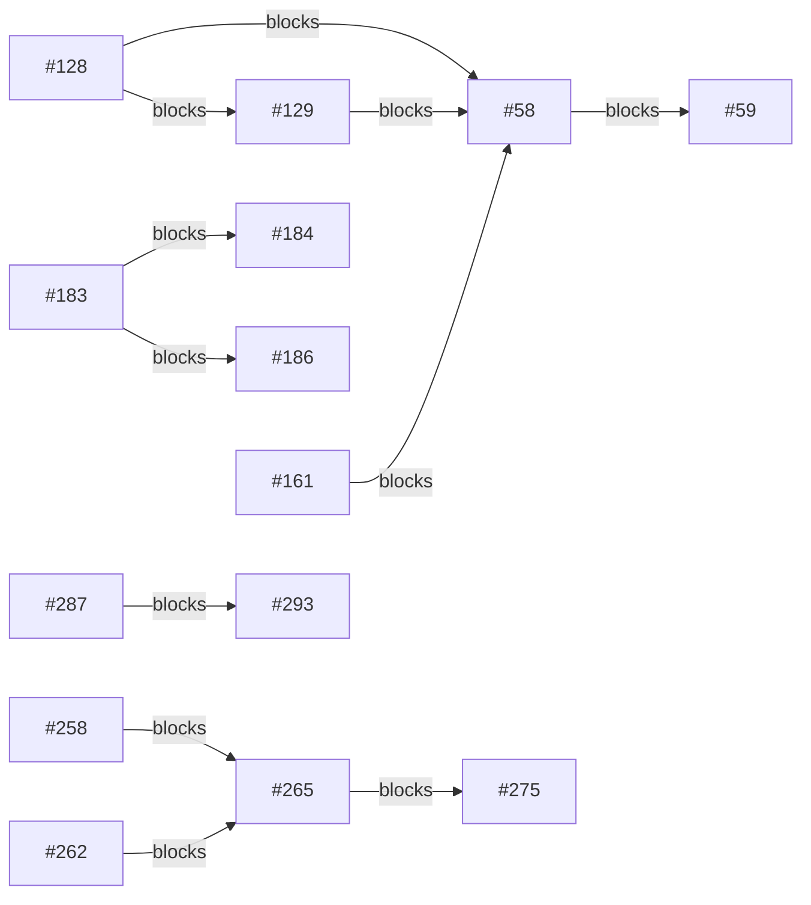

# Backlog triage — 2026-07-30

## Header

- Baseline: **green** on all three legs (`go test ./...`, `node --test scripts/triage/*.test.mjs`, `cd web && npm test`). No unknown failures, no known noise seen.
- Tree status after baseline: clean (`git status --short` produced no output).
- Commit: `21e772a217a95c71428f40a6037ab0b2edfcf799`
- Judged vs cached: 42 judged, 0 reused from cache (first run — no prior `state.json`).
- Unassessed: 0. Unassessable: 0.
- Browser coverage: 6 issues were eligible (frontend + reproCheck + not a feature request); capped at 4 per run. Verified: #212, #292, #295, #267 — all **BLOCKED** (lab backend not running, not started per policy). Skipped by cap: #242, #291 (not yet attempted).

## Requires your decision

Every issue below flagged `needsDecision` on at least one axis (config key / migration / architecture):

| Issue | configKey | migration | architecture |
|---|---|---|---|
| #69 |  |  | yes |
| #184 | yes | yes | yes |
| #186 |  |  | yes |
| #267 |  |  | yes |
| #272 |  |  | yes |
| #275 |  |  | yes |
| #278 | yes |  | yes |
| #279 | yes | yes | yes |
| #295 |  |  | yes |

## Waves

- Wave 1: #176 #266 #286 #212 #290 #292 #154 #215 #63 #99 #171 #192 #250 #294 #69 #128 #199
- Wave 2: #186 #295 #267 #106 #200 #279
- Wave 3: #271 #287
- Wave 4: #238 #265 #86 #58
- Wave 5: #272 #291 #293 #129
- Wave 6: #242
- Wave 7: #180 #275
- Wave 8: #120 #273
- Wave 9: #184
- Wave 10: #278
- Wave 11: #280
- Wave 12: #59

Issue(s) with an empty `touches` array: #242. An issue with no known file set conflicts with everything by design, so it alone can push work into later waves. #242 sits alone in its own wave and is the largest single contributor to conflict density below — that is the explanation for the thin wave one, not a scheduling defect.

## Blocking dependencies

11 `statedBlockers` edges shown above — these are the only edges in this graph; a conflict is a different relation from a dependency (see Conflict density below) and is never mixed into this diagram.

## Conflict density

Total conflict edges (file-overlap or shared-contract) among 42 issues: **185**.

Top offenders by edge count:

| Issue | Conflict edges |
|---|---|
| #242 | 41 |
| #287 | 22 |
| #59 | 21 |
| #120 | 17 |
| #180 | 17 |

#242 alone accounts for 41 of the 185 edges — its empty `touches` array (see Waves above) makes it conflict with every other judged issue by design, which is the largest single driver of this backlog's conflict density.

## Full judgement

| Issue | Kind | Impact | Evidence | Effort | Repro check | Touches |
|---|---|---|---|---|---|---|
| #58 | feature | none | web/src/routes/Search.tsx:6-9 is an explicit placeholder route ("Placeholder until issue #58 builds a search endpoint") with no backend support anywhere in internal/observ/observ.go; nothing is broken in production, there's simply no manual-search feature yet. | L | — | web/src/routes/Search.tsx, internal/observ/observ.go, internal/matcher/matcher.go, web/src/api |
| #59 | feature | none | Feature request for an unbuilt UI flow; no production code path is affected. web/src/routes/Search.tsx (lines 6-9) is explicitly a placeholder with no search UI or backend search endpoint at all yet. | L | — | web/src/routes/Search.tsx, web/src/api/queries.ts, web/src/api/types.ts, internal/observ/observ.go, internal/store/manual_jobs.go, internal/pipeline/importing.go |
| #63 | feature | none | Pure feature/UX request, not a runtime defect - nothing in production is broken by its absence. Also largely already shipped: web/src/routes/Setup.tsx (189 lines) implements the guided setup view with per-step Soulseek login test and Lidarr connection test via useTestConnection(), backed by internal/observ/config.go's ConnectionTester (registerConfig wires POST /api/config/test/lidarr and /api/config/test/soulseek at internal/observ/config.go:300-304), with human-readable error cards (Setup.tsx ErrorCard, t.settings.testFailed/testUnreachable strings) instead of raw connection errors. Config stays file-based and untested by setup, matching the issue's stated design intent. The one unimplemented piece - per-dependency health on the dashboard - is already split out as its own, more precisely scoped open issue #200 (GET /api/health/deps); Health.tsx currently derives its dependency cards from pipeline modules only, and its own comment at web/src/routes/Health.tsx:24-27 says "there is no dependency-health surface yet (issue #200)". | S | — | internal/observ/observ.go, internal/observ/config.go, web/src/routes/Health.tsx, web/src/routes/Health.module.css, web/src/api/queries.ts, web/src/api/types.ts |
| #69 | feature | none | No production code path is affected: sdk/ does not exist anywhere in the repo (confirmed via `ls sdk` returning nothing), and cmd/slskdarr/main.go wires concrete backends (internal/slskd, internal/soulseek, internal/matcher) directly with no plugin boundary today — see the import block at cmd/slskdarr/main.go:20-29. This is a request to design something new, not a defect in running code. | L | — | cmd/slskdarr/main.go, sdk/v1/capability.go, sdk/v1/registry.go, docs/sdk/README.md |
| #86 | feature | none | web/src/strings.ts:2 documents the current state as deliberate: "This is i18n preparation, not i18n — see #86" — there is no i18n runtime yet, so nothing in production is affected by its absence. | L | — | web/src/strings.ts, web/src/routes/Settings.tsx, web/src/routes/Settings.module.css, web/src/routes/Settings.test.tsx, web/package.json, web/src/main.tsx |
| #99 | bug | none | internal/soulseek/downloads.go:967-980: a goroutine already watches ctx.Done() and closes handoff.conn to unblock the in-flight streamFile call, exactly the mechanism the issue asks for. This was fixed by commit a8f9804 ("fix(soulseek): abort an in-flight streamFile on Cancel/Remove (#99)"), merged via PR #147, already on main/this branch. | S | — | internal/soulseek/downloads.go |
| #106 | techdebt | none | internal/soulseek is only ever driven by internal/pipeline/downloading.go, whose DownloadingStore.RunnableJobsInState(ctx, state, now, limit) call bounds how many DOWNLOADING jobs are picked up per tick — so today's single caller already caps concurrent Enqueue calls externally. The gaps described are real (downloadRegistry has no TTL/sweep, internal/soulseek/downloads.go:306-319; Enqueue starts an unbounded goroutine per call, downloads.go:582-609; dialPeer has no outgoing-connection budget, internal/soulseek/peers.go:311, while acquireInboundLease only caps inbound, internal/soulseek/listener.go:42), but nothing in the current single-caller topology exercises them — this is defense-in-depth against a future or misbehaving caller, not a live prod exposure. | M | — | internal/soulseek/downloads.go, internal/soulseek/peers.go, internal/soulseek/sessions.go |
| #120 | feature | none | Purely additive, opt-in, disabled-by-default optimization to Discovery's search pass (internal/pipeline/discovery.go:206 issues one broad Peers.Search per tick today); nothing in production depends on or is broken by its absence. | L | — | internal/pipeline/discovery.go, internal/pipeline/ports.go, internal/store/reliability.go, internal/soulseek/peers.go, internal/soulseek/search.go, internal/soulseek/shares.go, internal/soulseek/soul/peer/sharedfilelistrequest.go, internal/soulseek/soul/peer/sharedfileistresponse.go, cmd/slskdarr/main.go, internal/config/config.go, internal/config/write.go, config.example.toml |
| #128 | feature | none | No running-instance impact: nothing is broken today. internal/soulseek/search.go:307-333 (mapSearchResult) only extracts the Bitrate FileAttributeType and silently drops Duration/VBR/SampleRate/BitDepth that peer.go:44-59 already defines and the wire protocol already carries — confirmed by reading the code, matching the issue's claim. This is unimplemented functionality, not a defect. | L | — | internal/core/search.go, internal/soulseek/search.go, internal/matcher/matcher.go, internal/config/config.go, config.example.toml, internal/filter/filter.go |
| #129 | feature | none | internal/observ/observ.go:552-763 lists every registered route (jobs, cancel/retry, events, peers) with no /api/search endpoint; this is an absent capability, not a defect in running code. | L | — | internal/observ/observ.go, web/src/App.tsx |
| #154 | feature | cosmetic | web/src/routes/Settings.tsx:555 shows `disabled = !config.writable`, never `restarting` (state at line 595); the Save button at line 1222 is only gated by `update.isPending`, so during the real restart window (set at line 815) all fields and the Save button stay interactive and a repeat submit produces a failed request. No crash or data loss — purely a UX gap in a manual, infrequent action. | M | Open Settings, change a value, click Save, and immediately try editing a field or clicking Save again before the restart poll (web/src/routes/Settings.tsx:664-680) resolves — the field/button accept the interaction and a second save attempt fails against the restarting backend. | web/src/routes/Settings.tsx, web/src/strings.ts |
| #171 | test | none | internal/store/store_test.go:123-144 — the code under test (openWithLimits configuring ConnMaxIdleTime) is not in question; only the test's own polling loop (line 134: 2s wall-clock deadline vs 10ms ConnMaxIdleTime) is timing-sensitive. No production code path is touched, so there is no prod impact. | S | go test ./internal/store/... -run TestOpenRecyclesIdleConnections -count=5 (or full suite under load) — CLAUDE.md's own "Known noise" section confirms it fails intermittently under load and passes in isolation. | internal/store/store_test.go |
| #176 | techdebt | degraded | internal/store/dashboard.go:104-109 (jobViewFrom's LATERAL join) reads state, bytes_done and bytes_total for every transfer row per candidate on every dashboard job read; internal/store/migrations/0001_baseline_schema.sql:126 only defines idx_transfers_candidate ON transfers(candidate_id, updated_at), which doesn't cover state/bytes_done/bytes_total, so Postgres must heap-fetch each matching row (Bitmap Heap Scan) on this hot GET /api/jobs path instead of doing an Index Only Scan. | S | EXPLAIN (ANALYZE, BUFFERS) on the jobViewFrom aggregate query (or full jobViewSelect) against a representative transfers table; confirm the transfers scan is a Bitmap Heap Scan before the change and becomes an Index Only Scan after adding CREATE INDEX idx_transfers_candidate_bytes ON transfers(candidate_id) INCLUDE (state, bytes_done, bytes_total). | internal/store/migrations/0009_transfers_bytes_covering_index.sql |
| #180 | feature | none | Pure feature request; no defect in production. internal/pipeline/wanted.go has no kick/trigger mechanism today (Tick(ctx, now) is only driven by internal/pipeline/runner.go:130's time.Ticker), and internal/observ/observ.go's mux.HandleFunc registrations (observ.go:449-763) have no POST /api/reconcile route — the feature is additive, not a fix for existing broken behavior. | M | — | internal/pipeline/wanted.go, internal/pipeline/runner.go, internal/observ/observ.go |
| #184 | feature | none | No blocking mechanism exists anywhere in the codebase today (grep for "block" across internal/soulseek, internal/config, internal/core turns up only unrelated network-address-blocking in internal/soulseek/addrguard.go and mutex/channel-blocking comments) — this is a net-new feature, so there is nothing running in production that this issue's absence degrades. | L | — | internal/soulseek/messages.go, internal/soulseek/peers.go, internal/soulseek/uploads.go, internal/soulseek/shares.go, internal/config/config.go, config.example.toml, internal/store/migrations/0009_blocked_users.sql |
| #186 | techdebt | degraded | internal/store/messages.go:68-83 RecordIncomingMessage inserts every incoming Soulseek private message unconditionally (no per-peer cap, no rate limit); cmd/slskdarr/messages.go:48 calls it for every message the native client accepts from any peer with no sender filtering. internal/soulseek/messages.go:34,55 only bound a single message's body (maxIncomingMessageBytes = 64KiB) and the in-memory ack queue (incomingMessageQueue = 256) — neither limits rows persisted to Postgres. #183/#193 are merged to main (git log shows c0f4486, 22228b8), so this is live in prod: any Soulseek peer can send unlimited messages and each is durably written to private_messages with no retention or count cap — migration 0006_private_messages.sql's own comment explicitly rules out pruning. | M | Have a second Soulseek account send the running instance a large number of private messages in a loop and confirm `SELECT COUNT(*) FROM private_messages WHERE username = '<attacker>'` climbs without bound with no rejection or backpressure visible in client logs. | internal/store/messages.go, internal/soulseek/messages.go, cmd/slskdarr/messages.go, internal/store/migrations/0006_private_messages.sql |
| #192 | bug | none | testenv/compose.yml is the local PR-lab stack only (slskdarr service context: ..), never deployed to production. Confirmed the lidarr service (testenv/compose.yml:27-40) has no healthcheck and slskdarr's depends_on entry for it (testenv/compose.yml:93-95, `lidarr: condition: service_started`) is looser than the postgres entry (testenv/compose.yml:22-25, 88-90) which correctly uses `service_healthy`. | S | ./testenv/lab.sh reset then ./testenv/lab.sh logs slskdarr — look for an ERROR reaching Lidarr on :8686 in the first ~15s before slskdarr's own retry recovers on the next tick. | testenv/compose.yml |
| #199 | feature | none | No keyboard-shortcut infrastructure exists to regress: web/src/components/chrome has no HelpOverlay, there is no hooks/useKeyboard.ts or KeyActionsContext, and web/src/components/Layout.tsx has no document-level keydown listener. The only keydown handlers in web/src are view-local (routes/Jobs.tsx:295-306, routes/Settings.tsx:159-166), unrelated to this global scheme. This is a net-new feature absent from prod, not a broken one. | L | — | web/src/hooks/useKeyboard.ts, web/src/components/chrome/HelpOverlay.tsx, web/src/components/chrome/HelpOverlay.module.css, web/src/components/Layout.tsx, web/src/App.tsx, web/src/routes/Jobs.tsx, web/src/routes/Search.tsx, web/src/routes/Chat.tsx |
| #200 | feature | none | Pure feature request; no existing code path produces per-dependency (Lidarr/Soulseek/Shares) health today. internal/observ/observ.go:507-545 only aggregates pipeline module status (WantedSync/Discovery/Selecting/Downloading/Importing) into /status, and internal/observ/shares.go:35-89 exposes share-index IndexedAt separately - neither is a per-dependency up/down signal, so there is nothing broken in production for this endpoint to fix. | M | — | internal/observ/observ.go, internal/observ/observ_test.go |
| #212 | bug | cosmetic | web/src/styles/tokens.css:20,33 — verified independently via the WCAG relative-luminance formula: --bad #b5595c vs --bg #08090a computes to 4.317:1, and --text-dim #5f696f vs --bg computes to 3.548:1, matching the issue's 4.32/3.55 claims. Both tokens are consumed widely today (Table.module.css, JobActions.module.css, Tag.module.css, TopBar.module.css, Settings.module.css, Jobs.module.css, Overview.module.css) and render as legible text — nothing is broken, missing, or unreadable in practice; it falls short of the AA numeric threshold for users with low vision, which is a real accessibility shortfall but not a functional production defect. | S | Compute the WCAG 2.1 contrast ratio of --bad (#b5595c) and --text-dim (#5f696f) against --bg (#08090a), as defined in web/src/styles/tokens.css lines 7, 20, 33 — confirm both currently fall below 4.5:1 (4.32 and 3.55 respectively). | web/src/styles/tokens.css |
| #215 | feature | cosmetic | Verified live at 375px viewport: web/src/components/Layout.module.css:12 sets `.main { overflow-y: auto }` with overflow-x left at its initial `visible`, which per the CSS overflow spec computes to `auto` when only one axis is set explicitly — confirmed in-browser (main.scrollWidth=605 vs clientWidth=375, computed overflowX="auto", and main.scrollLeft is settable up to 230). So the Jobs table is horizontally scrollable and reachable today; the issue's stated root cause ("overflow:hidden on html/body makes content inaccessible, cannot scroll") does not hold for the current code. The real, narrower gap: web/src/routes/Jobs.module.css, JobDetail.module.css, Events.module.css, Shares.module.css and Peers.module.css have no `@media` breakpoints (grep confirms `web/src/components/Layout.module.css:30`, `Chat.module.css:217`, `Overview.module.css:168`, `Health.module.css:71/75`, `TopBar.module.css:38`, `SideNav.module.css:46` already have them — added since this issue was filed), so those 5 views render their full fixed-width grid (e.g. Jobs.module.css:57, ~596px minimum) and force a horizontal scroll on narrow screens instead of adapting columns. | M | Resize a browser to 375px wide and open /jobs, /job/:id, /events, /peers, /shares — table columns don't adapt and the view requires horizontal scrolling to read (scroll works, contra the issue text, but layout is unpolished); compare against /overview and /health at the same width, which already collapse via existing @media (max-width: 900px/640px) rules. | web/src/routes/Jobs.module.css, web/src/routes/JobDetail.module.css, web/src/routes/Events.module.css, web/src/routes/Shares.module.css, web/src/routes/Peers.module.css |
| #238 | feature | cosmetic | cmd/slskdarr/main.go:516-530 only assigns sendMessageFn when soulClient != nil, so on the slskd backend observ.ServerDeps.Send stays nil and internal/observ/messages.go:268-270 answers every send with a designed 503 fallback ("sending private messages is not enabled in the configuration", see the comment at messages.go:58-60) rather than a crash or data loss; slskd is also not the config.example.toml default backend. | M | — | internal/slskd/client.go, internal/pipeline/ports.go, cmd/slskdarr/main.go, internal/store/messages.go |
| #242 | test | none | web/src/routes/Settings.test.tsx and web/vite.config.ts are test-only files; no production code path is touched. Verified on current main (7e82b88) that `npx vitest run` in web/ passes 28/28 files, 364/364 tests, with Settings.test.tsx finishing in 1647ms, well under the 15s testTimeout at web/vite.config.ts:59. | S | cd web && npx vitest run — expect 28 files / all tests passing; Settings.test.tsx should complete well under vite.config.ts's 15s testTimeout with no failures |  |
| #250 | bug | none | internal/soulseek/client.go:744 calls c.recordConnected() (sets Status.State=StateConnected) BEFORE serveConnected (line ~805-806) acquires c.mu and sets c.serverConn/c.serverGeneration. Between those two points Status() already reports connected while serverConn is still nil, so any sendToServer call in that window hits the generation guard at client.go:531/534 and returns "not connected to requested server generation" - exactly the test's failure. However `grep -rn "Status().State" internal/` (excluding tests) shows nothing in production code branches on Client.Status().State before calling server-facing methods like ConnectPeer/Search - pipeline and app code call those methods directly and rely on their own error handling/backoff, not on this status flag. So the race is real but only observable through the test harness's waitForState-then-call pattern, not through any production code path. | S | go test -race -run TestConnectPeerIndirectSuccess ./internal/soulseek/ -count=20 (or add a short time.Sleep between the recordConnected() call at client.go:744 and the serveConnected() call at client.go:759 to widen the window and force the failure locally); the fix is to move the recordConnected() call to after c.serverConn/c.serverGeneration are assigned inside serveConnected instead of calling it before serveConnected is invoked. | internal/soulseek/client.go |
| #265 | techdebt | none | internal/observ/stream.go:944-951 (tick) builds and queues Throughput/UploadThroughput on every subscriber's livePayload regardless of whether that subscriber's UI reads it. This is an architecture/efficiency refactor, not a defect — nothing is broken today, throughput is just always computed and shipped alongside job data instead of gated by subscription. | M | — | internal/observ/stream.go, internal/observ/stream_test.go, web/src/api/stream.tsx, web/src/api/queries.ts, web/src/api/stream.test.tsx |
| #266 | bug | degraded | internal/observ/stream.go:866-874 — the corrTicker branch of streamHub.run calls h.fetchLive(ctx) and h.refreshCorrelation(ctx, ...) with the untimed ctx passed into run (vs. tick's fetchCtx, bounded by streamFetchTimeout at line 883). The code's own comment at lines 867-871 states this stalls the whole broadcaster goroutine — including tick's 1Hz broadcast — while heartbeats on already-open connections keep flowing, and explicitly says "Tracked as #266; not fixed here." | S | Make deps.Jobs (or transferBytes/jobDetail) block indefinitely while at least one /api/stream subscriber is connected, and let correlationInterval elapse so run's corrTicker branch fires. Expect: SSE heartbeats keep arriving but job/throughput frames stop entirely and stay stopped even after the underlying block is released (goroutine wedged forever on the untimed ctx). After wrapping this branch with context.WithTimeout(ctx, streamFetchTimeout) like tick does, the same setup should show the correlation fetch giving up after ~500ms and tick resuming its 1Hz broadcast. | internal/observ/stream.go |
| #267 | techdebt | cosmetic | web/src/api/stream.tsx:118-129 documents this as a known, already-accepted cost: the effect at line 131 keys on jobId/jobsScopeKey, so mounting /jobs opens an unscoped connection first, then a scoped ?jobs=... one once useJobScope (line 59) publishes the page's ids in a child effect. Each open re-runs onopen's two invalidateQueries calls (lines 160-166) and the server re-sends its initial snapshot, but this only happens once per /jobs mount, not per poll — no data loss or correctness break, just a redundant round of cache invalidation and a duplicate initial snapshot at navigation time. | M | Open the Network tab, navigate to /jobs, and confirm two EventSource requests to /api/stream fire in quick succession (one unscoped, one with ?jobs=...) instead of one. | web/src/api/stream.tsx, web/src/pages/Jobs.tsx |
| #271 | bug | cosmetic | internal/pipeline/paths.go:80-103 (cleanupCompletedFolder) already best-effort removes the per-album folder under CompleteDir once a job reaches DONE, and is called from internal/pipeline/importing.go:249 and :412 on every successful import path. It only skips removal when the folder still has entries (paths.go:88-92), which is deliberate (avoids deleting a partial import) -- so any leftover is, at worst, a folder containing non-audio residue (cover art, logs, m3u, subfolders) that legitimately blocks the empty-check, not an unbounded leak. The issue gives no repro, no path, no log excerpt, and this exact feature (delete empty per-album folder after confirmed import) already shipped in commit d6aa218 (#48, merged before this issue was filed on 2026-07-28). | S | After a lab run completes several jobs to DONE, list CompleteDir for leftover directories (e.g. `find <completeDir> -mindepth 1 -maxdepth 1 -type d`) and inspect any survivor's contents -- if it holds only non-audio files (covers, .m3u, .log) rather than being genuinely empty, that's a distinct gap from what the issue literally describes and needs its own repro from the reporter. | internal/pipeline/paths.go, internal/pipeline/importing.go |
| #272 | feature | cosmetic | internal/pipeline/importing.go:276-282 and internal/pipeline/paths.go:71-103 show this is already-known, intentional behavior, not a bug: unmatched extra files are deliberately left in the download folder (importing.go:278-282), cleanupCompletedFolder only ever removes an already-empty folder (paths.go:80-103, os.Remove not RemoveAll), and confirm's failUnconfirmed path explicitly skips cleanupFolder because Lidarr is assumed to have already moved the files (importing.go:423-435). So leftover files accumulate under CompleteDir over time (disk usage growth), but there is no crash, data loss, or stuck pipeline state -- every fail path still advances the job atomically (FailCandidateAndAdvance). | L | — | internal/pipeline/importing.go, internal/pipeline/paths.go |
| #273 | feature | none | Pure feature request for a new visualization view; no defect in running code. Failure reasons already exist per-job (internal/pipeline/importing.go:271, the rejectedDetail string recorded via AddJobEvent) and are servable today via GET /api/jobs/{id}/events plus the existing 'failed' chip in web/src/routes/Jobs.tsx — nothing is broken, the gap is a missing aggregated cross-job 'why did imports fail + what to do' view. | L | — | web/src/App.tsx, web/src/routes/Jobs.tsx, web/src/api/queries.ts, web/src/api/types.ts, internal/observ/observ.go, internal/observ/jobdetail.go |
| #275 | feature | none | web/src/api/queries.ts:291 already polls /api/jobs every 15s (JOBS_INTERVAL) and this works correctly in production today; the issue proposes replacing that poll with event-driven invalidation, which is an architecture/optimization change, not a fix for broken behavior. web/src/api/stream.tsx:160-166 already invalidates queryKeys.jobs on stream onopen/reconnect — the mechanism the issue wants to extend to per-status-change is already shipped and working. | L | — | web/src/api/stream.tsx, web/src/api/queries.ts, internal/observ/stream.go |
| #278 | feature | none | Nothing runs today: internal/ has no os/exec usage at all, and internal/pipeline/importing.go (ImportingStore/ImportingParams, lines 18-90) has no hook point before import; this is a pure feature request with no existing behavior to regress. | L | — | internal/pipeline/importing.go, internal/pipeline/ports.go, internal/config/config.go, config.example.toml, cmd/slskdarr/main.go |
| #279 | feature | none | No production impact from filing this request: current auth is unchanged, a shared bearer token / HTTP Basic check in internal/observ/security.go:21-49, applied via ProtectPrivateEndpoints (internal/observ/security.go:55-76). Adding real per-user login would be new functionality, not a fix to a defect in that path. | L | — | internal/observ/security.go, internal/observ/config.go, internal/config/config.go, internal/config/write.go, web/src/routes/Settings.tsx, web/src/api/client.ts |
| #280 | feature | none | No code path reads Lidarr's application log today (grep for log-related endpoints in internal/lidarr/client.go and internal/pipeline/importing.go turns up nothing) — this is a request for new capability, not a fix to broken production behavior. Existing handling in internal/pipeline/importing.go's verify() (lines ~220-262) already reads Lidarr's ManualImportCandidates per-file Rejections and treats an empty-folder response as already-imported, so some "already exists" cases are already covered without log scraping. | L | — | internal/lidarr/client.go, internal/pipeline/ports.go, internal/pipeline/importing.go |
| #286 | techdebt | degraded | internal/store/dashboard.go:45-48 (currentCandidateSubquery) sits in the join condition at dashboard.go:78, and the issue's own prod EXPLAIN (ANALYZE, BUFFERS) run shows it evaluated 6625 times for 3568 rows (53% of the query's 61454 buffer hits), plus ~19.6ms of 84.9ms total spent on JIT compilation the planner shouldn't have triggered. This facet query (dashboard.go:428-437) runs unconditionally on every GET /api/jobs, and web/src/api/queries.ts:40 polls that endpoint every 15s from every open dashboard tab. | M | Run EXPLAIN (ANALYZE, BUFFERS) against the exact facet query built in ListDashboardJobs (dashboard.go:429-437) with an empty DashboardJobsQuery on a prod-sized album_jobs table; confirm SubPlan 1 (currentCandidateSubquery) loop count versus outer row count, and check whether JIT still triggers on the post-fix cost estimate. | internal/store/dashboard.go, internal/store/dashboard_test.go |
| #287 | feature | cosmetic | Purely a dashboard UX gap today: internal/store/dashboard.go currently only exposes filter=transferring (active+stalled union), so a job that finishes (DONE/FAILED) or is waiting on import simply disappears from the Overview TRANSFERS panel with no 'what just happened' surface. No data loss, no incorrect state, no outage risk — a missing observability view, not a broken one. Note: this is largely moot for triage — a branch feat/overview-nulage-287 and an open PR #296 ("Closes #287") already implement the full design (dashboard.go filter/sort changes, SkipFacets, Overview.tsx region 2, strings.ts copy) and are awaiting merge/review, not sitting in the backlog unstarted. | M | — | internal/store/dashboard.go, internal/store/dashboard_test.go, internal/observ/observ.go, internal/observ/observ_test.go, cmd/slskdarr/main.go, web/src/routes/Overview.tsx, web/src/routes/Overview.module.css, web/src/routes/Overview.test.tsx, web/src/routes/Jobs.tsx, web/src/api/queries.ts, web/src/api/queries.test.ts, web/src/api/queries.live.test.tsx, web/src/api/types.ts, web/src/strings.ts |
| #290 | techdebt | cosmetic | docs only, no runtime effect | S | — | CLAUDE.md |
| #291 | bug | none | The code this bug lives in (the RECENTLY FINISHED panel and its finishedQuery, added by #287) exists only on the open, unmerged PR #296 (branch feat/overview-nulage-287, commit 48c8e7a onward) — `git branch --contains eff88ad` returns only that branch, and main/HEAD (verified clean, up to date with origin/main) has no finished panel at all: current web/src/routes/Overview.tsx has a single useJobs call (filter=transferring) and no finishedQuery. Nothing in production reads replaceLiveJobPage against a finished-state page today. | M | Check out PR #296 (feat/overview-nulage-287), run the app, let a job finish while Overview is open, and watch the RECENTLY FINISHED panel: the row renders an ACTIVE/DL tag (Tag status={job.status}) and an understated age in the WHEN column for up to LIVE_JOB_FRESH_MS (10s, web/src/api/queries.ts line 84) before self-correcting — because useJobs (queries.ts lines 287-295) applies replaceLiveJobPage using the global accumulated `live` payload to every page it returns, including finishedQuery's filter=finished page, with no scoping on job state. | web/src/api/queries.ts, web/src/routes/Overview.tsx |
| #292 | bug | cosmetic | web/src/routes/Overview.tsx:182-186 — the TRANSFERS row is a 
 with no tabIndex, onKeyDown, or focus style, so keyboard-only users cannot reach job details from this row (mouse click still works). Note: the issue's second claimed offender, the reconciliation/"recently finished" row list at lines 235-241, has no onClick at all — it isn't actually clickable, so only the TRANSFERS row is a real instance of this pattern. Cosmetic/UX-only: no data loss, no functional break for mouse users, no prod outage risk. | S | Tab through the Overview page with a keyboard only; the TRANSFERS row for a job (web/src/routes/Overview.tsx:182) never receives focus and Enter/Space do nothing, confirming no keyboard path to /jobs/:id from that row. | web/src/routes/Overview.tsx |
| #293 | test | cosmetic | On main, cmd/slskdarr/main.go:271-276 (pagedJobsFn) maps only Page/Sort/Dir/Filter/Source/Query/PageSize — confirmed via grep that SkipFacets and Now do not exist anywhere in internal/observ/observ.go, internal/store/dashboard.go or cmd/slskdarr/main.go on main. The issue's stated regression risks (losing SkipFacets re-enabling a ~85ms facet query; losing Now breaking filter=finished) apply to code that only exists on unmerged branch origin/feat/overview-nulage-287 (confirmed at cmd/slskdarr/main.go:271-280 on that branch, part of #287). So on main today this is purely an untested-mapping gap for 7 simple scalar fields, not a live regression vector — no production behavior depends on the currently-missing test. | S | — | cmd/slskdarr/main.go, cmd/slskdarr/main_test.go |
| #294 | bug | none | internal/store/candidates.go:56-59 — InsertCandidates's `UPDATE album_jobs SET retries = 0, not_before = NULL, updated_at = $1 WHERE id = $2` has no state guard, unlike every sibling writer (e.g. AdvanceJobStateFrom at internal/store/pipeline.go:294-306 and terminalCandidateAndAdvance at internal/store/candidates.go:183-185, both `WHERE id = $x AND state = $y`). Currently no production impact: InsertCandidates is only called from internal/pipeline/discovery.go:285, right after fetching jobs in WANTED state, and reaching DONE within that same tick (before this write lands) is not achievable given DONE requires a full SELECTING->DOWNLOADING->IMPORTING traversal. Issue #287 (still open per `tea issues 287`), which would make Overview trust `updated_at` as a DONE-job completion timestamp, is what turns this into an actual bug. | S | Go test: create a job, drive it (or force via SQL) to StateDone, then call store.InsertCandidates(ctx, jobID, cands, later) and assert the job row's updated_at changed despite being terminal -- it will, since the UPDATE at candidates.go:56-59 carries no `AND state = ...` clause. | internal/store/candidates.go, internal/store/candidates_test.go |
| #295 | bug | cosmetic | Overview.tsx:82-84 labels the stat 'IN FLIGHT' with subtitle subInFlight(status?.active ?? 0) — strings.ts:319 renders that as 'downloading from N peers', but status.active is StatusReport.Active (observ.go:68), which main.go:258-266 sets to len(ActiveTransfers()) — a count of file transfers, not distinct peers or jobs. No data is lost and no pipeline behavior changes; it is a dashboard stat that overstates peer diversity (reads '~24 peers' when only 5 jobs/12 transfers exist), so impact is confined to what the UI claims, not what the system does. | S | Open Overview page against the lab (5 DOWNLOADING jobs, 12 total transfers per TRANSFERS panel) and read the IN FLIGHT stat's subtitle: it will claim 'downloading from ~24 peers', a number equal to ActiveTransfers count, not the distinct peer usernames actually in use. | web/src/routes/Overview.tsx, web/src/strings.ts, web/src/routes/Overview.test.tsx |

## Unassessed

None. Every one of the 42 open issues received a judgement.

## Unassessable

None. Every judgement carried a recognised `prodImpact` and `effort`.

## Candidates to close

None observed this run. The four browser-eligible issues that were checked (#212, #292, #295, #267) all came back BLOCKED rather than PASS/ISSUES_FOUND — the lab backend was not running, and this run did not start it — so no defect was confirmed fixed or confirmed still present via a real browser in this pass. This is a coverage gap, not a "nothing needs fixing" result: see Not verified below.

## Not verified (BLOCKED)

The PR lab was not running for this dry run (`curl -sf http://localhost:9090/status` failed) and was deliberately not started (real Soulseek login, minutes to start, only one instance can run). Every frontend-reproduction check is therefore BLOCKED, not PASS or FAIL:

- #212, #292, #295, #267 — checked this run, verdict BLOCKED in each case (see `browser` in the workflow result; each evidence field confirms the agent probed `:9090`, got connection refused, and did not read CSS/source as a substitute for rendering).
- #242, #291 — eligible for browser verification but not attempted at all (run capped at 4 candidates).

To unblock: `./testenv/lab.sh up` (starts the backend), then re-run this triage — or re-run just the Browser phase against the six candidates above.

