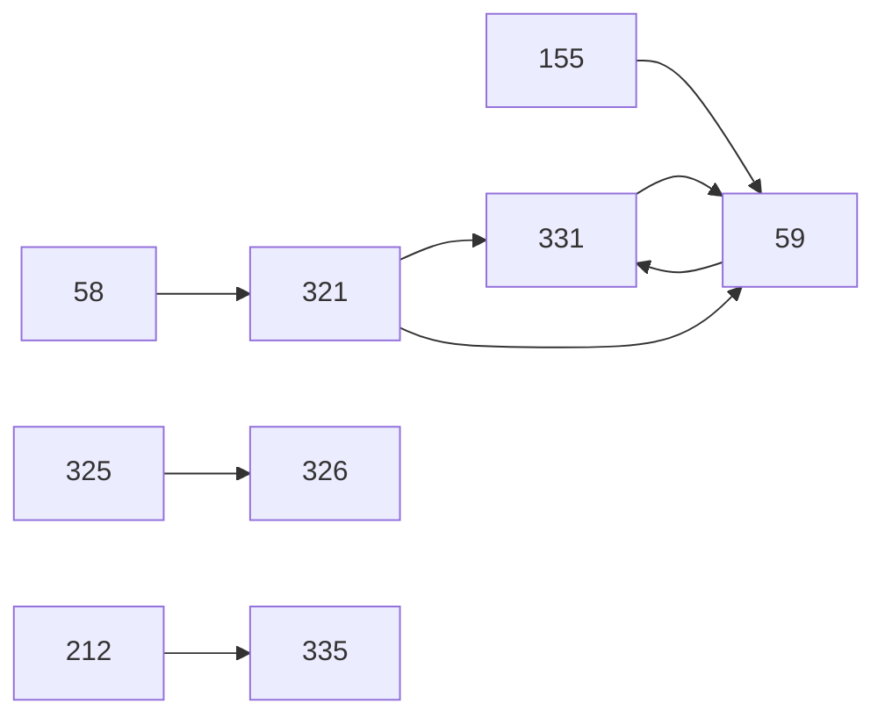

# Backlog-triage — label `Public`, 2026-07-31

**Scope:** de 12 öppna issues som bär labeln `Public` (av 48 öppna totalt). Detta är inte
en full backlog-triage — den senaste ligger i `2026-07-30-backlog.md`.

**Baseline:** grön. `go test ./...`, `cd web && npm test` och `node --test
scripts/triage/*.test.mjs` rapporterade alla grönt; ingen känd noise observerades i denna
körning (`knownSeen: []`), vilket inte är samma sak som att #171/#250 är lösta — de är
bara inte synliga under dessa förhållanden.

**Commit:** `3a7d3bf3a9601623e6c66518df21abe91d3ec006`
**Judged:** 12 · **Cached:** 0 (alla 12 var stale — 75 filer har ändrats sedan förra
triagens `computedAt` 25f97c6)
**Browser:** 2 av 2 kandidater verifierade mot det redan körande labbet på `:9090`.
Labbet startades inte och rördes inte.
**Unassessed / unassessable / unschedulable:** inga.

---

## 1. Kräver ditt beslut

Listade efter issue-nummer, fallande.

### #334 — tom sökning shelvar albumet i 30 dygn
`needsDecision: architecture + configKey`. Issuen listar tre möjliga riktningar och säger
uttryckligen att de är **avsiktligt inte förskrivna**. Att välja en av dem är ett
arkitekturbeslut om vad pipelinen räknar som bevis, och minst en av riktningarna
introducerar en ny config-nyckel — vilket i det här repot betyder att nyckeln måste finnas
i produktionens `config.toml` **före** merge, annars startar inte containern vid nästa
deploy.

### #331 — slå upp/skapa artist i Lidarr före manuell import
`needsDecision: architecture + configKey`. Identitetsproblemet (`foreignArtistId` krävs
för att skapa en artist i Lidarr) har inget självklart svar och issuen ber själv om att
det läses före designen.

### #59 — manuella jobb genom importpipelinen
`needsDecision: architecture + migration`. Kräver ett nytt fält i `internal/store` och
alltså en migration; en mergad migration är oåterkallelig i det här repot.

---

## 2. Bekräftat reproducerande i webbläsare

Båda kandidaterna kördes mot labbet via Vite från denna checkout. Listade efter
issue-nummer, fallande.

### #335 — `ISSUES_FOUND`
Token-värdena lästes ur **den renderade DOM:en** via `getComputedStyle`, inte ur
källfilen, och kontrasterna räknades i sidan:

| Par | Uppmätt | Tröskel |
|---|---|---|
| `--text-dim` vs `--btn` | 4.47:1 | 4.5:1 (AA text) ❌ |
| `--bad` vs `--btn` | 4.48:1 | 4.5:1 (AA text) ❌ |
| `--tick-queued` vs `--tick-off` | 1.20:1 | 3:1 (WCAG 1.4.11) ❌ |

Alla tre matchar exakt siffrorna i issuen. Tick-paret är det som ritar *varje* progress-bar
i appen (`Ticks.tsx`), och 1.20:1 är inte marginellt — det är långt under.

### #332 — `ISSUES_FOUND`
Skärmdump av live TRANSFERS-panelen: `192.6 MB / 911.8 MB` bryts på två rader och gör
raden synligt högre än grannarna. Samma sak på `466.9 MB / 653.5 MB`, `100.5 MB /
233.9 MB`, `421.7 MB / 2.2 GB`, `74.1 MB / 204.8 MB`. Rader som visar `pos N` eller
`verifying` förblir enradiga — vilket är precis det mönster issuen beskriver.

---

## 3. Vågor

Ordningen inom varje våg är rank-ordning (högst först), inte issue-nummer — den bär
mening och får inte sorteras om.

```
Våg 1:  #334 #332 #335 #63 #279
Våg 2:  #333 #321
Våg 3:  #99
Våg 4:  #325
Våg 5:  #59 #326
Våg 6:  #331
```

**#99 har tomma `touches`** — inte för att domaren missade något, utan för att den redan är
löst på `main` och alltså inte har någon filmängd att ändra. En issue utan känd filmängd
konfliktar per design med allt, vilket ensamt förklarar varför den ligger isolerad i våg 3
och trycker ner #325/#59/#326/#331. **Stänger man #99 kollapsar vågorna 3–6 kraftigt.**

#333 hamnar i våg 2 för att den delar `Overview.tsx` med #332 — en äkta filkonflikt, inte
ett beroende.

---

## 4. Blockerande beroenden



Notera cykeln #59 ↔ #331: båda uppger varandra som blockerare. Det är inte ett schemafel
utan ett tecken på att de två är ett enda arbete som delats i två issues — värt att
avgöra vilken riktning som gäller innan någon av dem påbörjas.

---

## 5. Konfliktdensitet

24 konfliktkanter över 12 issues. Största bidragsgivare:

`#99 (11) · #321 (7) · #331 (6) · #325 (5) · #334 (4)`

#99 står för nästan halva densiteten helt på egen hand, av skälet ovan.

---

## 6. Full bedömning

Rader efter issue-nummer, fallande. Detta är en uppslagstabell, inte en prioritering —
rangordningen bor i vågorna.

| # | Kind | Impact | Effort | Repro check | Touches |
|---|---|---|---|---|---|
| 335 | bug | cosmetic | M | Räkna WCAG-kontrast för `--text-dim`/`--bad` mot `--btn` och `--tick-queued` mot `--tick-off` | `tokens.css`, `check-css-tokens.mjs` |
| 334 | bug | **degraded** | M | Kör labbet, hitta ett FAILED-jobb, kör om samma query — får den >0 träffar reproducerar konflationen | `discovery.go`, `backoff.go`, `selecting.go`, `config.go`, `config.example.toml` |
| 333 | feature | cosmetic | S | Öppna Overview för ett jobb äldre än ett dygn — WHEN visar `106h 21m` utan tooltip | `format.ts`, `Overview.tsx`, `format.test.ts` |
| 332 | bug | cosmetic | S | Öppna Overview, titta på TRANSFERS när SIZE visar t.ex. `340.1 MB` | `Overview.module.css`, `format.ts`, `Overview.tsx` |
| 331 | feature | none | L | — | `lidarr/client.go`, `app/jobs.go`, `observ.go`, `store/pipeline.go`, `config*.toml`, `Search.tsx`, `SearchResultCard.tsx` |
| 326 | feature | none | M | — | `Shares.tsx`, `UploadHistory.tsx`, `queries.ts`, `strings.ts`, `Shares.module.css` |
| 325 | feature | none | L | — | `soulseek/uploads.go`, `client.go`, `0010_upload_history.sql`, `store/uploads.go`, `observ/uploads.go`, `server.go`, `cmd/slusk/soulseek.go`, `config.example.toml` |
| 321 | feature | none | L | — | `musicbrainz/client.go`, `discovery.go`, `lidarr/client.go`, `config.go`, `config.example.toml`, `Search.tsx`, `SearchResultCard.tsx`, `queries.ts`, `types.ts` |
| 279 | feature | none | L | — | `observ/security.go`, `observ/config.go`, `server.go`, `Settings.tsx`, `types.ts` |
| 99 | techdebt | none | S | Läs `downloads.go:940-1025` — är ctx plumbad är issuen stale | *(tom)* |
| 63 | feature | none | S | — | `observ.go`, `Health.tsx` |
| 59 | feature | **degraded** | L | — | `app/jobs.go`, `importing.go`, `ports.go`, `store/manual_jobs.go`, `lidarr/client.go`, `Search.tsx`, `SearchResultCard.tsx` |

---

## 7. Unassessed

Inga. Alla 12 domare returnerade en bedömning.

## 8. Unassessable

Inga.

## 9. Unschedulable

Inga. Ingen `touches`-post namngav en katalog.

---

## 10. Kandidater att stänga

Ingen browser-verdict kom tillbaka `PASS` — men två issues visade sig vid kodläsning
beskriva ett tillstånd som inte längre finns. Det är inte samma bevisform som en
browser-`PASS`, och beslutet är ditt.

### #99 — sannolikt redan löst
Domaren pekar på commit `a8f9804`, *"fix(soulseek): abort an in-flight streamFile on
Cancel/Remove (#99)"*, 2026-07-23. `internal/soulseek/downloads.go:967-980` plumbar nu ctx
in i `runDownload` och startar en watcher som stänger `handoff.conn` på `ctx.Done()`;
`:1002-1008` routar felet genom `finishInterrupted`, som `:761-764` låter ett redan
`TransferCancelled`-tillstånd vara; `:1018-1024` kontrollerar `TransferCancelled` igen före
`TransferCompleted`. Det är exakt vad issuen ber om.

### #63 — till största delen redan levererad
`web/src/routes/Setup.tsx:89-189` implementerar redan guidad setup precis som specen
beskriver (Soulseek-login-test, Lidarr-URL/API-nyckel-test, delade mappar,
`ErrorCard`-meddelanden på människospråk), levererad via mergade PR #198/#201/#281.
`web/src/routes/Health.tsx:13-110` renderar redan per-modul-hälsa. Det som återstår —
löpande hälsa per *beroende* till skillnad från per pipeline-modul — är enligt domaren
redan utbrutet i en egen issue.

---

## 11. Ej verifierade (BLOCKED)

Inga. Båda browser-kandidaterna kunde köras eftersom labbet redan var uppe.

De tio återstående issues fick ingen browser-check: sju är rena feature-requests utan
något att reproducera (`reproCheck: null`), #99 och #63 kontrolleras genom kodläsning, och
#334 kräver ett labbjobb som når FAILED — vilket inte kan framtvingas inom ramen för en
triage.

---

## Efterskrift — vad som hände efter körningen

Tillagt samma dag, efter att rapporten skrevs. Mätningarna ovan står oförändrade;
det här är enbart vad som landade efteråt.

| Issue | Utfall |
|---|---|
| #332 | Åtgärdad och mergad (PR #343). Browser-mätningen visade dessutom att `nowrap` inte räckte — SIZE-kolumnen behövde 84px → 92px, eftersom ett par fyrsiffriga MB-värden (`1015M / 1020M`, ett vanligt ~1 GB FLAC-album) kräver 89.7px även i kompakt format. Issuens egen instruktion för det fallet följdes: justera bredden, ta inte bort nowrap. |
| #335 | Åtgärdad och mergad (PR #342) i en separat session. |
| #325 | Åtgärdad och mergad (PR #341). Migrationen blev `0010`, inte `0009` som issuen angav — `0009_transfer_bytes_covering_index.sql` hade landat sedan issuen skrevs. Inga nya config-nycklar. |
| #333 | Åtgärdad, PR #344 öppen. |

Kvarstår orörda: #334, #331, #321, #279, #59 (alla kräver ett beslut), samt #99 och
#63 som kandidater att stänga.

### En rättelse till CLAUDE.md:s known-noise-lista

Rapportens header säger "baseline grön". Det var vad workflowets baseline rapporterade,
men det var tur, inte sanning.

`npm test` failar sporadiskt på `Settings.test.tsx`, `Chat.test.tsx` och `Jobs.test.tsx`
med waitFor-timeouts. Två körningar av **identisk kod** gav 2 respektive 6 fel i olika
filer. Isolerat är alla gröna. Verifierat att det inte är någon av dagens ändringar genom
att stasha dem och köra hela sviten på orörd `main`: 2 fel även där.

Det är #242:s signatur. CLAUDE.md noterar att #242 togs bort från known-noise-listan
2026-07-30 eftersom den "inte reproducerade". **Den borttagningen var för tidig** — och
just den sortens borttagning är vad listan varnar för: en tom rad döljer ett verkligt fel
lika effektivt som en inaktuell rad gör.
