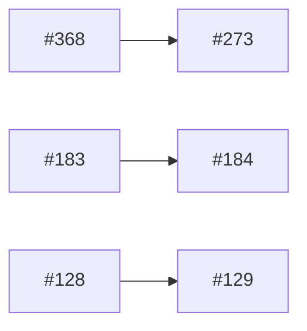

# Backlog triage — 2026-08-04

Baseline: **green** on all three legs — `go test ./...`, `node --test scripts/triage/*.test.mjs`, and `cd web && npm test` all reported green, with no unknown failures and no known-noise entries observed this run.

- Commit: `ef79d1d7e02f18294cb67603eeae0225473d6abe`
- Open issues: **49** — **49 judged this run, 0 reused from cache.** The previous state file was written at `25f97c6`; 428 files changed between there and HEAD, so every cached judgement died on the code-change axis.
- Browser coverage: 4 candidates selected, **0 verified** — all four came back `BLOCKED` because the PR lab was not running. This capability never starts it.

## Requires your decision

Issues whose judgement set at least one decision flag, by issue number descending. An issue with a `needsDecision` object whose flags are all false is not listed — nothing was flagged.

| Issue | Config key | Migration | Architecture | Title |
|---|---|---|---|---|
| #409 | — | — | yes | research(soulseek): sitter 16 MiB-taket på browse-svaret rätt, och vad gör andra klienter vid stora delningar? |
| #406 | — | — | yes | feat: förstagångsinstallation i dashboarden istället för handredigerad config.toml |
| #395 | — | — | yes | feat(soulseek): hämta om gluetuns forwardade port under drift, inte bara vid uppstart |
| #391 | **yes** | — | — | feat: erbjud källkoden i UI:t — AGPL § 13 kräver det (#380) |
| #382 | — | — | yes | arch: målmodell — vertikala slices för HTTP-ytan, transport skild från publisher |
| #314 | — | **yes** | yes | refactor: registrera den lokala nedladdningsmappen vid skrivtillfället |
| #298 | — | — | yes | chore(triage): cachen ser inte att en bedömnings allvar hänger på en tredje issues status |
| #278 | **yes** | — | yes | feat: run script before import |
| #238 | — | — | yes | feat(slskd): privata meddelanden mot slskd-backenden |
| #184 | — | **yes** | yes | feat: blockera användare |
| #120 | **yes** | **yes** | yes | feat(soulseek): cache shares from known-good peers |
| #86 | — | — | yes | feat(ui): i18n-stöd för frontend |

The config-key column is the one that can stop a container. `internal/config` rejects unknown keys and has no silent defaults, and a merge deploys within minutes — so **#391, #278 and #120 must have their key present in production's `config.toml` before the PR merges**, not after.

## Confirmed still reproducing

**Empty — and for the reason that says nothing about the backlog.** All four browser candidates returned `BLOCKED`, not `PASS`: the lab backend on `:9090` was not listening, so no page was ever rendered. This is not "every candidate passed"; it is "no candidate was observed". Nothing in this report is backed by observed runtime behaviour — every judgement below is inferred from reading code.

## Waves

Order within each wave is `computeWaves`' own: highest-ranked first (`rank = impact * 10 - effort`). Do not re-sort by issue number.

**Wave 1** (20) — `#186 #386 #215 #324 #367 #412 #267 #327 #395 #305 #308 #417 #171 #192 #294 #299 #300 #391 #420 #250`
**Wave 2** (9) — `#314 #409 #291 #368 #414 #293 #399 #298 #199`
**Wave 3** (4) — `#319 #154 #106 #200`
**Wave 4** (3) — `#317 #86 #273`
**Wave 5** (2) — `#318 #406`
**Wave 6** (1) — `#402`
**Wave 7** (1) — `#128`
**Wave 8** (1) — `#180`
**Wave 9** (2) — `#184 #129`
**Wave 10** (1) — `#280`
**Wave 11** (1) — `#69`
**Wave 12** (1) — `#120`
**Wave 13** (1) — `#238`
**Wave 14** (1) — `#278`
**Wave 15** (1) — `#382`

### Why there are fifteen waves

Two issues came back with an **empty `touches`** list, and an issue with no known file set conflicts with everything by construction:

- **#402** — chore: decide how public bug reports reach the tracker
- **#382** — arch: målmodell — vertikala slices för HTTP-ytan, transport skild från publisher

Each carries 48 edges — one to every other schedulable issue — which between them is **95** of the 235 conflict edges, not 96: they conflict with each other too, and that edge is shared. They are why the tail of this schedule is eleven single-issue waves rather than two or three fuller ones. Giving either a real `touches` list, or re-judging it, would collapse a large part of that tail.

## Blocking dependencies

`statedBlockers` edges only — "this issue said it requires that one first". Conflicts are **not** drawn here; they are a different relation and are counted in the next section.



Three edges across 49 issues. One caveat: **#184 states #183 as a blocker, and #183 is closed** ("feat: privata meddelanden (PM) — visa och skicka"), verified via `tea issues 183`. The dependency is satisfied, not pending — #184 is not blocked by it. The other two edges are both live: #368 and #128 are open.

## Conflict density

File-overlap and shared-contract conflicts, as numbers rather than a graph — 235 edges across 49 schedulable issues is not a readable diagram, and "do not work these two at once" is not "do this one first".

- **Total conflict edges: 235**
- Top offenders by edge count:

| Issue | Edges | Why |
|---|---|---|
| #402 | 48 | empty `touches` — conflicts with every other issue |
| #382 | 48 | empty `touches` — conflicts with every other issue |
| #120 | 21 | eight-file `touches` spanning pipeline, store, soulseek, config and `cmd/slusk/main.go` |
| #180 | 19 | touches `internal/pipeline/runner.go` and `internal/observ/observ.go`, both hot shared files |
| #238 | 17 | broad cross-layer touch set |
| #184 | 17 | spans soulseek, store, observ and config |
| #69 | 17 | touches `cmd/slusk/main.go` and `internal/pipeline/pipeline.go` |
| #128 | 16 | spans config, pipeline and matcher |

`internal/observ/observ.go`, `cmd/slusk/main.go` and `internal/config/config.go` are the recurring collision points — unsurprising, since they are the wiring seams the layout deliberately concentrates coupling into.

## Full judgement

A lookup reference, by issue number descending. Rank order lives in Waves, not here.

The **Repro check** column holds the judgement's proposed falsifiable check, written before anything was driven. It is *not* a status — whether a defect still holds appears only in the three browser-verdict sections, and this run produced no verdict other than `BLOCKED`.

| Issue | Kind | Impact | Evidence | Effort | Repro check | Touches |
|---|---|---|---|---|---|---|
| #420 | bug | `none` | testenv/lab.sh only drives the local PR lab (docker compose stack + seeding), never the running production instance — it has no runtime effect on prod regardless of whether the bug is real. Separately, I could not reproduce either described symptom against current code: testenv/render_config.py's required() (testenv/render_config.py:33-37) raises ValueError on a missing SLSKD_SOULSEEK_USERNAME/SLUSK_SOULSEEK_USERNAME, main() catches it and returns 2 (testenv/render_config.py:106-113, confirmed live: exit 2, "configuration error: set SLSKD_SOULSEEK_USERNAME..."), and lab.sh's render() calls that script directly under `set -eu` (testenv/lab.sh:38-42), so the nonzero code propagates and lab.sh does not exit 0. I also reproduced a failing `docker compose up --detach --build --force-recreate` (testenv/lab.sh:70) against a Dockerfile with a broken RUN step using the installed Docker Compose v5.3.1: it exited 1, not 0, so a failed build does not silently leave lab.sh reporting success either. The issue may describe behavior from an older Compose version or a specific failure shape not tested here, but as written and as current code stands, the exit-0-on-failure claim does not reproduce. | S | Run `testenv/lab.sh up` with SLUSK_SOULSEEK_USERNAME unset/blank in testenv/.env and check `echo $?` — expected per issue: 0; observed in this review (via render_config.py directly, same code path): 2. Also run `testenv/lab.sh up` after intentionally breaking the Dockerfile/build context and check `echo $?` — observed: nonzero (1) with Docker Compose v5.3.1. | `testenv/lab.sh`<br>`testenv/render_config.py` |
| #417 | bug | `cosmetic` | cmd/slusk/main.go:281-290 (statusFn) only sets Active and Parked on observ.StatusReport, leaving Queued and Stalled at their zero value; the struct is declared at internal/observ/observ.go:74-78 and serialized verbatim at internal/observ/observ.go:583-639. The only consumers found are display-only: web/src/routes/Health.tsx:40-41 renders the raw numbers, and web/src/routes/Overview.tsx:174-204 uses status.stalled solely to compute a UI 'attention' stat tile and its bad/dim colour tone. Nothing in the Go backend or the pipeline reads these fields to make a decision, so per the rubric's explicit carve-out ('an operator acting on a wrong number is not the system behaving worse') this is misinformation to a reader, not degraded system behaviour. | S | GET /status on a running instance with known queued or stalled jobs (e.g. via testenv/lab.sh) and confirm queued/stalled report 0 while active/parked are correct — internal/store already exposes CountJobsInStates (internal/store/pipeline.go:39), used the same way for Parked, so populating Queued/Stalled is a same-shaped addition to statusFn at cmd/slusk/main.go:281. | `internal/observ/observ.go`<br>`cmd/slusk/main.go` |
| #414 | bug | `cosmetic` | Purely a stale copy string rendered in the UI header, no functional/data effect: web/src/strings.ts:67 ('slusk validates the config you already wrote — it never writes it') is passed straight through at web/src/routes/Setup.tsx:106,118 (Page subtitle prop). It contradicts the Config view's write capability shipped in #134 (the sibling string at web/src/strings.ts:892-896 was already fixed then, this one was missed) but causes no misbehavior — only a misleading sentence. | S | Open the Setup view in the dashboard (or grep web/src/strings.ts:67) and confirm the subtitle still reads 'it never writes it' despite the Config view supporting writes since #134. | `web/src/strings.ts`<br>`web/src/routes/Setup.test.tsx`<br>`web/src/App.test.tsx` |
| #412 | bug | `degraded` | config.example.toml's slskd option block (the '--- Option: the slskd backend instead of the native client ---' comment) tells the user the [soulseek] section 'becomes optional... but see the note above it: shares, private messaging and uploads still need it' and never says slskd needs its OWN, separate Soulseek login. docker-compose.example.yml's matching slskd option block repeats the same omission (its note says [soulseek] is 'still worth configuring under this backend' with no account-separation warning). cmd/slusk/main.go:185-206 and the comment at main.go:538-539 confirm the native soulClient is wired up independently of pipeline.backend — a slskd-download + native-share configuration is explicitly supported — and internal/soulseek/client.go:593-663 shows the native client auto-reconnects with exponential backoff after any disconnect, including a same-account login kick from a separately configured slskd instance (slskd's own login lives entirely outside slusk's config.toml, e.g. testenv/compose.yml:57-58's SLSKD_SLSK_USERNAME/PASSWORD). If a self-hoster follows the example files' recommendation and reuses one Soulseek account for both, the two processes repeatedly kick each other off the single allowed session: shares/uploads/messaging become unreliable and, in the worst case, slskd's own search/download session gets bounced too. That is 'works, but measurably worse: wasted work, repeated retries' (degraded), not outage, since slskd's search path is not permanently broken by this. CLAUDE.md and testenv/README.md already show the project knows the two-account requirement is real (the lab configures two distinct accounts, testenv/README.md:16-27), but that knowledge was never carried into the production-facing config.example.toml / docker-compose.example.yml. | S | grep config.example.toml and docker-compose.example.yml's slskd option blocks for any mention of "separate account" or "two accounts" near the [soulseek]/[slskd] guidance — currently absent in both files (verified by reading them directly), while testenv/README.md:16-27 and CLAUDE.md already state the two-account requirement for the lab. | `config.example.toml`<br>`docker-compose.example.yml` |
| #409 | bug | `degraded` | internal/soulseek/soul/peer/sharedfileistresponse.go:18 uses the same maxSharedFileListDecompressedSize (16 MiB) constant on both the outgoing Serialize path (line 90) and the incoming Deserialize path (line 238). Because it is applied symmetrically to slusk's own outgoing share, internal/soulseek/shares.go:662-673 turns any library beyond roughly 170,000 files into a permanent ErrShareTooLarge and disables sharing entirely for that user ('sharing is disabled until fewer files are shared', shares.go:670-672) -- a real, currently-shipping feature (publishing a share) breaks for large libraries, even though nothing in the protocol or in Nicotine+/Soulseek.NET imposes any such outbound cap (per docs/research/2026-08-03-shared-file-list-size-limits.md). | M | Build a share (or call serializeSharedFileList directly in a test) with more than ~170,000 files so the uncompressed payload exceeds 16 MiB; confirm scanShares still returns ErrShareTooLarge from internal/soulseek/shares.go:662-673, i.e. that the outbound path is still capped at the same 16 MiB as the inbound decode path in sharedfileistresponse.go. | `internal/soulseek/soul/peer/sharedfileistresponse.go`<br>`internal/soulseek/soul/peer/sharedfileistresponse_test.go`<br>`internal/soulseek/shares.go` |
| #406 | feature | `none` | Feature request only; no setup-mode code exists yet in cmd/slusk/main.go or internal/config/write.go, so nothing currently running in production is affected. The issue is explicitly parked pending user signal from #404 (triage comment on issue 406, gitea.shcizo.se/shcizo/slusk/issues/406). | L | — | `cmd/slusk/main.go`<br>`internal/config/write.go`<br>`internal/observ/config.go`<br>`internal/store/users.go`<br>`web/src/routes/Setup.tsx`<br>`web/src/strings.ts`<br>`CONTEXT.md` |
| #402 | feature | `none` | This is a process/decision-point issue about routing bug reports from the public GitHub mirror (github.com/hyzr-dev/slusk) into the private Gitea tracker. No code implements or is implicated by any of the three proposed options today — there is no ISSUE_TEMPLATE, no mirror-sync workflow, and no GitHub webhook config anywhere in the repo (confirmed: find for *ISSUE_TEMPLATE*/*CONTRIBUTING* returns nothing, and grep for "mirror" across .gitea/workflows/ only turns up promote.yml's release-announcement step, unrelated to bug-report routing). Nothing in the running slusk instance is affected either way. | S | — | **(empty)** |
| #399 | techdebt | `none` | go.mod:1 declares `module github.com/hyzr-dev/slusk` with no /v2 suffix, and .gitea/workflows/deploy.yml builds/publishes the running canary from a Docker image (tag-triggered), never via `go install` — README.md's current "Building from source" section (lines 323-330) only documents `make build`. The module-proxy versioning gap cannot affect the deployed instance; it only misleads an external user who runs `go install github.com/hyzr-dev/slusk/cmd/slusk@latest` outside this repo's own tooling. | S | go install github.com/hyzr-dev/slusk/cmd/slusk@latest; the installed binary reports v1.59.2 (last v1-path tag) instead of the current v2.x tag, because the module proxy ignores v2+ tags without a /v2 path suffix | `README.md` |
| #395 | feature | `degraded` | internal/soulseek/client.go:710-720 (trySetup) fetches the gluetun forwarded port exactly once, only from retryStartup at process start; c.listenPort (client.go:604, read at client.go:855 in SetListenPort) is never re-fetched or re-advertised afterward. When gluetun rotates the forwarded port, slusk keeps listening on and advertising the stale port, so peers must fall back to indirect (server-relayed) connections instead of direct ones -- a functioning-but-worse state, with no log line anywhere in the file marking the divergence. README.md:226-228 already documents this exact limitation and names 'restart slusk' as the only recovery, confirming it is real and current, not speculative. | L | Run slusk behind gluetun with port forwarding configured (soulseek.gluetun in config.toml), let it bind and advertise the forwarded port, then trigger gluetun to rotate the forwarded port (VPN reconnect or provider port change) without restarting slusk; confirm slusk keeps listening/advertising the old port and logs nothing about the change. | `internal/soulseek/client.go`<br>`internal/soulseek/listener.go`<br>`README.md` |
| #391 | feature | `none` | No runtime effect on the running instance today: this is a legal-compliance gap (AGPL-3.0 section 13, per docs/adr/0002-agpl-3.0-license.md, which itself states "Nothing in the UI does that yet"), not a code defect. web/src/components/chrome/TopBar.tsx renders correctly as-is; there is nothing in the pipeline, store, or observ layer that behaves worse because this link is missing. | S | — | `web/src/components/chrome/TopBar.tsx`<br>`web/src/components/chrome/TopBar.module.css`<br>`web/src/components/chrome/TopBar.test.tsx`<br>`docs/adr/0002-agpl-3.0-license.md` |
| #386 | bug | `dataloss` | Confirmed race: Client.Remove (internal/soulseek/downloads.go:702-716) cancels tr.cancel() and immediately os.Remove()s the .part file, then deregisters the transfer — but runDownload only re-checks TransferCancelled once, right after the F-connection handoff (internal/soulseek/downloads.go:955-963), with no re-check between there and the streamFile call at internal/soulseek/downloads.go:998. If Remove races in after that check, runDownload proceeds into streamFile, which os.OpenFile(O_CREATE)s a fresh .part at internal/soulseek/fileconn.go:174 after Remove's delete already ran (and returned ErrNotExist harmlessly). That .part is now orphaned: the transfer is gone from the registry so no later Remove targets it again, and I found no sweep/GC for stray .part files anywhere under internal/soulseek or internal/pipeline (quarantineLeftovers in internal/pipeline/selecting.go only relocates whole leftover folders of terminally FAILED jobs, it doesn't delete stray partials, and does nothing for a job that later succeeds via another candidate). That matches the rubric's dataloss wording verbatim: 'files left behind that nothing will ever clean up.' | M | Drive Client.Remove concurrently with runDownload just after the F-connection handoff succeeds (e.g. hold the fake peer's file connection open long enough to control timing, as download_e2e_test.go already does) and check whether a .part file exists under DownloadDir after Remove returns and the goroutine has exited — a leftover .part proves the race still holds. | `internal/soulseek/downloads.go`<br>`internal/soulseek/fileconn.go`<br>`internal/soulseek/downloads_test.go` |
| #382 | techdebt | `none` | Pure architectural proposal, not yet decided (issue body: "Inget beslut fattat"). Confirmed internal/observ/observ.go:375-539 does hold a 60+-field ServerDeps struct of mostly function closures, matching the claim, but the issue only documents the problem and lists three considered approaches (A/B/C) with four open questions — no code change is proposed or requested yet, so nothing here can affect the running instance. | L | — | **(empty)** |
| #368 | bug | `cosmetic` | Verified: web/src/api/types.ts:68-82 JobStatusFilter has no 'notImported' member (filter=notImported cannot even be constructed client-side); internal/store/dashboard.go:407 and internal/observ/observ.go:963 both omit 'notImported' from their filter allowlists, so a request with that filter 400s; internal/observ/observ.go:266-280 JobStatusFacets has no NotImported field, so the ALL chip (which does include these jobs per internal/store/dashboard_test.go:2520-2523) has no matching per-status chip to reconcile against. All of this is purely a dashboard display/filter gap — the job's own state machine, status derivation (dashboard.go:176) and Overview 'finished' panel (dashboard.go:456-464) already handle NOT_IMPORTED correctly and are tested (dashboard_test.go:2470, 2503). No data loss, no pipeline effect, no outage; only a UI count mismatch and an unsupported filter value. | S | Create a manual job whose download completes with no matching Lidarr album (state NOT_IMPORTED), open the Jobs page: sum the visible status chip counts and compare to the ALL chip — they will not match. Then request GET /api/jobs?filter=notImported — backend returns 400 'invalid dashboard jobs filter' per internal/store/dashboard.go:407-409 and internal/observ/observ.go:963. | `internal/observ/observ.go`<br>`internal/store/dashboard.go`<br>`web/src/api/types.ts`<br>`web/src/routes/Jobs.tsx`<br>`web/src/routes/Jobs.test.tsx`<br>`internal/store/dashboard_test.go` |
| #367 | techdebt | `degraded` | web/src/api/queries.ts:909-918: useThread is a useInfiniteQuery with refetchInterval: THREAD_INTERVAL (3000ms, defined at line 110) and no maxPages. React Query v5 refetches every currently-loaded page on each interval tick by default, so a user who has paged back N times causes N requests to /api/messages/{username}?before=... every 3s for as long as the thread stays mounted — wasted backend work scaling with how far back the user has scrolled, unbounded by anything in the code today. | S | Open the chat view, select a thread, click 'load older messages' 3-4 times to load several pages, then watch the Network tab: every ~3s (THREAD_INTERVAL) all loaded /api/messages/{username}?before=... requests refire simultaneously instead of just the newest page. | `web/src/api/queries.ts` |
| #327 | bug | `degraded` | internal/matcher/relevance.go:140-141 — CheckRelevance returns Match:true/SourceNoData unconditionally whenever an album title's non-noise token set is empty. isNoise (internal/matcher/normalize.go, yearRe=^(19\|20)\d{2}$ and longDigitsRe=^\d{3,}$) classifies purely-numeric titles as noise, so any album titled e.g. '1984', '2112', '1999', '1989' gets ZERO relevance checking against candidates — reopening exactly the false-positive-acceptance failure mode #316 built this gate to stop, for a whole class of real albums. Pinned by internal/matcher/relevance_test.go:298 ('purely numeric title fails open via SourceNoData'), which asserts an unrelated-band/unrelated-album candidate is accepted as a match. Effect on the running instance: for those albums, Discovery/Selecting can pick and download an unrelated release, which then fails Lidarr import or imports wrong content and retries — wasted work and retry churn, not data destruction or a stalled pipeline, hence degraded rather than dataloss/outage. | L | go test ./internal/matcher/ -run TestCheckRelevance -v \| grep -A2 'purely numeric title fails open'; the test at internal/matcher/relevance_test.go:298 currently passes (wantMatch:true), confirming the fail-open still reproduces on main. Full calibration per the issue requires ./testenv/lab.sh reset plus querying job_events for candidate_rejected rows containing 'not matching the requested album' to determine real threshold values — that step cannot be done by static code reading alone. | `internal/matcher/relevance.go`<br>`internal/matcher/normalize.go`<br>`internal/matcher/relevance_test.go` |
| #324 | bug | `degraded` | internal/soulseek/shares.go:1057-1069 (matchesShareSearch) and shares.go:1071-1143 (shareSnapshot.match) never consult c.excludedPhrases, so respondToSearch (shares.go:870-929) serves peer.File results whose paths contain the server's pushed excluded-search-phrase list (client.go:301-307 documents the list exists so "well-behaved peers never answer a search whose terms cover one of these phrases" — slusk answers anyway with matching files). Confirmed the outgoing-query filter (search.go:237, matchExcludedPhrase at search.go:503-524) uses token-set semantics and only guards queries slusk sends, not files slusk returns to others' searches — no code path filters response files at all. This doesn't stall the pipeline or lose data, but it is a real, continuous protocol-etiquette violation each time another peer searches and matches an excluded file, with plausible risk to the account's standing on the network; not "cosmetic" since the actual bytes sent over the wire are wrong, not just a log/UI string. | S | Push a server excluded-search-phrase list (code 160) that covers a token present in a locally shared file's virtual path, have another test peer send a FileSearchResponse-triggering query that matches that file, and check whether shares.go:889 shareSnapshot().match(...) still returns that file in results — it will, since matchesShareSearch (shares.go:1057) never checks c.excludedPhrases. | `internal/soulseek/shares.go` |
| #319 | bug | `degraded` | Root cause: the Soulseek network silently filters some multi-token queries (e.g. 'bob dylan') beyond the server's disclosed ExcludedSearchPhrases list, so those albums score 0 raw results. Already mitigated on main: internal/pipeline/discovery.go:326-345 rewrites the query by dropping a token after emptySearchRewriteThreshold (const at discovery.go:58) consecutive empty cycles, and failOrBackoff/failExcludedSearch (discovery.go:174-183) no longer burn the job's full retry budget on a bare empty or excluded search. This landed via the closed, merged fix for #334 (commit dfda796, 2026-08-01), whose issue body explicitly covers #319's two remediation parts (A: stop treating empty search as full failure, B: token-drop rewrite). #319 is the investigation/measurement thread that produced #334's fix; it is still open with 'needs-info' but its last comment (2026-08-02) predates awareness that the mitigation had already merged the day before. Residual impact is degraded, not resolved: token-dropping is a best-effort workaround for filtering logic that is 'not observable from the client' per the issue's own conclusion, so some genuinely-findable albums can still fail to match if the deterministic token-drop rotation doesn't happen to hit the blocking combination before backoff exhausts. | S | Run testenv/lab.sh against a query known to trigger network-side filtering (e.g. an artist+album combo behaving like 'bob dylan desire') and confirm the EventSearchFallback token-drop rewrite (discovery.go ~line 326, gated by emptySearchRewriteThreshold at discovery.go:58) fires in job_events and either recovers results or backs off without exhausting the full retry budget. | `internal/pipeline/discovery.go`<br>`internal/matcher/query.go` |
| #318 | bug | `cosmetic` | internal/pipeline/backoff.go:76 (recordBackoffEvent) hardcodes detail="" for every job_failed event written via failOrBackoff (called at backoff.go:57). This is purely an audit-trail/UI gap: internal/store/dashboard.go:799-818 (LatestFailureDetails) already has a documented fallback (comment at dashboard.go:790-798, added for #310) that falls back to the newest non-empty-detail event of any kind when job_failed itself has none. No pipeline state, retry logic, or job outcome is affected -- only how informative the FAILED JOBS panel's reason text is. | S | Trigger a job to exhaust retries and fail (e.g. testenv lab run producing zero candidates), then `SELECT detail FROM job_events WHERE event='job_failed' ORDER BY id DESC LIMIT 5;` -- detail is empty string for every row. | `internal/pipeline/backoff.go`<br>`internal/pipeline/backoff_test.go` |
| #317 | bug | `degraded` | internal/pipeline/discovery.go:393-397 documents that no cross-cycle rejection filter exists; internal/store/pipeline.go:190-196 (ResetJobToWanted) deletes all candidates/transfers on every WANTED reset; internal/pipeline/selecting.go:216-222 calls failOrBackoff(resetToWanted=true) when candidates are exhausted. Since Soulseek search results are deterministic for a fixed query, the next cycle re-caches and re-downloads the same already-failed candidate, wasting up to MaxRetries x candidate-count full downloads before the job fails. No data loss (rejected files are cleaned up in Importing.failCandidate for non-manual jobs) and no outage (job still eventually fails/succeeds per normal retry accounting) -- purely wasted bandwidth/time, so degraded not dataloss/outage. | M | Seed a job whose only Soulseek search result is a candidate that Lidarr will reject on import (e.g. incomplete/wrong edition), let it run through IMPORTING->SELECTING->exhausted->WANTED->Discovery again, and confirm the same (username, release_directory) candidate is re-downloaded rather than filtered out. | `internal/store/pipeline.go`<br>`internal/pipeline/discovery.go`<br>`internal/pipeline/selecting.go`<br>`internal/pipeline/importing.go`<br>`internal/core/types.go` |
| #314 | bug | `dataloss` | internal/pipeline/paths.go:236-238 and :244-247 (commonLeaf) — cleanupCompletedFolder (internal/pipeline/paths.go:96-98) and quarantineFolder (internal/pipeline/paths.go:144-147) both silently no-op when commonLeaf returns "", with no log line and no job_event; internal/store/pipeline.go:169-186 (ResetJobToWanted) deletes candidates and transfers in the same tx on every non-terminal retry, severing the only link cleanup uses to find a job's on-disk folder. Verified both read as described. Combined effect matches the dataloss row's own wording ('files left behind that nothing will ever clean up'): production is already measured at 77 of 3004 DONE jobs over 30 days with orphaned folders (issue body), and every one of the four leak paths keeps firing on the code as it stands today, so disk usage grows without bound for as long as the instance runs. | L | SELECT count(*) FROM album_jobs j WHERE j.state='DONE' AND NOT EXISTS (SELECT 1 FROM transfers t WHERE t.candidate_id IN (SELECT id FROM candidates WHERE album_job_id=j.id)) -- reproduces leak path 4 (77/3004 per the issue's own measurement); leak paths 1-3 need a job whose retry/discovery-termination history is inspected against on-disk completeDir contents. | `internal/soulseek/downloads.go`<br>`internal/pipeline/paths.go`<br>`internal/pipeline/importing.go`<br>`internal/store/pipeline.go`<br>`internal/slskd/client.go` |
| #308 | feature | `cosmetic` | No functional behavior changes for any user of the app; only what a screen reader announces for activatable rows is affected. Confirmed at web/src/routes/Overview.tsx:290-294 (transfer rows), :339-343 (finished rows), and :379-383 (failed rows): each is `role="row"` with `tabIndex={0}` and an onKeyDown handler, but no `aria-roledescription`, button role, or other marker distinguishing it from a plain non-interactive table row. Keyboard operability itself (added in #292) is intact and unaffected. | S | Open Overview in a screen reader (VoiceOver/NVDA), tab to a transfer/finished/failed row, and confirm it is announced only as "row", with no indication it is activatable via Enter/Space. | `web/src/routes/Overview.tsx` |
| #305 | bug | `cosmetic` | web/src/strings.ts:495 labels the metric 'active downloads' but the value comes from internal/store/jobs.go:280-281 (ActiveTransfers, states Queued/InProgress/Stalled) via cmd/slusk/main.go:290 (status.active) — same metric #295 already relabeled to 'active transfers' on Overview.tsx:182. Purely a mislabeled UI string; no data or behavior is wrong. | S | Open Health view in the dashboard: the metric tile shows 'active downloads' while status.active provably includes queued and stalled transfers too (internal/store/jobs.go:280-281). | `web/src/strings.ts`<br>`web/src/routes/Health.test.tsx` |
| #300 | techdebt | `none` | The affected code is the backlog-triage dev tool itself (.claude/workflows/backlog-triage.js:279), not the slusk application shipped to production — running it cannot affect the deployed canary or any user instance. Confirmed the filter `.filter(j => j?.frontend && j?.reproCheck && j?.kind !== 'feature')` (line 279) checks kind !== 'feature' but has no corresponding kind !== 'test' check, so a test-kind issue with frontend:true and a reproCheck set would wrongly enter the browser-verification candidate pool and, under BROWSER_CAP (4 per run, line ~287), could displace a genuinely browser-verifiable issue. | S | Read .claude/workflows/backlog-triage.js:279 and confirm the filter predicate omits `kind !== 'test'`; to see it manifest, run the triage workflow against a backlog containing a test-kind issue with frontend:true and a non-null reproCheck and confirm it appears in the browser-phase candidate list. | `.claude/workflows/backlog-triage.js` |
| #299 | bug | `none` | scripts/triage/waves.mjs is the backlog-triage CLI tool (a dev-tooling script), not code that ships in the built binary or runs against the production slusk instance — internal/store and internal/pipeline (listed in the distilled issue's paths) are not actually touched by this bug. Confirmed the defect itself at scripts/triage/waves.mjs:66-90: contractsTouched() (line 76 `.map(c => c.name)`) discards which side matched, and conflicts() (line 88-89) intersects by contract name only, so two issues on the same side of a contract (e.g. both touching different files under internal/config/, contract 'config' at waves.test.mjs:82) are wrongly flagged as conflicting. waves.test.mjs has a test for opposite-sides conflicting (line 95-100) but none for same-side non-conflict, confirming the gap is untested. | S | Add a test case with two issues touching different files on the same side of a contract (e.g. issue A touches internal/config/a.go, issue B touches internal/config/b.go, both matching the 'config' contract's first side per waves.test.mjs:82) and assert conflicts(a, b, CONTRACTS) is false. Run `node --test scripts/triage/waves.test.mjs` — it currently returns true (false positive), confirming the bug still reproduces. | `scripts/triage/waves.mjs`<br>`scripts/triage/waves.test.mjs` |
| #298 | techdebt | `none` | No runtime effect on slusk in production: this is a gap in the backlog-triage tooling's cache-invalidation logic (scripts/triage/waves.mjs:194-224, the invalidate() function), which only runs during triage skill invocations against docs/triage/state.json. Neither file is loaded, imported, or reachable from cmd/slusk or internal/*; nothing in the running slusk instance depends on this cache's freshness. | M | — | `scripts/triage/waves.mjs`<br>`scripts/triage/waves.test.mjs`<br>`.claude/skills/backlog-triage/SKILL.md` |
| #294 | techdebt | `none` | internal/store/candidates.go:57-61 is a real invariant violation (see internal/store/pipeline.go:140-155 and 164-168, which document "every transition UPDATE must be conditional" for this table), and it is reachable, not just theoretical: CancelJobsNotWanted (internal/store/pipeline.go, invoked from WantedSync at internal/pipeline/wanted.go) can move a WANTED job to CANCELLED concurrently with Discovery's InsertCandidates call at internal/pipeline/discovery.go:490. When that race lands, InsertCandidates still resets retries/empty_searches/not_before/updated_at on the now-CANCELLED row. But CANCELLED is terminal and excluded from the dashboard's job list query (internal/store/dashboard.go:261: `WHERE j.state != $1` bound to StateCancelled) and from RunnableJobsInState, so the clobbered fields are never read again by anything - no retry, no re-display, no re-processing. Real guard omission, no reachable production consequence given today's callers/queries. | S | go test ./internal/store/ -run TestInsertCandidates -v (currently passes without a state guard; add a case that forces a job to DONE/CANCELLED then calls InsertCandidates and asserts retries/not_before/updated_at are unchanged - it fails against the current unconditional UPDATE) | `internal/store/candidates.go`<br>`internal/store/candidates_test.go` |
| #293 | test | `none` | cmd/slusk/main.go:295-326 — the mapping is a plain field-by-field struct literal and, as read today, is complete and correct (all seven long-standing fields plus SkipFacets/Now from #287 are present). There is no current defect in production; the issue describes a coverage gap that would let a future edit silently drop a field (e.g. Filter or Now) without any test catching it — that's a risk of a future regression, not an existing one, so prodImpact is none. | S | — | `cmd/slusk/main.go`<br>`cmd/slusk/main_test.go` |
| #291 | bug | `cosmetic` | web/src/api/queries.ts:474 (useJobs) calls replaceLiveJobPage unconditionally on every page it returns, with no scope/opt-out for a terminal-only page. web/src/routes/Overview.tsx:125-128 calls useJobs with filter:'finished' for the RECENTLY FINISHED panel, and the comment at Overview.tsx:140-145 states plainly this panel is NOT immune to the merge -- a job can render its last in-flight live frame (ACTIVE/DL tag, stale updatedAt) until framedAt exceeds LIVE_JOB_FRESH_MS (queries.ts:119, 10s). This is confirmed present in the code today. The issue's own browser-verification attempt was inconclusive (earliest observed row render was 22s post-transition, past the 10s window, across 3 real transitions). Per the rubric, a defect that only misinforms a reader (a wrong tag/age shown briefly, self-healing without user action) is cosmetic unless something in the system itself behaves worse as a result -- nothing here does: no wasted retries, no stuck job, no data effect. | S | In the RECENTLY FINISHED panel, cancel or let complete an in-flight job and watch that row within 10s (LIVE_JOB_FRESH_MS) of the transition for an ACTIVE/DL status tag or a WHEN age read from the pre-completion updatedAt; the issue's own instrumented browser attempt (2026-07-30 comment) never caught a row inside that window (earliest was 22s), so a fresh attempt needs tighter, server-side-timed instrumentation rather than UI polling to be conclusive. | `web/src/api/queries.ts`<br>`web/src/routes/Overview.tsx` |
| #280 | feature | `none` | Feature request/discussion only, nothing to regress in production. Grep across internal/lidarr and internal/pipeline confirms no code path reads Lidarr logs or handles an "already exists" import-failure case (internal/lidarr/client.go, internal/pipeline/importing.go) — there is nothing existing that this issue's absence degrades. | M | — | `internal/lidarr/client.go`<br>`internal/pipeline/importing.go` |
| #278 | feature | `none` | No production impact: this is a feature request for a not-yet-existing capability. Confirmed via grep -rn "exec.Command\|os/exec" internal/ returning zero matches — no script-execution mechanism exists anywhere in the codebase today, so nothing in production can be affected by its absence. | L | — | `internal/pipeline/importing.go`<br>`internal/config/config.go`<br>`config.example.toml` |
| #273 | feature | `none` | Pure UI feature request with no code change to the running pipeline or backend behavior — NOT_IMPORTED jobs already exist and are already visible in the DB/state machine (internal/core/state.go:44, internal/pipeline/importing.go:455-461); nothing here can regress production. | L | — | `web/src/routes/Jobs.tsx`<br>`web/src/api/types.ts`<br>`internal/observ/observ.go`<br>`internal/store/dashboard.go` |
| #267 | techdebt | `degraded` | internal/observ/stream.go:1281-1330 (streamHub.subscribe) runs fetchLive, refreshCorrelation (which itself calls h.jobs(ctx), h.fetchDetails, h.transferBytes, h.fetchUploadMark -- all DB queries, see stream.go:1050-1141) synchronously on every SSE connect. web/src/api/stream.tsx:235-255 documents that client-side navigation to /jobs opens three EventSource connections in quick succession (unscoped, then empty-scope, then real-ids), so that DB query set runs 3x for one navigation instead of once. Client-side query invalidation is already gated to firstEver/autoReconnect opens only (stream.tsx:307-336), so this is server-side DB load waste, not a functional/data-correctness defect, and it's bounded per navigation rather than a runaway loop. | M | Open the dashboard, navigate client-side (not a hard reload) to /jobs, and watch the Network tab's EventSource entries -- three separate /api/stream connections should open within milliseconds of each other, matching the trace stream.tsx's own pinning test (web/src/api/stream.test.tsx) already asserts against. | `web/src/api/stream.tsx`<br>`web/src/routes/Jobs.tsx` |
| #250 | bug | `none` | This is a test-only flake confined to CI: TestConnectPeerIndirectSuccess (internal/soulseek/connectpeer_test.go:234-301) exercises a fake in-process test server and fake peer, never the production client/server against real Soulseek. The failure surfaces only in the Gitea act_runner container per the issue body and CLAUDE.md's Known-noise table, never locally, and touches nothing that ships in the binary. It degrades CI gate trustworthiness, not the running slusk instance. | M | go test -v ./internal/soulseek/ -run TestConnectPeerIndirectSuccess run inside the Gitea act_runner container (docker.gitea.com/runner-images:ubuntu-latest) — does the fake server's t.Logf output in the run now surface which step of drainLoginRequest/SetListenPort-read/drainInitialTreeAdvertisements (client_test.go:207-226) closed the connection early | `internal/soulseek/connectpeer_test.go`<br>`internal/soulseek/client_test.go` |
| #238 | feature | `none` | No regression to existing production behavior: cmd/slusk/main.go:632-646 only wires observ.SendMessageFunc when soulClient != nil (native backend); for the slskd backend it stays nil by design, and internal/observ/messages.go:249-252 (serveSendMessage) already answers 503 for a nil send func rather than panicking or corrupting state. internal/slskd/client.go has zero message-related methods today, confirming this is a documented missing capability, not a broken one. | L | — | `internal/slskd/client.go`<br>`internal/pipeline/ports.go`<br>`cmd/slusk/main.go`<br>`internal/store/messages.go`<br>`internal/observ/messages.go` |
| #215 | bug | `degraded` | web/src/styles/global.css:8 locks both scroll axes (`html, body { overflow: hidden }`); web/src/components/Layout.module.css:12 gives `.main` only `overflow-y: auto`, no horizontal counterpart. Any view whose fixed-width columns exceed the viewport (issue's own measurements, e.g. routes/Jobs.module.css:35's fixed column widths totalling ~494px) renders content that cannot be reached by any scroll gesture -- not merely clipped, genuinely unreachable. routes/Overview.module.css:236-249 already documents dropping a data column (PEER) at 375px specifically because of this bug, citing issue #215 by number in the comment. | S | Open the dashboard, narrow the window to ~375-600px (or use devtools phone emulation), go to Jobs, and try to horizontally scroll to reach the clipped right-hand columns (bytes/ETA/actions) -- currently impossible because html/body overflow:hidden blocks the axis. | `web/src/components/Layout.module.css`<br>`web/src/styles/global.css` |
| #200 | feature | `none` | Pure feature gap, not a defect in running code: Health.tsx (web/src/routes/Health.tsx lines 24-29) already derives its dependency-style cards from status?.moduleDetails, and internal/observ/observ.go's ModuleStatus/ModulesFunc (lines 351-365) only ever reports pipeline-module health, never per-dependency health. Nothing regresses or misbehaves for users today; the mock's three dependency indicators simply have no data source to render, which is a missing-feature state, not a fault in a shipped path. | M | — | `internal/observ/observ.go`<br>`internal/observ/observ_test.go`<br>`web/src/routes/Health.tsx`<br>`web/src/api/queries.ts` |
| #199 | feature | `none` | Pure frontend feature addition with no existing keyboard-handling code to break (grep of docs/design/slusk-tui.dc.html for "keyboard"/"shortcut" returns nothing, and web/src has no useKeyboard.ts or HelpOverlay component). Nothing in the running production instance changes behavior until this is implemented; there is no defect to reference. | L | — | `web/src/components/Layout.tsx`<br>`web/src/components/Layout.module.css`<br>`web/src/hooks/useKeyboard.ts`<br>`web/src/components/HelpOverlay.tsx` |
| #192 | bug | `none` | testenv/compose.yml only (local PR lab, not production); the affected dependency is testenv/compose.yml:105-106 (slusk depends on lidarr with condition: service_started, no healthcheck defined for lidarr) versus the working pattern at testenv/compose.yml:101-102 (postgres uses service_healthy). Nothing here runs against the production canary. | S | ./testenv/lab.sh reset then ./testenv/lab.sh logs slusk — expect a "connection refused" ERROR from the first wanted_sync tick against Lidarr before it recovers on the next 15s tick | `testenv/compose.yml` |
| #186 | techdebt | `dataloss` | internal/store/messages.go:68-83 (RecordIncomingMessage) persists every accepted incoming message with no per-peer or total-row cap; internal/store/migrations/0006_private_messages.sql:7-11 explicitly documents that pruning is intentionally absent. internal/soulseek/messages.go:34 and :55 only bound single-message size (64 KiB) and in-flight queue depth (256), not total stored volume — any Soulseek peer can drive unbounded row growth in private_messages, and nothing in the code today stops or later cleans that up. | M | Have a Soulseek peer send many private messages to the running instance in a loop and confirm `SELECT count(*) FROM private_messages` climbs without bound while no code path deletes or caps rows. | `internal/store/messages.go`<br>`internal/store/migrations/0006_private_messages.sql`<br>`internal/soulseek/messages.go` |
| #184 | feature | `none` | Pure feature request with zero code impact on the running production instance — no blocking or ignore-list code exists anywhere in internal/soulseek, internal/store, or internal/config today, so there is nothing to regress. Verified the incoming-message dispatch at internal/soulseek/client.go:1083 (case server.CodeMessageUser) has no filtering hook, and internal/store/migrations/ has no block/ignore table (highest migration is 0013_add_album_mbid.sql). | M | — | `internal/soulseek/client.go`<br>`internal/soulseek/messages.go`<br>`internal/store/migrations/0014_block_list.sql`<br>`internal/store/messages.go`<br>`internal/observ/messages.go`<br>`internal/config/config.go`<br>`config.example.toml` |
| #180 | feature | `none` | No production effect today: internal/pipeline/wanted.go's Tick (lines 104-143) is only invoked by the runner's interval ticker (internal/pipeline/runner.go:142 runTick), there is no kick-channel or manual-trigger path anywhere in pipeline, and internal/observ/security.go's isPrivatePath (~line 149) has no /api/reconcile entry because the endpoint does not exist. This is a net-new feature request, not a defect in shipped code. | M | — | `internal/pipeline/runner.go`<br>`internal/pipeline/wanted.go`<br>`internal/observ/observ.go`<br>`internal/observ/security.go` |
| #171 | test | `none` | internal/store/store.go:59 sets db.SetConnMaxIdleTime(maxIdleTime) unconditionally, outside and unaffected by the test; the flake is confined to internal/store/store_test.go:134-143's wall-clock polling loop, which races database/sql's own cleanup goroutine under CPU contention. No production code path is touched or gated by this test's outcome. | S | go test ./internal/store/ -count=5 (documented ~40% failure rate; the issue's 2026-08-03 comment reproduced it 2/5 locally on clean main, plus once in CI run 587/job 1060 on PR #411's branch, isolated from that PR's actual diff) | `internal/store/store_test.go` |
| #154 | feature | `cosmetic` | Confirmed by reading web/src/routes/Settings.tsx: the Save button's disabled state is only `update.isPending` (line 1222) and `disabled = !config.writable` (line 555) — never `restarting` (state declared line 595, set true somewhere on successful save). All other fields' `disabled` prop is the same `disabled` constant, also independent of `restarting`. The restart poll (lines 664-680) fires a bare `setInterval(...2000)` with no overlap guard and no timeout, so a slow /api/config response could overlap the next tick, and a stalled restart polls forever with no user-visible timeout. None of this touches backend state, writes, or job data — a Save/test click during the restart window just gets a failed HTTP request against the down process (ApiError caught at line ~826, sets saveError), which is a UX papercut, not a system misbehaving. No path to data loss or a stuck backend job. | M | — | `web/src/routes/Settings.tsx`<br>`web/src/routes/Settings.module.css`<br>`web/src/strings.ts` |
| #129 | feature | `none` | Feature request for unbuilt UI (filter syntax box in web/src/routes/Search.tsx, which already exists per grep of web/src/App.tsx line 17/86); nothing in the running instance is affected by its absence. | S | — | `web/src/routes/Search.tsx`<br>`web/src/routes/Search.module.css`<br>`internal/observ/observ.go` |
| #128 | feature | `none` | Pure feature request; no filter parser, result_filter config key, or filter-application code exists anywhere in the repo. internal/pipeline/discovery.go:449-455 shows the existing EventCandidateRejected pattern this would extend; internal/core/search.go:24-34 confirms attribute extraction (#58) is already complete. | M | — | `internal/config/config.go`<br>`internal/config/validate.go`<br>`internal/pipeline/discovery.go`<br>`internal/pipeline/selecting.go`<br>`internal/matcher/matcher.go`<br>`config.example.toml` |
| #120 | feature | `none` | Nothing described exists in the codebase today — no share_cache config section (internal/config has no such key), no cache tables (internal/store/migrations/0013_add_album_mbid.sql is the latest, nothing named share/snapshot/cache), and internal/pipeline/discovery.go / internal/pipeline/ports.go have no known-good-peer cache-first path. Only the primitives the design proposes to reuse already exist: internal/soulseek/peers.go:390 getOrConnectPeerSession, internal/soulseek/shares.go:826-827 SharedFileListRequest handling, and internal/store/reliability.go:39 known_users / artist_user_reliability. Since this is unimplemented, opt-in, and disabled by default even once built, it has no effect on the running instance as the code stands today. | L | — | `internal/pipeline/discovery.go`<br>`internal/pipeline/ports.go`<br>`internal/store/reliability.go`<br>`internal/soulseek/peers.go`<br>`internal/soulseek/shares.go`<br>`internal/config/config.go`<br>`cmd/slusk/main.go`<br>`config.example.toml` |
| #106 | techdebt | `none` | internal/pipeline/downloading.go:266 (removeFromSlskd, invoked from resolve()) purges every settled transfer, and internal/pipeline/downloading.go:101 / internal/pipeline/downloading.go:104 (MaxActive/MaxInflightPerPeer) bound concurrent enqueues — the only caller today already provides the discipline internal/soulseek lacks internally. downloadRegistry never evicts on its own (no Remove() call in runDownload, internal/soulseek/downloads.go:841-900; Enqueue at internal/soulseek/downloads.go:582-609 relies entirely on the caller), and outgoing peerConns is incremented with no budget check before dialing (internal/soulseek/sessions.go:306), unlike the enforced inboundPeerLimit at internal/soulseek/client.go:198-200/421-422/480. None of this currently leaks or exhausts resources in production because pipeline is the sole caller and already disciplined. | M | — | `internal/soulseek/downloads.go`<br>`internal/soulseek/peers.go`<br>`internal/soulseek/sessions.go` |
| #86 | feature | `none` | Pure feature addition to the frontend build; web/src/strings.ts:1-2 already states "This is i18n preparation, not i18n" and no i18n library is wired anywhere in web/. Nothing currently running is affected — there is no defect to reproduce. | L | — | `web/src/strings.ts`<br>`web/package.json`<br>`web/src/App.tsx`<br>`web/src/components/tui/Layout.tsx` |
| #69 | feature | `none` | No code exists for this yet — grep for "plugin" across the repo and for an sdk/ directory both return nothing (confirmed: `ls sdk` errors with no such file/directory); there is no running production path this touches. internal/pipeline/pipeline.go's Module contract (name, interval, tick) remains the only extension point today and is unaffected by this issue merely existing in the backlog. | L | — | `sdk/v1/README.md`<br>`cmd/slusk/main.go`<br>`internal/pipeline/pipeline.go` |

## Unassessed

None. Every one of the 49 judge agents returned a judgement — 103 agents ran, 0 errored, 0 returned empty.

## Unassessable

None. Every judgement carried a recognised `prodImpact` and `effort`.

## Unschedulable

None. No judgement named a directory in `touches` this run — an improvement on the first run, which reported `web/src/api` on issue 58. Note this is a different failure from the two empty-`touches` issues above: an empty list is schedulable (it just conflicts with everything), a directory entry is not.

## Candidates to close

**None.** No browser verdict came back `PASS` this run — but see the next section: none came back at all. This is not evidence that every candidate still reproduces.

## Not verified (BLOCKED)

All four browser candidates, by issue number descending. Every one blocked on the same precondition: nothing listening on `:9090`.

### #367 — chore(ui): begränsa antalet cachade sidor i useThread

Probed the required lab backend as instructed: `curl -sf http://localhost:9090/status` and `curl -v http://localhost:9090/status` both fail with "Connection refused" on 127.0.0.1:9090 and ::1:9090 — nothing is listening on that port. Per the task instructions I did not start the lab (it logs into a real Soulseek account, takes minutes, and only one instance can run at a time), so there is no backend for the Vite dev server to proxy `/api` and `/status` to, and the chat view (which needs `/api/messages/{username}` and the thread list) cannot be exercised at all. No frontend server was started and no browser session was opened since there was nothing functional to render against. Verdict is BLOCKED — the app could not be reached, not that the defect was absent.

### #291 — fix(ui): en nyss avslutad rad kan pinnas från strömmen och synas i båda Overview-panelerna

The lab backend at http://localhost:9090 does not answer: `curl -sf http://localhost:9090/status` fails with exit code 000/7 ("Connection refused" on both ::1 and 127.0.0.1), and `lsof -nP -iTCP:9090 -sTCP:LISTEN` returns nothing — no process is listening on that port. Per the task instructions, I must not start the lab myself (it logs into a real Soulseek account, takes minutes, and only one instance can run), so verification could not proceed past this point.

No frontend dev server was started and no browser was opened, since there is no backend to point it at (SLUSK_DEV_API=http://localhost:9090 would proxy to nothing). No code changes were made — this session only read the issue (#291) via `tea issues 291 --comments --output json` and inspected `web/src/api/queries.ts` (replaceLiveJobPage/replaceLiveJobs, LIVE_JOB_FRESH_MS=10000, JOBS_INTERVAL=60000, the #275 SSE-invalidate mechanism) to understand what the check would need to exercise once a backend is available: cancel or await completion of an in-flight job and watch the RECENTLY FINISHED row within LIVE_JOB_FRESH_MS (10s) of the transition for a leaked ACTIVE/DL tag or a pre-completion `updatedAt`-derived WHEN age, ideally with server-side timing rather than UI polling, per the issue's own 2026-07-30 comment noting that a 2026-07-30 instrumented attempt never caught a row inside the 10s window (earliest was 22s) and that the architecture has since changed (JOBS_INTERVAL raised to 60s, SSE `event: invalidate` now primary).

To unblock: start `./testenv/lab.sh up` (or confirm with the user it is already running elsewhere) and re-run this check — I did not attempt this myself as instructed.

### #267 — perf(ui): /jobs öppnar två EventSource-anslutningar vid montering

Probed the required precondition before doing anything else: `curl -sf http://localhost:9090/status` failed (exit code 7). Verbose curl confirms "Connection refused" on both ::1:9090 and 127.0.0.1:9090 — the lab backend is not running. Per explicit task instructions I must not start the lab myself (it logs into a real Soulseek account, takes minutes to start, and only one instance can run at a time), so I could not serve the frontend against a live backend and could not exercise the actual /api/stream EventSource connections described in issue #267 (navigating client-side to /jobs and watching the Network tab for three separate SSE connections opening within milliseconds of each other). No browser was launched and no page was rendered, so per the skill's contract this is BLOCKED, not PASS or ISSUES_FOUND — I never observed the app's behavior at all, correct or defective.

### #215 — fix(ui): elva vyer saknar brytpunkter och overflow:hidden gör avskuret innehåll oåtkomligt

Probed the lab backend as instructed: `curl -sf http://localhost:9090/status` returned no response (curl exit non-zero, no output). Per the task instructions, the lab must not be started (it logs into a real Soulseek account and only one instance can run), so there is no reachable backend to serve the frontend against. No frontend dev server was started and no browser rendering was attempted, since the app cannot be reached — verdict is BLOCKED per the explicit mapping given ("You could not render or reach the app at all -> BLOCKED").

To unblock all four:

```bash
./testenv/lab.sh up
```

Printing that command is this capability's job. Running it is not — starting the lab logs into a real Soulseek account, and only one can run at a time. That belongs to a separate capability, invoked deliberately.
