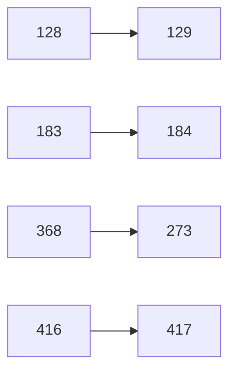

# Backlog triage — 2026-08-05

**Baseline:** green. `go test ./...`, `node --test scripts/triage/*.test.mjs` and `cd web && npm test` all reported green, with no unknown failures and no known-noise entries seen.

**Commit:** `36c3696633b4d2d4078df42175199e648d92fb89` (`main`).

**Coverage:** 50 open issues. 30 judged fresh this run, 20 reused from cache.

**Browser:** 9 candidates matched the browser filter; the cap is 4, so #414, #432, #433, #434 and #417 were skipped. All 4 that were attempted came back `BLOCKED` — the PR lab was not running, so nothing was rendered. The browser phase produced no evidence about the backlog this run.

**Impact distribution:** cosmetic 10, dataloss 3, degraded 11, none 26.

## Requires your decision

Listed by issue number, descending. These block before anything else does: a required config key found after a merge stops the container on the next deploy.

| Issue | Decision needed | Title |
|---|---|---|
| #409 | architecture | research(soulseek): sitter 16 MiB-taket på browse-svaret rätt, och vad gör andra klienter vid stora delningar? |
| #406 | architecture | feat: förstagångsinstallation i dashboarden istället för handredigerad config.toml |
| #395 | architecture, concurrency | feat(soulseek): hämta om gluetuns forwardade port under drift, inte bara vid uppstart |
| #382 | architecture | arch: målmodell — vertikala slices för HTTP-ytan, transport skild från publisher |
| #298 | architecture | chore(triage): cachen ser inte att en bedömnings allvar hänger på en tredje issues status |
| #278 | architecture, configKey | feat: run script before import |
| #273 | architecture | feat: Build a new view with unimported files |
| #267 | architecture | perf(ui): /jobs öppnar två EventSource-anslutningar vid montering |
| #199 | architecture | feat(ui): tangentbordsstyrning och hjälp-overlay för TUI:t |
| #184 | architecture, migration | feat: blockera användare |

## Confirmed still reproducing

**Empty — and this says nothing about the backlog.** No verdict came back `ISSUES_FOUND`, but that is not because the candidates passed: all four attempted verifications returned `BLOCKED` because the PR lab was not running, so no defect was ever driven in a browser. See *Not verified* below. A run where every candidate is blocked and a run where every candidate passes produce the same empty section here; this was the first kind.

## Waves

Order within each wave is `computeWaves`' own: highest-ranked first. Do not re-sort by issue number.

**Wave 1** (20) — `#186 #386 #215 #324 #367 #412 #267 #327 #395 #308 #414 #433 #154 #192 #293 #294 #299 #300 #391 #250`
**Wave 2** (9) — `#314 #409 #291 #368 #399 #106 #298 #420 #86`
**Wave 3** (3) — `#319 #432 #417`
**Wave 4** (2) — `#238 #434`
**Wave 5** (3) — `#317 #200 #199`
**Wave 6** (2) — `#318 #406`
**Wave 7** (1) — `#402`
**Wave 8** (2) — `#128 #273`
**Wave 9** (1) — `#180`
**Wave 10** (2) — `#184 #129`
**Wave 11** (1) — `#69`
**Wave 12** (1) — `#120`
**Wave 13** (1) — `#278`
**Wave 14** (1) — `#280`
**Wave 15** (1) — `#382`

**Why the later waves are thin.** Three issues report no `touches` at all — #402, #382, #69 — and an issue with no known file set conflicts with everything by design. Each carries 49 conflict edges, one to every other issue in the backlog, which alone pushes work down the wave list. Two of them (#402, #382) are genuinely file-less: a process decision about routing public bug reports, and an undecided architecture proposal. Giving them a `touches` set is not possible until they *are* decisions; re-judging #69 may collapse several of the tail waves into one.

## Blocking dependencies

`statedBlockers` edges only — "this issue said it requires that one first". Conflicts are a different relation and are reported as a count below, never drawn here.



**#416 is already closed**, so #417's stated blocker is stale — that dependency no longer holds and #417 is free to start. The other three stand: #368, #183 and #128 are all still open.

## Conflict density

**282 conflict edges** across 50 issues, from file overlap and shared contracts combined.

Issues driving the most, by descending edge count:

| Issue | Edges |
|---|---|
| #69 | 49 |
| #382 | 49 |
| #402 | 49 |
| #120 | 22 |
| #180 | 18 |

The top three are the empty-`touches` issues named above; their 49 edges each are an artefact of having no file set, not of genuinely touching everything. Excluding them leaves #120 and #180 as the real hubs.

## Full judgement

Lookup reference, listed by issue number descending. Rank order lives in Waves, not here. The sixth column is the judgement's **proposed** repro check, written before anything was driven — it is not a status.

| Issue | Kind | Impact | Effort | Evidence | Repro check | Touches |
|---|---|---|---|---|---|---|
| #434 | bug | cosmetic | S | web/src/strings.ts:234-235 hardcodes '[,] PREV' / 'NEXT [.]' as the shared t.pager labels; web/src/routes/Peers.tsx:205 mounts the same Pager but has no keydown handler anywhere in the file (only Jobs.tsx:308-327 binds ',' and '.' via goToPage). Verified: on /peers the button's accessible name falsely advertises a shortcut that does nothing. No behavior is wrong -- clicking still pages correctly -- this is purely a misleading label/accessible-name, which is the rubric's 'cosmetic' row verbatim ('every behaviour is correct; something the UI... says is wrong, misleading'). | Open /peers with enough peers to paginate, inspect the PREV/NEXT button accessible name or visible label, press '.' -- the label reads 'NEXT [.]' but the page does not change (no keydown listener in web/src/routes/Peers.tsx). | `web/src/strings.ts`<br>`web/src/components/tui/Pager.tsx`<br>`web/src/routes/Jobs.tsx`<br>`web/src/routes/Peers.tsx` |
| #433 | bug | cosmetic | S | web/src/routes/Peers.module.css:5 sets grid-template-columns: minmax(0, 1fr) 70px 56px 56px 90px with a 10px gap (line 6), and .row's padding is 7px 16px (Peers.module.css:39). Fixed tracks + 4 gaps + row left/right padding = 70+56+56+90+40+32 = 344px. Page.module.css:2 adds 24px page padding on each side, so at a 375px viewport the content column is roughly 375-48=327px wide, less than the 344px the non-PEER tracks alone demand — minmax(0,1fr) is forced toward 0 and the PEER column (holding the only identifying data, the username) becomes illegible/overlapping. This is a pure CSS layout defect: the table still renders, sorts, paginates and expands correctly; no data is lost or corrupted and no backend behavior changes, so per the rubric ("every behaviour is correct; something the UI says/shows is wrong") this is cosmetic, not degraded. | Open /peers in a browser resized to 375px width and inspect the PEER column: usernames should be unreadable/collapsed and header labels should visually overlap ("PEEDCORE"); resize back to a desktop width and confirm the layout is normal and no horizontal overflow is introduced. | `web/src/routes/Peers.module.css` |
| #432 | bug | cosmetic | S | web/src/routes/Jobs.tsx:468-473 renders the pagination nav (result range + Pager) whenever hasData(phase) is true, with no totalPages>1 guard — unlike web/src/routes/Peers.tsx:202 which gates the identical UI on `totalPages > 1`. This only affects a purely visual element (an inert single-page-button pager); no data, request, or state is affected. | Open the Jobs view with a filter that yields <= JOBS_PAGE_SIZE results and confirm the pagination nav (result range + single-page-button Pager) still renders, versus the Peers view with <= PEERS_PAGE_SIZE results where the pager is correctly suppressed (web/src/routes/Peers.tsx:202). | `web/src/routes/Jobs.tsx`<br>`web/src/routes/Jobs.test.tsx` |
| #420 | bug | none | M | Confined entirely to testenv/, the local PR-verification lab (per CLAUDE.md: "The local PR lab is the substitute for staging" — explicitly not production). The stale-serving bug lives in testenv/lab.sh:66 (up() calls `compose up --detach --build --force-recreate slskd slusk` unguarded under `set -eu`, then testenv/wait_ready.py:29 polls only /healthz for liveness); if that build step fails, the script aborts via set -eu before recreating containers, leaving whatever slusk container was already running from a prior successful up/reset still serving old code, and wait_ready.py has no build/version identity check to catch that. This never touches the deployed canary or a promoted instance, so it has zero effect on the running production instance. | Run ./testenv/lab.sh up once to get a healthy lab, then introduce a build error in the checkout and run ./testenv/lab.sh up again — the script exits nonzero via set -eu while the previously running slusk container keeps answering GET http://127.0.0.1:9090/healthz with 200, serving the old binary. | `testenv/lab.sh`<br>`testenv/wait_ready.py`<br>`testenv/compose.yml` |
| #417 | bug | cosmetic | M | internal/observ/observ.go:73-77 declares Queued/Stalled on StatusReport; cmd/slusk/main.go:281-289 statusFn only sets Active and Parked, so Queued/Stalled always serialize as 0. web/src/routes/Health.tsx:40-41 renders status?.queued and status?.stalled directly into the Health page. Every backend behaviour is still correct (pipeline logic untouched) — this is purely a wrong/stale number displayed on a monitoring page. Per the rubric's clarification ("outcome means what the system does, not what a human might do in response"), a defect that only misinforms a reader is cosmetic; nothing in the system itself behaves worse as a result. | GET /status while jobs exist in queued/stalled transfer states; queued and stalled fields will read 0 regardless of actual pipeline state. | `internal/observ/observ.go`<br>`cmd/slusk/main.go`<br>`internal/store/dashboard_jobs.go`<br>`web/src/api/types.ts`<br>`web/src/routes/Health.tsx`<br>`web/src/strings.ts` |
| #414 | bug | cosmetic | S | web/src/strings.ts:67 holds the string "slusk validates the config you already wrote — it never writes it", rendered as the Setup page subtitle at web/src/routes/Setup.tsx:106 and :118. It is factually wrong: internal/config/write.go:155 defines ApplySettings, which writes config, and it is wired at cmd/slusk/main.go:510. Purely a misleading UI string on a page that doesn't itself write config — no functional or data-safety consequence. | Open the Setup page in the running UI and compare its subtitle text against the Config view, which can write config via ApplySettings. | `web/src/strings.ts` |
| #412 | bug | degraded | S | config.example.toml's slskd option block (the '--- Option: the slskd backend instead of the native client ---' comment) tells the user the [soulseek] section 'becomes optional... but see the note above it: shares, private messaging and uploads still need it' and never says slskd needs its OWN, separate Soulseek login. docker-compose.example.yml's matching slskd option block repeats the same omission (its note says [soulseek] is 'still worth configuring under this backend' with no account-separation warning). cmd/slusk/main.go:185-206 and the comment at main.go:538-539 confirm the native soulClient is wired up independently of pipeline.backend — a slskd-download + native-share configuration is explicitly supported — and internal/soulseek/client.go:593-663 shows the native client auto-reconnects with exponential backoff after any disconnect, including a same-account login kick from a separately configured slskd instance (slskd's own login lives entirely outside slusk's config.toml, e.g. testenv/compose.yml:57-58's SLSKD_SLSK_USERNAME/PASSWORD). If a self-hoster follows the example files' recommendation and reuses one Soulseek account for both, the two processes repeatedly kick each other off the single allowed session: shares/uploads/messaging become unreliable and, in the worst case, slskd's own search/download session gets bounced too. That is 'works, but measurably worse: wasted work, repeated retries' (degraded), not outage, since slskd's search path is not permanently broken by this. CLAUDE.md and testenv/README.md already show the project knows the two-account requirement is real (the lab configures two distinct accounts, testenv/README.md:16-27), but that knowledge was never carried into the production-facing config.example.toml / docker-compose.example.yml. | grep config.example.toml and docker-compose.example.yml's slskd option blocks for any mention of separate account or two accounts near the [soulseek]/[slskd] guidance — currently absent in both files, while testenv/README.md and CLAUDE.md already state the two-account requirement for the lab. | `config.example.toml`<br>`docker-compose.example.yml` |
| #409 | bug | degraded | M | internal/soulseek/soul/peer/sharedfileistresponse.go:18 uses the same maxSharedFileListDecompressedSize (16 MiB) constant on both the outgoing Serialize path (line 90) and the incoming Deserialize path (line 238). Because it is applied symmetrically to slusk's own outgoing share, internal/soulseek/shares.go:662-673 turns any library beyond roughly 170,000 files into a permanent ErrShareTooLarge and disables sharing entirely for that user ('sharing is disabled until fewer files are shared', shares.go:670-672) -- a real, currently-shipping feature (publishing a share) breaks for large libraries, even though nothing in the protocol or in Nicotine+/Soulseek.NET imposes any such outbound cap (per docs/research/2026-08-03-shared-file-list-size-limits.md). | Build a share with more than ~170,000 files so the uncompressed payload exceeds 16 MiB; confirm scanShares still returns ErrShareTooLarge, i.e. that the outbound path is still capped at the same 16 MiB as the inbound decode path. | `internal/soulseek/soul/peer/sharedfileistresponse.go`<br>`internal/soulseek/soul/peer/sharedfileistresponse_test.go`<br>`internal/soulseek/shares.go` |
| #406 | feature | none | L | Pure feature request for a new pre-database setup wizard; nothing in the running instance changes as a result of this issue existing. Confirmed by reading the code it points at: internal/config/write.go (748 lines) already implements ApplySettings/TOML write machinery for the *post-login* settings view, and internal/store/users.go:1-33 plus internal/store/migrations/0011_users_and_sessions.sql already implement a first-user bootstrap flow (issue #279) that assumes Postgres is already up. web/src/routes/Setup.tsx (189 lines) already exists and is exactly that post-DB first-account flow, confirming the previous triage comment's point that the name 'Setup' is taken. None of this touches or degrades any currently running code path. | — | `cmd/slusk/main.go`<br>`internal/config/write.go`<br>`internal/observ/config.go`<br>`internal/store/users.go`<br>`web/src/routes/Setup.tsx`<br>`web/src/strings.ts`<br>`config.example.toml`<br>`docker-compose.example.yml` |
| #402 | feature | none | S | This is a process/decision-point issue about routing bug reports from the public GitHub mirror (github.com/hyzr-dev/slusk) into the private Gitea tracker. No code implements or is implicated by any of the three proposed options today — there is no ISSUE_TEMPLATE, no mirror-sync workflow, and no GitHub webhook config anywhere in the repo (confirmed: find for *ISSUE_TEMPLATE*/*CONTRIBUTING* returns nothing, and grep for "mirror" across .gitea/workflows/ only turns up promote.yml's release-announcement step, unrelated to bug-report routing). Nothing in the running slusk instance is affected either way. | — | — |
| #399 | techdebt | none | S | go.mod:1 declares `module github.com/hyzr-dev/slusk` with no /v2 suffix, and .gitea/workflows/deploy.yml builds/publishes the running canary from a Docker image (tag-triggered), never via `go install` — README.md's current "Building from source" section (lines 323-330) only documents `make build`. The module-proxy versioning gap cannot affect the deployed instance; it only misleads an external user who runs `go install github.com/hyzr-dev/slusk/cmd/slusk@latest` outside this repo's own tooling. | go install github.com/hyzr-dev/slusk/cmd/slusk@latest; the installed binary reports v1.59.2 instead of the current v2.x tag, because the module proxy ignores v2+ tags without a /v2 path suffix | `README.md` |
| #395 | feature | degraded | L | internal/soulseek/client.go:710-720 (trySetup) fetches the gluetun forwarded port exactly once, only from retryStartup at process start; c.listenPort (client.go:604, read at client.go:855 in SetListenPort) is never re-fetched or re-advertised afterward. When gluetun rotates the forwarded port, slusk keeps listening on and advertising the stale port, so peers must fall back to indirect (server-relayed) connections instead of direct ones -- a functioning-but-worse state, with no log line anywhere in the file marking the divergence. README.md:226-228 already documents this exact limitation and names 'restart slusk' as the only recovery, confirming it is real and current, not speculative. | Run slusk behind gluetun with port forwarding configured, let it bind and advertise the forwarded port, then trigger gluetun to rotate the forwarded port without restarting slusk; confirm slusk keeps listening/advertising the old port and logs nothing about the change. | `internal/soulseek/client.go`<br>`internal/soulseek/listener.go`<br>`README.md` |
| #391 | feature | none | S | Feature request, not a defect: web/src/components/chrome/TopBar.tsx renders correctly today and nothing in the running instance behaves incorrectly as a result of the missing link. The gap is legal/compliance (AGPL §13 offer-of-source), not a runtime effect — docs/adr/0002-agpl-3.0-license.md itself states 'Nothing in the UI does that yet' as a stated consequence of the license choice, not a bug in existing code. | — | `web/src/components/chrome/TopBar.tsx`<br>`web/src/components/chrome/TopBar.test.tsx` |
| #386 | bug | dataloss | M | internal/soulseek/fileconn.go:170-176 (streamFile writes the resume offset then os.OpenFile's the .part file, with no ctx check in between) races internal/soulseek/downloads.go:702-718 (Remove cancels the transfer, deregisters it via c.downloads.remove(tr), then calls os.Remove(partPath) once). If OpenFile runs after Remove's os.Remove, it recreates partPath after Remove already reported success and deregistered the transfer; grepping `.part` across internal/soulseek and internal/pipeline shows nothing ever revisits or cleans up a .part file for a deregistered id, so the recreated file is permanently stranded on disk -- the dataloss row's own wording ("files left behind that nothing will ever clean up"). | Add a -race unit test that pauses streamFile (via a test hook/sleep) between the Offset write and os.OpenFile while Remove runs concurrently, then assert no .part file exists on disk after Remove returns and after the paused goroutine resumes. | `internal/soulseek/downloads.go`<br>`internal/soulseek/fileconn.go` |
| #382 | techdebt | none | L | Pure architectural proposal, not yet decided (issue body: "Inget beslut fattat"). Confirmed internal/observ/observ.go:375-539 does hold a 60+-field ServerDeps struct of mostly function closures, matching the claim, but the issue only documents the problem and lists three considered approaches (A/B/C) with four open questions — no code change is proposed or requested yet, so nothing here can affect the running instance. | — | — |
| #368 | feature | cosmetic | S | No data is lost or behaves worse: internal/observ/observ.go:997 and internal/store/dashboard.go's validateDashboardJobsQuery (switch on q.Filter, case list ending 'failures') both reject filter=notImported with a 400 (correct rejection, just missing a value), and internal/store/dashboard.go:590-609 computes DashboardStatusFacets without a NotImported field/COUNT(*) FILTER, so the chip row (web/src/routes/Jobs.tsx:46 CHIP_ORDER) omits notImported while Facets.Status.All still includes those jobs. Every value returned is correct; the UI just fails to expose one status, matching the cosmetic row ('something the UI says is wrong or misleading') rather than degraded — nothing retries, nothing queries slower, and no observability that hides a genuine backend failure is lost (the underlying job and its NOT_IMPORTED state remain fully queryable elsewhere, e.g. the job detail view and the DB). | GET /api/jobs?filter=notImported returns 400 'invalid filter' (internal/observ/observ.go:997); on the Jobs page, sum the seven status chip counts against the ALL total when a NOT_IMPORTED job exists — they will not match. | `internal/store/dashboard.go`<br>`internal/observ/observ.go`<br>`web/src/api/types.ts`<br>`web/src/routes/Jobs.tsx`<br>`web/src/routes/Jobs.test.tsx`<br>`internal/store/dashboard_test.go` |
| #367 | techdebt | degraded | S | web/src/api/queries.ts:1010 sets refetchInterval: THREAD_INTERVAL (3000ms, defined line 113) on useThread's useInfiniteQuery. TanStack Query v5 refetches every already-fetched page of an infinite query on each interval tick, not just the first, so once a user has clicked "load older" several times in a chat thread, every 3s tick issues one GET per loaded page (queryFn at line 1003) instead of one — real wasted request volume against the peer/server that scales with how far back the user has scrolled. That is exactly the 'degraded' row's "wasted work, repeated retries... under real load." | Open a chat thread in the SPA, click "load older" 4-5 times to load multiple pages, then watch the Network tab: every ~3s a full round of requests fires (one per loaded page) instead of a single request. | `web/src/api/queries.ts` |
| #327 | bug | degraded | M | internal/matcher/normalize.go:103 (yearRe `^(19\|20)\d{2}$`) and :174 (isNoise's yearRe branch) classify a purely-numeric album title like "1984"/"1989"/"1999" as noise; relevance.go:138-142 then finds titleTokens empty and returns Match:true via SourceNoData unconditionally, i.e. the #316 relevance gate is silently disabled for these albums. This is locked in as expected/current behavior by the existing test at internal/matcher/relevance_test.go:298 ("purely numeric title fails open via SourceNoData"). Effect: CheckRelevance accepts any wrong-album candidate whose path happens to satisfy Soulseek's token-AND search for a numerically-titled album - wasted downloads / possible wrong imports, not a stalled pipeline or destroyed data, so degraded rather than dataloss. | go test ./internal/matcher/ -run TestCheckRelevance -v (already green today, confirming the fail-open case at internal/matcher/relevance_test.go:298); or call matcher.CheckRelevance with AlbumTitle:"1984" and Files from an unrelated directory and observe Match:true, Source:SourceNoData. | `internal/matcher/normalize.go`<br>`internal/matcher/relevance.go`<br>`internal/matcher/relevance_test.go` |
| #324 | bug | degraded | S | internal/soulseek/shares.go:1057-1069 (matchesShareSearch) and shares.go:1071-1143 (shareSnapshot.match) never consult c.excludedPhrases, so respondToSearch (shares.go:870-929) serves peer.File results whose paths contain the server's pushed excluded-search-phrase list (client.go:301-307 documents the list exists so "well-behaved peers never answer a search whose terms cover one of these phrases" — slusk answers anyway with matching files). Confirmed the outgoing-query filter (search.go:237, matchExcludedPhrase at search.go:503-524) uses token-set semantics and only guards queries slusk sends, not files slusk returns to others' searches — no code path filters response files at all. This doesn't stall the pipeline or lose data, but it is a real, continuous protocol-etiquette violation each time another peer searches and matches an excluded file, with plausible risk to the account's standing on the network; not "cosmetic" since the actual bytes sent over the wire are wrong, not just a log/UI string. | Push a server excluded-search-phrase list that covers a token present in a locally shared file's virtual path, have another test peer send a query that matches that file, and check whether shareSnapshot().match(...) still returns that file in results — it will, since matchesShareSearch never checks c.excludedPhrases. | `internal/soulseek/shares.go` |
| #319 | bug | degraded | S | internal/pipeline/discovery.go:291-352 — when Peers.Search returns 0 raw results, Discovery already retries with a normalized query and (past a threshold) a token-dropped rewrite (mitigation shipped for #334), but when all attempts still return zero it records `searched album, query=%q results=0 candidates=0` (line 349) and the job can end FAILED with that same string surfaced in the FAILED JOBS panel (per issue body, post-#310). That message is indistinguishable from a genuine no-peer-has-it outcome even though the issue's own measurements show some zeros are network-level filtering of specific word combinations, not absence — "missing observability that hides a genuine failure" per the rubric. | — | `internal/pipeline/discovery.go`<br>`internal/store/dashboard.go` |
| #318 | bug | cosmetic | S | internal/pipeline/backoff.go:76 (recordBackoffEvent) hardcodes detail="" for every job_failed event written via failOrBackoff (called at backoff.go:57). This is purely an audit-trail/UI gap: internal/store/dashboard.go:799-818 (LatestFailureDetails) already has a documented fallback (comment at dashboard.go:790-798, added for #310) that falls back to the newest non-empty-detail event of any kind when job_failed itself has none. No pipeline state, retry logic, or job outcome is affected -- only how informative the FAILED JOBS panel's reason text is. | Trigger a job to exhaust retries and fail, then SELECT detail FROM job_events WHERE event='job_failed' ORDER BY id DESC LIMIT 5; detail is empty string for every row. | `internal/pipeline/backoff.go`<br>`internal/pipeline/backoff_test.go` |
| #317 | bug | degraded | M | internal/pipeline/discovery.go:393-397 documents that no cross-cycle rejection filter exists; internal/store/pipeline.go:190-196 (ResetJobToWanted) deletes all candidates/transfers on every WANTED reset; internal/pipeline/selecting.go:216-222 calls failOrBackoff(resetToWanted=true) when candidates are exhausted. Since Soulseek search results are deterministic for a fixed query, the next cycle re-caches and re-downloads the same already-failed candidate, wasting up to MaxRetries x candidate-count full downloads before the job fails. No data loss (rejected files are cleaned up in Importing.failCandidate for non-manual jobs) and no outage (job still eventually fails/succeeds per normal retry accounting) -- purely wasted bandwidth/time, so degraded not dataloss/outage. | Seed a job whose only Soulseek search result is a candidate that Lidarr will reject on import, let it run through IMPORTING->SELECTING->exhausted->WANTED->Discovery again, and confirm the same (username, release_directory) candidate is re-downloaded rather than filtered out. | `internal/store/pipeline.go`<br>`internal/pipeline/discovery.go`<br>`internal/pipeline/selecting.go`<br>`internal/pipeline/importing.go`<br>`internal/core/types.go` |
| #314 | techdebt | dataloss | L | internal/pipeline/paths.go:47-51 (cleanupFolder) and :95-99 (cleanupCompletedFolder) both call commonLeaf(filenames) and silently `return` with zero logging when it yields "" (paths.go:236-238 returns "" for len(filenames)==0). The DONE-job path that hits this with zero transfer rows is measured in production (issue comment, 2026-07-30): 77 of 3004 DONE jobs in a 30-day window. Confirmed also structurally: internal/store/pipeline.go:190-196 ResetJobToWanted deletes candidates/transfers on every non-terminal retry, so any job that retries more than once can only ever have its last search cycle's folders derived - earlier cycles' folders become permanently unreachable by any cleanup path in the codebase. This matches the dataloss row's own wording: "files left behind that nothing will ever clean up." | Run the production SQL from the 2026-07-30 issue comment against the live DB (or an equivalent testenv query): jobs whose successful candidate has zero transfers rows fall into the silent branch of commonLeaf/cleanupFolder with no log line and no job_event - grep internal/pipeline/paths.go:47-51 confirms no logging occurs on the leaf=="" return. | `internal/store/migrations/0014_job_download_folders.sql`<br>`internal/store/pipeline.go`<br>`internal/pipeline/paths.go`<br>`internal/pipeline/selecting.go`<br>`internal/pipeline/downloading.go`<br>`internal/pipeline/importing.go` |
| #308 | feature | cosmetic | S | No functional behavior changes for any user of the app; only what a screen reader announces for activatable rows is affected. Confirmed at web/src/routes/Overview.tsx:290-294 (transfer rows), :339-343 (finished rows), and :379-383 (failed rows): each is `role="row"` with `tabIndex={0}` and an onKeyDown handler, but no `aria-roledescription`, button role, or other marker distinguishing it from a plain non-interactive table row. Keyboard operability itself (added in #292) is intact and unaffected. | Open Overview in a screen reader, tab to a transfer/finished/failed row, and confirm it is announced only as row, with no indication it is activatable via Enter/Space. | `web/src/routes/Overview.tsx` |
| #300 | techdebt | none | S | The affected code is the backlog-triage dev tool itself (.claude/workflows/backlog-triage.js:279), not the slusk application shipped to production — running it cannot affect the deployed canary or any user instance. Confirmed the filter `.filter(j => j?.frontend && j?.reproCheck && j?.kind !== 'feature')` (line 279) checks kind !== 'feature' but has no corresponding kind !== 'test' check, so a test-kind issue with frontend:true and a reproCheck set would wrongly enter the browser-verification candidate pool and, under BROWSER_CAP (4 per run, line ~287), could displace a genuinely browser-verifiable issue. | Read the browser-phase filter predicate and confirm it omits kind !== 'test'; to see it manifest, run the triage workflow against a backlog containing a test-kind issue with frontend true and a non-null reproCheck and confirm it appears in the browser-phase candidate list. | `.claude/workflows/backlog-triage.js` |
| #299 | bug | none | S | scripts/triage/waves.mjs is the backlog-triage CLI tool (a dev-tooling script), not code that ships in the built binary or runs against the production slusk instance — internal/store and internal/pipeline (listed in the distilled issue's paths) are not actually touched by this bug. Confirmed the defect itself at scripts/triage/waves.mjs:66-90: contractsTouched() (line 76 `.map(c => c.name)`) discards which side matched, and conflicts() (line 88-89) intersects by contract name only, so two issues on the same side of a contract (e.g. both touching different files under internal/config/, contract 'config' at waves.test.mjs:82) are wrongly flagged as conflicting. waves.test.mjs has a test for opposite-sides conflicting (line 95-100) but none for same-side non-conflict, confirming the gap is untested. | Add a test case with two issues touching different files on the same side of a contract and assert conflicts(a, b, CONTRACTS) is false. Run node --test scripts/triage/waves.test.mjs — it currently returns true, confirming the bug still reproduces. | `scripts/triage/waves.mjs`<br>`scripts/triage/waves.test.mjs` |
| #298 | techdebt | none | M | scripts/triage/waves.mjs and docs/triage/state.json are dev tooling for the backlog-triage skill, wired only into the Makefile test target (`node --test scripts/triage/*.test.mjs`, Makefile:15) — grep confirms no cmd/ or internal/ path references "triage" at all, so this cache-invalidation gap cannot affect the running slusk instance; it only degrades the trustworthiness of a maintainer-facing triage report. (The distillation's third path, internal/store/candidates.go, is unrelated to this issue — read in full, it's the pipeline candidates persistence layer; the issue body itself cites only scripts/triage/waves.mjs's invalidate() and docs/triage/state.json.) | — | `scripts/triage/waves.mjs`<br>`scripts/triage/waves.test.mjs`<br>`.claude/skills/backlog-triage/SKILL.md` |
| #294 | techdebt | none | S | internal/store/candidates.go:57-61 is a real invariant violation (see internal/store/pipeline.go:140-155 and 164-168, which document "every transition UPDATE must be conditional" for this table), and it is reachable, not just theoretical: CancelJobsNotWanted (internal/store/pipeline.go, invoked from WantedSync at internal/pipeline/wanted.go) can move a WANTED job to CANCELLED concurrently with Discovery's InsertCandidates call at internal/pipeline/discovery.go:490. When that race lands, InsertCandidates still resets retries/empty_searches/not_before/updated_at on the now-CANCELLED row. But CANCELLED is terminal and excluded from the dashboard's job list query (internal/store/dashboard.go:261: `WHERE j.state != $1` bound to StateCancelled) and from RunnableJobsInState, so the clobbered fields are never read again by anything - no retry, no re-display, no re-processing. Real guard omission, no reachable production consequence given today's callers/queries. | go test ./internal/store/ -run TestInsertCandidates -v (currently passes without a state guard; add a case that forces a job to DONE/CANCELLED then calls InsertCandidates and asserts retries/not_before/updated_at are unchanged — it fails against the current unconditional UPDATE) | `internal/store/candidates.go`<br>`internal/store/candidates_test.go` |
| #293 | test | none | S | cmd/slusk/main.go:295-343 (pagedJobsFn/bulkRetryFn) maps every field of PagedJobsQuery to store.DashboardJobsQuery correctly today, and no test file in cmd/slusk (checked main_test.go et al.) exercises this closure — internal/observ/observ_test.go mocks PagedJobs away (e.g. line 337) and internal/store/dashboard_test.go constructs DashboardJobsQuery directly, never through this mapping. As the code stands the mapping is correct, so there is no current runtime defect — the risk is a future field-dropping regression going undetected, which is a test-coverage gap, not an active production effect. | — | `cmd/slusk/main.go`<br>`cmd/slusk/main_test.go` |
| #291 | bug | cosmetic | S | web/src/api/queries.ts:487 (useJobs) unconditionally applies replaceLiveJobPage to every page regardless of params.filter, and web/src/routes/Overview.tsx:125-128,346 feeds that into the RECENTLY FINISHED panel's <Tag status={job.status} bare /> — confirmed still present on origin/main. Effect is a transient, self-healing UI mislabel (wrong status tag + slightly stale age column) for up to LIVE_JOB_FRESH_MS=10s (web/src/api/queries.ts:122) on a row that has already completed correctly server-side; no data is lost or corrupted and the job's actual persisted state is unaffected. | In the browser, watch the Overview RECENTLY FINISHED panel immediately after a job transitions to a terminal state and check within ~10s whether the row briefly shows an ACTIVE/DL tag and a pre-completion age. The issue's own last verification comment found this was never actually caught in 3 browser attempts (earliest observed row was 22s post-transition), so a direct unit test on replaceLiveJobPage/useJobs (per the issue's acceptance criteria) is the reliable way to verify, not further browser polling. | `web/src/api/queries.ts`<br>`web/src/routes/Overview.tsx` |
| #280 | feature | none | L | Nothing in internal/lidarr/client.go (read in full, all exported methods) calls a Lidarr logs endpoint, and no code under internal/lidarr or internal/pipeline/importing.go detects an "already exists" rejection reason today — this asks for functionality that does not exist yet, so it has no effect on the running instance as the code stands. | — | `internal/lidarr/client.go`<br>`internal/pipeline/importing.go` |
| #278 | feature | none | L | No production impact: this is a feature request for a not-yet-existing capability. Confirmed via grep -rn "exec.Command\|os/exec" internal/ returning zero matches — no script-execution mechanism exists anywhere in the codebase today, so nothing in production can be affected by its absence. | — | `internal/pipeline/importing.go`<br>`internal/config/config.go`<br>`config.example.toml` |
| #273 | feature | none | L | Feature request only, no defect in running code. Backend already tracks NOT_IMPORTED jobs and reasons (internal/app/jobs.go:166 references core.StateNotImported; internal/store/dashboard.go and internal/observ/observ.go already surface NOT_IMPORTED); this issue asks for a new frontend view, not a fix to existing behaviour. | — | `web/src/api/types.ts`<br>`web/src/components/JobActions.tsx`<br>`web/src/strings.ts` |
| #267 | techdebt | degraded | M | web/src/api/stream.tsx:257-336 — mounting /jobs via client-side navigation opens an unscoped EventSource first (jobsScope still undefined on first commit), then a scoped one once useJobScope's child effect runs; each source.onopen (line 329) fires invalidateQueries on queryKeys.jobs and queryKeys.charts (extra REST round trips), and each open triggers internal/observ/stream.go:1050 refreshCorrelation server-side (three DB queries per open, per doc comment at stream.tsx:38-45/235-255). Confirmed by browser verification in the issue's 2026-07-30 comment: three GET /api/stream calls on client nav to /jobs vs one on a direct page load. Bounded per-navigation waste, not unbounded growth or data loss — fits 'degraded' (wasted work, repeated REST/DB calls) not 'dataloss' or 'outage'. | In the PR lab, load `/` then click into the `jobs` nav link (client-side navigation, not a direct URL load) and watch the network tab for /api/stream — expect two or three GET /api/stream requests in quick succession (one unscoped ?jobs=, then a scoped ?jobs=1,2,5 request), with the first aborted. | `web/src/api/stream.tsx`<br>`web/src/routes/Jobs.tsx` |
| #250 | test | none | M | The defect is confined to a test harness sequencing issue in internal/soulseek/connectpeer_test.go (startConnectedClient, lines ~124-161) and internal/soulseek/client_test.go (drainInitialTreeAdvertisements, ~207-226); the only production code involved is the generation-mismatch check at internal/soulseek/client.go:528-531, which reports a real but downstream symptom of the fake server closing its connection early, not a defect in production behavior. No runtime path of the deployed binary is affected — this only fails inside the Gitea act_runner CI container, never locally, and is already carried as a documented exemption in CLAUDE.md line 384's Known noise table. | Run `go test -v ./internal/soulseek/ -run TestConnectPeerIndirectSuccess` inside the Gitea act_runner container (docker.gitea.com/runner-images:ubuntu-latest) and check whether the fake server's t.Logf lines from its startup drain sequence (drainLoginRequest / SetListenPort frame / the six-step drainInitialTreeAdvertisements) surface a diverging step — this cannot be checked locally; 50 local runs including 20 under CPU load have never reproduced it. | `internal/soulseek/connectpeer_test.go`<br>`internal/soulseek/client_test.go` |
| #238 | bug | degraded | M | cmd/slusk/main.go:666-680 — sendMessageFn is only assigned inside `if soulClient != nil`; when pipeline.backend=slskd, soulClient is nil so sendMessageFn stays nil, and observ.go:525-527's own doc comment confirms Send==nil makes POST /api/messages/{username} answer 503. There is no slskd-side compensating path: internal/slskd/client.go has no messaging method at all (only Enqueue/ListDownloads/Cancel/Remove/DeleteDownloadFolder/Search*), and the only code that calls store.RecordIncomingMessage is internal/soulseek/messages.go:208 via the native client's MessageSink — nothing in internal/slskd or cmd/slusk/main.go feeds incoming messages into the store for the slskd backend. So on a slskd-backend instance the whole messaging feature is silently non-functional (clean 503 on send, incoming messages never recorded) while the rest of the pipeline runs unaffected — degraded, not outage/dataloss, since the 503 path is deliberate/handled and nothing crashes or corrupts data. | Run with pipeline.backend=slskd; POST /api/messages/{username} returns 503 (cmd/slusk/main.go:666-680 leaves Send nil). Have another Soulseek client message the slskd account and confirm no row appears via GET /api/messages (internal/slskd/client.go has no message-receiving code path). | `cmd/slusk/main.go`<br>`internal/slskd/client.go`<br>`internal/pipeline/ports.go`<br>`internal/store/messages.go` |
| #215 | bug | degraded | S | web/src/styles/global.css:8 locks both scroll axes (`html, body { overflow: hidden }`); web/src/components/Layout.module.css:12 gives `.main` only `overflow-y: auto`, no horizontal counterpart. Any view whose fixed-width columns exceed the viewport (issue's own measurements, e.g. routes/Jobs.module.css:35's fixed column widths totalling ~494px) renders content that cannot be reached by any scroll gesture -- not merely clipped, genuinely unreachable. routes/Overview.module.css:236-249 already documents dropping a data column (PEER) at 375px specifically because of this bug, citing issue #215 by number in the comment. | Open the dashboard, narrow the window to ~375-600px, go to Jobs, and try to horizontally scroll to reach the clipped right-hand columns — currently impossible because html/body overflow hidden blocks the axis. | `web/src/components/Layout.module.css`<br>`web/src/styles/global.css` |
| #200 | feature | none | M | No production impact: this is a pure UX/observability gap, not a defect in running behavior. internal/observ/observ.go's GET /status handler (built starting line 604) only ever emits moduleDetails keyed by pipeline module name; web/src/routes/Health.tsx lines 24-27 explicitly document there is no dependency-health data source yet. Nothing crashes, no data is lost, no request degrades — the dashboard just shows an inferred (and admittedly misleading) proxy for dependency health instead of the real thing. | — | `internal/observ/observ.go`<br>`internal/observ/observ_test.go`<br>`web/src/routes/Health.tsx`<br>`web/src/routes/Health.module.css`<br>`web/src/api/queries.ts`<br>`web/src/strings.ts` |
| #199 | feature | none | L | Pure feature request with no current defect: no keyboard infrastructure exists today (web/src/hooks/useKeyboard.ts and a HelpOverlay component do not exist in the tree), the only keyboard handling anywhere is the ad-hoc `,`/`.` pagination in web/src/routes/Jobs.tsx:315-326, and CLAUDE.md:338 explicitly classifies keyboard operability as "nice-to-have... not a gate." Nothing in production behaves incorrectly as a result of this gap. | — | `web/src/hooks/useKeyboard.ts`<br>`web/src/chrome/HelpOverlay.tsx`<br>`web/src/chrome/Layout.tsx`<br>`web/src/routes/Jobs.tsx` |
| #192 | bug | none | S | testenv/compose.yml only (local PR lab, not production); the affected dependency is testenv/compose.yml:105-106 (slusk depends on lidarr with condition: service_started, no healthcheck defined for lidarr) versus the working pattern at testenv/compose.yml:101-102 (postgres uses service_healthy). Nothing here runs against the production canary. | ./testenv/lab.sh reset then ./testenv/lab.sh logs slusk — expect a connection refused ERROR from the first wanted_sync tick against Lidarr before it recovers on the next 15s tick | `testenv/compose.yml` |
| #186 | techdebt | dataloss | M | internal/store/messages.go:68-83 (RecordIncomingMessage) persists every accepted incoming message with no per-peer or total-row cap; internal/store/migrations/0006_private_messages.sql:7-11 explicitly documents that pruning is intentionally absent. internal/soulseek/messages.go:34 and :55 only bound single-message size (64 KiB) and in-flight queue depth (256), not total stored volume — any Soulseek peer can drive unbounded row growth in private_messages, and nothing in the code today stops or later cleans that up. | Have a Soulseek peer send many private messages to the running instance in a loop and confirm SELECT count(*) FROM private_messages climbs without bound while no code path deletes or caps rows. | `internal/store/messages.go`<br>`internal/store/migrations/0006_private_messages.sql`<br>`internal/soulseek/messages.go` |
| #184 | feature | none | M | Pure feature request with zero code impact on the running production instance — no blocking or ignore-list code exists anywhere in internal/soulseek, internal/store, or internal/config today, so there is nothing to regress. Verified the incoming-message dispatch at internal/soulseek/client.go:1083 (case server.CodeMessageUser) has no filtering hook, and internal/store/migrations/ has no block/ignore table (highest migration is 0013_add_album_mbid.sql). | — | `internal/soulseek/client.go`<br>`internal/soulseek/messages.go`<br>`internal/store/migrations/0014_block_list.sql`<br>`internal/store/messages.go`<br>`internal/observ/messages.go`<br>`internal/config/config.go`<br>`config.example.toml` |
| #180 | feature | none | M | No such endpoint or kick mechanism exists anywhere in the tree today (grep for reconcile/kick in internal/pipeline and internal/observ turns up only unrelated reconcile() methods in internal/pipeline/downloading_test.go). WantedSync.Tick (internal/pipeline/wanted.go:104) only runs on Runner's fixed ticker (internal/pipeline/runner.go:130-137); there is no way to trigger it early and no code path this issue would change is live in production, so there is nothing running today for it to degrade. | — | `internal/pipeline/wanted.go`<br>`internal/observ/observ.go`<br>`internal/observ/auth_test.go` |
| #154 | feature | cosmetic | M | No system-level misbehavior: web/src/routes/Settings.tsx:1222 gates the Save button only on `update.isPending` (the initial mutation), not on `restarting`, and the connection-test button at line 1262 isn't gated on `restarting` at all, so a user can click Save or Test Connection while the backend is mid-restart and get a failed request/'unreachable' status. The restart-recovery poll (lines 664-680) also has no timeout and treats any successful GET /api/config as recovery without distinguishing an old vs. new process. All of this is client-side UX (spinner/disabled-state/timeout/refetch feedback) — it doesn't corrupt config, lose data, or wedge the pipeline; worst case is a confusing failed click or an indefinite 'restarting…' banner if the process never comes back, which is a UI-says-something-misleading defect, not the system behaving worse. | Open Settings, change a field and Save; while the 'Saved — restarting…' banner is visible (restarting poll running, lines 664-680), click Save again or click a connection-test button — both remain enabled and clickable instead of being disabled during the restart window. | `web/src/routes/Settings.tsx` |
| #129 | feature | none | S | Feature request for a missing UI capability (filter syntax box), not a defect. Verified web/src/routes/Search.tsx exists with search field, result cards, sort and format chips (from #58) but no filter-expression input, and internal/observ/observ.go:499-507 shows StartSearch/SearchSnapshot/SearchDelta/StopSearch already wired for /api/search — nothing in the running instance behaves incorrectly, there is simply no filter box yet. | — | `web/src/routes/Search.tsx`<br>`web/src/routes/SearchResultCard.tsx`<br>`internal/observ/observ.go` |
| #128 | feature | none | M | Pure feature request; no filter parser, result_filter config key, or filter-application code exists anywhere in the repo. internal/pipeline/discovery.go:449-455 shows the existing EventCandidateRejected pattern this would extend; internal/core/search.go:24-34 confirms attribute extraction (#58) is already complete. | — | `internal/config/config.go`<br>`internal/config/validate.go`<br>`internal/pipeline/discovery.go`<br>`internal/pipeline/selecting.go`<br>`internal/matcher/matcher.go`<br>`config.example.toml` |
| #120 | feature | none | L | Pure feature proposal with no code in the repo today: internal/soulseek/shares.go only builds and serves this instance's own outbound share index (scanShares at internal/soulseek/shares.go:452, respondToSearch at :870); there is no code path that browses a remote peer's shares or caches them, so nothing in production behaves differently until this is built. Two of the issue's own paths do not exist as named (cmd/sluskdarr/main.go — actual is cmd/slusk/main.go; internal/soulseek/soul/peer/sharedfilelistresponse.go — actual filename is sharedfileistresponse.go, missing an 'l'), reinforcing that this is greenfield work, not a fix to something already running. | — | `internal/pipeline/discovery.go`<br>`internal/pipeline/ports.go`<br>`internal/store/reliability.go`<br>`internal/soulseek/peers.go`<br>`internal/soulseek/search.go`<br>`internal/soulseek/shares.go`<br>`internal/soulseek/downloads.go`<br>`internal/soulseek/soul/peer/sharedfilelistrequest.go`<br>`internal/soulseek/soul/peer/sharedfileistresponse.go`<br>`internal/store/migrations/0015_peer_share_cache.sql`<br>`cmd/slusk/main.go`<br>`config.example.toml` |
| #106 | techdebt | none | M | internal/pipeline/downloading.go:266 (removeFromSlskd, invoked from resolve()) purges every settled transfer, and internal/pipeline/downloading.go:101 / internal/pipeline/downloading.go:104 (MaxActive/MaxInflightPerPeer) bound concurrent enqueues — the only caller today already provides the discipline internal/soulseek lacks internally. downloadRegistry never evicts on its own (no Remove() call in runDownload, internal/soulseek/downloads.go:841-900; Enqueue at internal/soulseek/downloads.go:582-609 relies entirely on the caller), and outgoing peerConns is incremented with no budget check before dialing (internal/soulseek/sessions.go:306), unlike the enforced inboundPeerLimit at internal/soulseek/client.go:198-200/421-422/480. None of this currently leaks or exhausts resources in production because pipeline is the sole caller and already disciplined. | — | `internal/soulseek/downloads.go`<br>`internal/soulseek/peers.go`<br>`internal/soulseek/sessions.go` |
| #86 | feature | none | L | Pure feature request — no defect in the running instance. web/src/strings.ts (1275 lines) already centralizes all UI strings but is not wired to any i18n library; this is a documentation/architecture proposal (phase-1 prep noted in the file's own header comment at web/src/strings.ts:1-2) with no behavioral change to production. | — | `web/src/strings.ts`<br>`web/src/components/tui/SectionHeader.tsx` |
| #69 | feature | none | L | Pure design proposal with zero runtime effect: `sdk/` does not exist in the repo (verified via find) and grep for "plugin" across internal/ and cmd/ returns no matches. Nothing in production is affected because nothing has been built — this is not code yet, just an architecture sketch. | — | — |

## Unassessed

None. Every judge agent returned a judgement — 65 agents, zero errors, zero empty results.

## Unassessable

None. Every judgement carried a recognised `prodImpact` and `effort`.

## Unschedulable

None. No `touches` entry named a directory this run — the failure mode that put `web/src/api` on issue 58 in the first run did not recur.

## Candidates to close

None. No browser verdict came back `PASS`, because none of the four attempted checks reached the app at all.

## Not verified (BLOCKED)

All four browser candidates. The same cause in every case: nothing was listening on the lab's port, and starting the lab is deliberately outside this capability — it logs into a real Soulseek account and only one instance can run at a time.

The command that would unblock all four:

```
./testenv/lab.sh up
```

- **#367** — Probed the lab backend as instructed: `curl -sf http://localhost:9090/status` failed with exit code 7 (connection refused, verified via `curl -sv` on both ::1 and 127.0.0.1 port 9090). Per the task's explicit instruction I did not start the lab (it logs into a real Soulseek account and only one instance can run). Since the backend is unreachable, I could not serve the frontend against it (SLUSK_DE
- **#291** — Probed the lab backend as instructed: `curl -sf http://localhost:9090/status` returned exit code 7 (connection failed). A verbose retry confirmed the root cause: `curl -sv http://localhost:9090/status` shows "Connection refused" on both the IPv6 (::1:9090) and IPv4 (127.0.0.1:9090) attempts — nothing is listening on port 9090. Per the task's explicit instruction, I did not start the lab myself (it
- **#267** — Could not reach the PR lab backend. `docker ps` shows no slusk/lidarr/slskd/postgres containers running, and `curl -sf http://localhost:9090/status` fails with "Connection refused" (verified via verbose curl: tried both ::1 and 127.0.0.1 on port 9090, both refused). Per instructions, the lab must not be started by this agent (it logs into a real Soulseek account, takes minutes, and only one lab ca
- **#215** — Probed the required lab backend with `curl -sf http://localhost:9090/status` and got exit code 7 (connection refused / not reachable) — no response at all. Per the task instructions, the lab must not be started (it logs into a real Soulseek account and takes minutes, only one instance can run), so no verification could proceed: the frontend was never served, no browser was opened, and the Jobs pag
