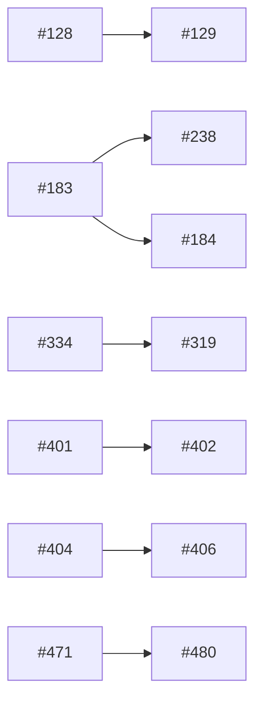

# Backlog triage — 2026-08-10

Baseline: **green** — `go test ./...`, `node --test scripts/triage/*.test.mjs` and `cd web && npm test` all passed, no unknown failures, no known-noise entries seen (#250 did not fire this run). Working tree carried one untracked file, `jobs-page.png`, unrelated to the run.

- Commit: `e0a7f89241557a087cc5bf303e2ca65021a43642`
- Open issues read: **36** (`tea issues --state open --limit 200`; 36 is not a page boundary, so no silent truncation)
- Judged this run: **36**. Reused from cache: **0**.
- Browser coverage: **1 of 1** eligible candidate verified (see *Confirmed still reproducing*). No cap was hit.

The cache in `docs/triage/state.json` (from `36c3696`, 2026-08-05) held 50 judgements, of which `invalidate` returned 7 as fresh. All 7 were re-judged anyway: they were written before #489 added `category`, `triageLabel`, `suggestedLabel` and `labelReason` to the judgement schema, and `args.cached` is trusted without validation — passing them through would have left the label column and the *Label suggestions* section empty for those issues with nothing to signal that it happened. This is a schema-drift invalidation axis the skill does not currently list alongside its three.

## Requires your decision

One issue carries a decision flag. No issue in this backlog flags a new required config key or a migration, so nothing here can stop a container from starting on the next deploy.

### #409 — architecture

internal/soulseek/soul/peer/sharedfileistresponse.go:18 sets maxSharedFileListDecompressedSize = 16<<20 and line 90 applies it via sharedFileListLimitWriter to slusk's own outgoing Serialize path, so a library over roughly 170,000 files fails to publish its browse response (ErrMessageTooLarge raised at sharedfileistresponse.go:41) -- a real, reproducible feature limitation for large libraries, not data loss or an outage.

The decision itself: PR #410's research pinpoints `maxSharedFileListDecompressedSize` but ends on four unendorsed options — split the constant into separate encode/decode bounds, raise the shared cap symmetrically, cap what a share may publish instead, or change error-vs-silent-skip on inbound overflow. Nothing can be implemented until you pick the constant and the failure mode.

## Confirmed still reproducing

Only one issue was eligible for browser verification at all, and it reproduced. The gate is `frontend && reproCheck && kind ∉ {feature, test}`: of the 36 judgements, 11 are `frontend`, but 8 of those are `feature` and one (#319) has no `reproCheck` string, leaving #447 alone. That is a thin evidence base, not a healthy backlog — see *Waves* for the same shape from the other direction.

### #447 — cosmetic, effort M, currently `—`

> Rendered the Peers view (route /peers) in a live browser via `make dev`-equivalent Vite server (SLUSK_DEV_API=http://localhost:9090, port 51350) proxied to the running lab backend on :9090.
>
> At 641x812 viewport, the PEER column clips every username to ~8 characters with an ellipsis (18 rows, all truncated to 5 visible characters plus an ellipsis; peer usernames redacted) — reproducing exactly the defect described in issue #447.
>
> At 375x812 viewport (narrower!), the same underlying rows render full, unclipped usernames — the same 18 peers, at lengths from 4 to 15 characters (redacted).
>
> This confirms the issue's core claim: a wider viewport (641px) produces worse username clipping than a narrower one (375px), consistent with a grid-template-columns breakpoint bug. Screenshots saved at /Users/samuelenocsson/dev/slskdarr/.playwright-mcp/peers-641.png and peers-375.png (gitignored, not committed). Console showed only an unrelated favicon 404 — no app errors. Dev server (port 51350) killed after verification; port confirmed free; no orphaned vite/vitest/node processes remained; git status clean aside from a pre-existing untracked jobs-page.png unrelated to this session.

The lab stack was already up (8 hours) when the run started; this capability did not start it and did not stop it. The verifier's evidence string listed all 18 peer usernames verbatim; they are redacted above, because CLAUDE.md forbids pasting lab output verbatim and this repo is mirrored publicly. The measurement is unaffected — the defect is the column width, not who is in it.

## Waves

Order within a wave is `computeWaves`' own: highest-ranked first (`impact * 10 − effort`). Do not re-sort.

**Wave 1** (14)

`#186 #409 #465 #267 #327 #447 #484 #192 #412 #464 #466 #438 #86 #106`

**Wave 2** (6)

`#308 #238 #458 #200 #278 #250`

**Wave 3** (1)

`#402`

**Wave 4** (4)

`#180 #420 #128 #199`

**Wave 5** (4)

`#457 #120 #273 #477`

**Wave 6** (1)

`#480`

**Wave 7** (1)

`#69`

**Wave 8** (1)

`#184`

**Wave 9** (1)

`#406`

Waves 6–9 are single-issue tails, and the cause is named: **#480, #402 and #69 all returned an empty `touches`**. An issue with no known file set conflicts with everything by construction, so each of them alone occupies a wave and pushes whatever it collides with further out. All three are genuinely file-less as judged — #480 and #402 are design/process records proposing no code change, #69 is an architectural proposal for a `sdk/` package that does not exist — so the honest repair is not to invent `touches` for them but to note that they are unschedulable-in-practice rather than late.

#402 additionally sits alone in wave 3 for the same reason.

## Blocking dependencies

`statedBlockers` edges only — "this issue says it needs that one first". Conflicts are **not** drawn here; see the next section.



Four of the seven blockers are already closed and shipped, per the judgements that name them: **#183** (private messages — migration `0006_private_messages.sql`, `internal/core/messages.go`, `web/src/routes/Chat.tsx`) unblocks #238 and #184; **#334** (empty-search rewrite fallback) unblocks #319; and #273's old backend blocker #470 is closed too, though the judge recorded no `statedBlockers` for it. In every one of those cases the dependency is satisfied and the issue still sits at `ready-for-human` because its own open *scope* questions never depended on the blocker. Do not read a satisfied blocker as "now schedulable".

#128 → #129 is the one live chain in the list: #129 cannot be specified until #128's filter engine exists, which is exactly why #129 carries `needs-info` (see *Deferred by label*).

## Conflict density

33 issues were scheduled. Between them, **141 conflict edges** — file overlap plus shared contracts from `scripts/triage/contracts.json` (3 contracts).

| Issue | Edges | Why |
|---|---|---|
| #69 | 32 | empty `touches` — conflicts with every other scheduled issue |
| #402 | 32 | empty `touches` — conflicts with every other scheduled issue |
| #480 | 32 | empty `touches` — conflicts with every other scheduled issue |
| #120 | 13 | 11 files spanning `internal/pipeline`, `internal/soulseek`, `internal/config` and `cmd/slusk/main.go` |
| #184 | 11 | 7 files spanning `internal/soulseek`, `internal/config`, `internal/core` and three `web/src` modules |

96 of the 141 edges (68%) come from the three empty-`touches` issues alone. Strip those and the real coupling in this backlog is modest: 45 edges across 30 issues.

## Full judgement

A lookup table, not a ranking — rank order lives in *Waves*. Rows by issue number, descending. The **Label** column is the role the issue carries in Gitea **today**, not the suggestion; suggestions have their own section. **Repro check** is the *proposed* falsifiable check, written before anything was driven — it is not an outcome, and a populated cell says nothing about whether the defect still holds.

Four rows (**#480, #465, #464, #402**) carry no category label, so their `kind` is the judge's own derivation rather than the tracker's. That is a labelling gap in Gitea, not a defect in this run.

| Issue | Kind | Label | Impact | Evidence | Effort | Repro check | Touches |
|---|---|---|---|---|---|---|---|
| #484 | feature | ready-for-agent | cosmetic | No functional or data-safety impact: the feature is inert, not broken — a parked job simply shows the pre-existing static ParkedExplanation copy instead of its specific job_parked reason (internal/observ/observ.go:1128 excludes parked jobs from FailDetail lookup, so nothing crashes or misleads, it's just missing information the operator can still get from the per-job event timeline). | M | — | `internal/observ/observ.go`<br>`internal/observ/jobdetail.go`<br>`web/src/components/ParkedExplanation.tsx`<br>`web/src/routes/JobExpansion.tsx`<br>`web/src/routes/JobDetail.tsx` |
| #480 | techdebt | needs-triage | none | The issue proposes no code change to make now -- it explicitly says 'If ownership detection turns out to be sufficient in practice, this stays closed' pending #471. Nothing in current production behavior is affected by filing this issue. | M | — | — |
| #477 | techdebt | ready-for-human | none | No behavioral change requested; the issue is about consolidating duplicated definitions that currently agree with each other. No bug is reported and none was found while reading the code. | L | — | `internal/core/state.go`<br>`internal/store/dashboard.go`<br>`internal/observ/observ.go`<br>`web/src/components/JobActions.tsx` |
| #466 | bug | ready-for-agent | none | internal/store/dashboard.go:268 (`WHERE j.state != $1` with StateCancelled) excludes the only concurrently-reachable non-WANTED exit from the recently-finished panel that #294's guard protected, so the consistency gap has no observable symptom today, exactly as the issue itself states. | S | Add a table-driven case (styled on TestInsertCandidatesLeavesTerminalJobUntouched) for SetJobBackoff/SetJobEmptySearchBackoff: set job to CANCELLED, call each function, confirm updated_at/not_before/retries/empty_searches did not move — currently they would, since neither has a state guard. | `internal/store/pipeline.go`<br>`internal/store/candidates_test.go` |
| #465 | techdebt | — | degraded | .gitea/workflows/ci.yml:53 (actions/checkout@v4 with no ref override, so Gitea checks out PR head rather than a merge with main) combined with the go job at ci.yml:76-77 (go vet) and :96-104 (go test) -- both only see the PR's own tree, so a semantic incompatibility against files a concurrently-green PR is about to add is invisible before merge. Already manifested once: main briefly failed to compile its tests after #441 and #461 merged (different files, no textual conflict) -- limited that time to a test file, but the mechanism is unchanged in the current workflow and could next hit production code before a fix:/feat: merge auto-deploys to the canary. | S | Branch A from main and change a public function's signature in production code; branch B from an earlier main commit and add/modify a different file calling the old signature; merge A first (CI green), then confirm B's CI run (against its own head, not merged-with-new-main) still reports green despite being incompatible with the new main -- mirrors what already happened with #441/#461 on download_folders_test.go. | `/Users/samuelenocsson/dev/slskdarr/.gitea/workflows/ci.yml` |
| #464 | test | — | none | Only internal/soulseek/tree_test.go is implicated; the code exercised (tree.go's offerParents/runCandidates) shows no code change in the flagged PR #460 touched it at all -- this is a CI test-flake report, not a runtime defect. | S | go test ./internal/soulseek/ -run TestPossibleParentsSilentFirstDoesNotStarveValidLater -race -count=20 inside a CPU/memory-constrained container (e.g. docker run --cpus=1 --memory=256m golang:1.26.3) to try to reproduce the 1s deadline failure under load, since it has not reproduced locally, isolated, or concurrently with other suites per the issue's own repro table. | `internal/soulseek/tree_test.go`<br>`CLAUDE.md` |
| #458 | feature | — | none | testenv/render_config.py and testenv/compose.yml are local PR-lab harness files only, never deployed; no production code path touches write_lidarr_config or the lidarr service's env in compose.yml. | S | — | `testenv/render_config.py`<br>`testenv/compose.yml` |
| #457 | bug | — | none | docker-compose.with-lidarr.example.yml is a copy-and-fill-in template users run on their own hosts (see its header instructions) — it is not deployed to the canary and has no code path executed in the running production instance. The underlying EACCES precondition it exists to prevent was already fixed and confirmed by PR #456 (same PUID:PGID for slusk and Lidarr, testenv/compose.yml:78-84); this issue only verifies the observable outcome (DONE + directory cleanup) for future adopters of the example file, so there is no defect currently reachable in production. | M | Run `testenv/lab.sh reset` with a dedicated Soulseek test account configured in testenv/.env, add one artist in Lidarr, wait for an album_jobs row to reach DONE, then confirm the corresponding source directory under /music/slskd-downloads (the shared downloads volume) is actually gone rather than left behind — a leftover directory is the EACCES symptom described in the issue. | `docker-compose.with-lidarr.example.yml`<br>`testenv/compose.yml` |
| #447 | bug | — | cosmetic | web/src/routes/Peers.module.css:151-154 — at 641px viewport the username column renders to ~56px (clips to ~8 chars); main still computes overflow-x:auto per the issue's own measurement, so content is scrollable and no functionality is lost, only readability of the username at one narrow viewport band. | M | Open the Peers view in a browser at 641x812 viewport and observe the PEER column/username clipping to ~8 characters; compare against 375x812 where it renders the full username, per the grid-template-columns measurements in the issue body. | `web/src/routes/Peers.module.css`<br>`web/src/components/Layout.module.css`<br>`web/src/components/tui/Panel.module.css`<br>`web/src/components/tui/Panel.tsx` |
| #438 | techdebt | needs-triage | none | scripts/triage/waves.mjs and docs/triage/state.json are backlog-triage tooling consumed by .claude/skills/backlog-triage and .claude/workflows/backlog-triage.js -- they never run inside the deployed slusk binary (cmd/slusk, internal/*) and cannot affect album_jobs, the pipeline, or any served endpoint. Worst case is a stale cached triage judgement in a report a maintainer reads. | M | Craft an `invalidate` stdin payload (per waves.mjs CLI) where a cached judgement's impactEvidence cites `#999`, `state.issues` never contained a row for 999 (opened and closed entirely between runs), and `openIssues` omits 999. Run `node scripts/triage/waves.mjs invalidate` on it and confirm the judgement is returned in `fresh`, not `stale` -- demonstrating closedSince() never sees 999 because it derives closed issues only from state.json's own prior rows, exactly as the code's own doc comment on closedSince describes. | `scripts/triage/waves.mjs`<br>`docs/triage/state.json` |
| #420 | bug | ready-for-agent | none | testenv/ is the local PR-verification lab (Postgres/Lidarr/slskd/slusk stack driven by testenv/lab.sh); it is explicitly not run in CI (per the issue's own out-of-scope section) and has no code path reachable from the deployed canary or production instances. The defect can cause an agent to falsely believe a PR is verified, but it cannot itself alter or degrade the running production service. | M | In testenv/, run `./testenv/lab.sh up` once successfully, then force a build failure (e.g. point the slusk build at an unreachable base image or introduce a compile error) and run `./testenv/lab.sh up` again: confirm the previous slskd/slusk containers are still answering on the lab's dashboard port (`curl -s http://127.0.0.1:9090/healthz` returns 200) despite the failed build, and that GET /status's `version` field is identical before and after because no VERSION build-arg is passed in testenv/compose.yml. | `testenv/lab.sh`<br>`testenv/wait_ready.py`<br>`testenv/compose.yml`<br>`testenv/README.md` |
| #412 | bug | needs-triage | none | config.example.toml and docker-compose.example.yml are template/example files with no runtime effect of their own (config.example.toml:1-15 documents them as PART1/2/3 templates a human copies and fills in) -- the defect only manifests if a human follows the misleading recommendation into their own instance's config, which is exactly the 'outcome means what the system does, not what a human might do in response to what it displays' bound in the rubric. Production's recommended/default-exercised backend is soulseek (native), not slskd (config.example.toml:44-50), so the canary itself is not exposed by this doc gap as things stand. | S | Set pipeline.backend="slskd", fill [slskd] with a working slskd install, and fill [soulseek] with the SAME Soulseek account slskd.yml uses for its own login; confirm one of the two sessions gets dropped by the Soulseek server (visible as the native client's /status soulseek module flapping between Connected/Failed, main.go:520-532). | `config.example.toml`<br>`docker-compose.example.yml` |
| #409 | feature | needs-triage | degraded | internal/soulseek/soul/peer/sharedfileistresponse.go:18 sets maxSharedFileListDecompressedSize = 16<<20 and line 90 applies it via sharedFileListLimitWriter to slusk's own outgoing Serialize path, so a library over roughly 170,000 files fails to publish its browse response (ErrMessageTooLarge raised at sharedfileistresponse.go:41) -- a real, reproducible feature limitation for large libraries, not data loss or an outage. | S | Serialize a share with more than ~170,000 files (or any Directories slice whose uncompressed payload exceeds 16 MiB); SharedFileListResponse.Serialize still returns ErrMessageTooLarge from sharedfileistresponse.go:41, confirming the self-imposed outbound cap is unchanged. | `internal/soulseek/soul/peer/sharedfileistresponse.go`<br>`internal/soulseek/soul/peer/sharing_response_test.go`<br>`internal/soulseek/soul/peer/browse_response_deserialize_test.go` |
| #406 | feature | needs-triage | none | Pure feature request for tooling that does not exist yet; nothing in the current codebase is affected until this is built, so there is no running-instance impact to cite. | L | — | `cmd/slusk/main.go`<br>`internal/observ/config.go`<br>`internal/config/write.go`<br>`web/src/routes/Setup.tsx`<br>`config.example.toml`<br>`docker-compose.example.yml`<br>`CONTEXT.md` |
| #402 | techdebt | — | none | Purely a process/tooling gap about how public bug reports reach the internal tracker; it changes no code path in the running slusk instance. The issue body itself says "no report has ever arrived, and volume is expected to be low" and "Not urgent". | S | — | — |
| #382 | techdebt | needs-triage | none | Pure documentation/design proposal, no code change proposed or implied; internal/observ and internal/app already coexist in production as described without functional defect. | L | — | `cmd/sluskdarr/main.go`<br>`internal/observ/serverdeps.go`<br>`internal/observ/identify.go`<br>`internal/app/identify.go`<br>`CONTEXT.md`<br>`docs/adr` |
| #327 | bug | ready-for-human | degraded | internal/matcher/relevance.go:141 (SourceNoData accepts every candidate unchecked for numeric-only titles) and internal/matcher/relevance.go:35 (minDirPrecision=0.6 rejects verified-correct albums, e.g. collaboration/label directory names) | M | ./testenv/lab.sh reset, then compare SELECT state, count(*) FROM album_jobs GROUP BY state against a pre-gate baseline, and read SELECT detail FROM job_events WHERE event='candidate_rejected' for rows containing 'not matching the requested album' | `internal/matcher/relevance.go`<br>`internal/matcher/normalize.go`<br>`internal/matcher/relevance_test.go` |
| #319 | bug | ready-for-human | cosmetic | internal/pipeline/discovery.go:333-338 shows the empty-search fallback (matcher.DropTokenQuery, triggered at emptySearchRewriteThreshold) already fires and records core.EventSearchFallback, so jobs are no longer needlessly burning retry budget on this post-#334. What remains is that the FAILED JOBS panel message "searched album, query=%q results=%d candidates=%d" (internal/pipeline/discovery.go, per issue comment 4057) does not distinguish a filtered zero from a genuine zero -- a reporting/observability gap, not data loss or degraded pipeline throughput. | M | — | `internal/pipeline/discovery.go`<br>`web/src (FAILED JOBS panel messaging, exact component not yet identified)` |
| #308 | feature | ready-for-human | degraded | web/src/routes/Overview.tsx:291-292 -- role="row" tabIndex={0} on TRANSFERS rows carries no accessible name or role indicating the row is activatable; a screen-reader user tabs onto it and hears only "row", with no cue that Enter/Space does anything. Same pattern repeats at lines 340-341 (RECENTLY FINISHED) and 380-381 (FAILED). Real usability degradation for screen-reader users, not data loss or an outage. | L | Open the Overview dashboard, enable a screen reader (VoiceOver/NVDA), Tab onto a TRANSFERS/RECENTLY FINISHED/FAILED row -- it announces only "row", with no indication Enter/Space activates it. Falsified if the announcement already conveys actionability. | `web/src/routes/Overview.tsx`<br>`web/src/routes/Jobs.tsx`<br>`web/src/routes/Overview.test.tsx`<br>`web/src/routes/Jobs.test.tsx` |
| #278 | feature | ready-for-human | none | Feature does not exist yet — nothing runs in production today that this issue affects; it is a request for new functionality, not a defect in shipped code. | M | — | `internal/config/config.go`<br>`config.example.toml` |
| #273 | feature | ready-for-human | none | Pure UI feature request; no route or component for this view exists yet (web/src/App.tsx:78-90 lists all current routes and none covers import-failure explanation), so nothing running in production is degraded by its absence. | L | — | `web/src/App.tsx`<br>`web/src/routes/Jobs.tsx`<br>`web/src/api/queries.ts`<br>`web/src/api/types.ts`<br>`web/src/strings.ts` |
| #267 | feature | ready-for-human | degraded | web/src/api/stream.tsx:235-255 (the jobsScope doc comment, which names #267 explicitly) documents that mounting a scope-publishing route opens THREE EventSource connections in quick succession, not two -- an unscoped first commit plus two useJobScope republishes as the async query resolves. Each open triggers onopen's invalidateQueries on queryKeys.jobs and queryKeys.charts (stream.tsx:329-332), i.e. extra REST rounds, and the server-side subscribe path runs a synchronous refreshCorrelation per the issue body (three DB queries; that claim lives in internal/observ/stream.go, outside the paths I read, so not independently verified here). This is wasted work on every client-side navigation to /jobs or Overview, not a correctness or availability failure -- fits "degraded", not "outage"/"dataloss". | M | Open the /jobs route via client-side navigation (not a hard reload) with the network panel open and watch for two or three EventSource connections to /api/stream opening in quick succession -- the pinning test referenced in stream.tsx's comment (in web/src/api/stream.test.tsx) is the automated version of this check. | `web/src/api/stream.tsx`<br>`web/src/routes/Jobs.tsx`<br>`web/src/routes/Overview.tsx` |
| #250 | bug | ready-for-human | none | Test-only flake in internal/soulseek/connectpeer_test.go (TestConnectPeerIndirectSuccess) that fails only inside the CI container and never reproduces locally per the issue's own 50-run/12-core test; no code path here runs in the production binary. CLAUDE.md's Known Noise table lists it as a permitted CI failure, not a runtime defect. | L | go test -v ./internal/soulseek/ -run TestConnectPeerIndirectSuccess run inside the Gitea act_runner container (docker.gitea.com/runner-images:ubuntu-latest) -- passes locally per the issue, so a local run proves nothing about it | `internal/soulseek/connectpeer_test.go`<br>`internal/soulseek/client_test.go`<br>`internal/soulseek/client.go` |
| #238 | feature | ready-for-human | cosmetic | No production breakage: the UI already degrades correctly, distinguishing 503 (can't send from here) from 502 (send failed), per cmd/slusk/main.go:709-718 and internal/observ/messages.go:268 (serveSendMessage). This is a missing feature for slskd-backend users, not a defect in shipped behavior. | L | — | `internal/slskd/client.go`<br>`internal/pipeline/ports.go`<br>`cmd/slusk/main.go`<br>`internal/store/store.go` |
| #200 | feature | ready-for-agent | none | Pure feature addition; nothing in production is broken by its absence. The existing derivation Health.tsx uses (moduleDetails per pipeline module) is misleading but is a UX/design concern the issue itself proposes to fix, not an active incident — no crash, no dataloss, no outage path exists here. | M | — | `internal/observ/observ.go`<br>`internal/observ/observ_test.go`<br>`web/src/routes/Health.tsx` |
| #199 | feature | ready-for-human | none | Pure feature addition with no shipped behavior yet — no runtime effect on the running instance either way; the gap is between the design mock's spec and the UI's current keyboard support, not a defect in shipped code. | L | — | `web/src/hooks/useKeyboard.ts`<br>`web/src/components/chrome/HelpOverlay.tsx`<br>`web/src/components/chrome/SideNav.tsx`<br>`web/src/components/chrome/StatusBar.tsx`<br>`web/src/routes/Jobs.tsx` |
| #192 | bug | ready-for-agent | none | testenv/ is the local PR lab, not production; the race and misleading log only occur on `lab.sh up`/`reset` startup, never in the deployed canary or promoted images. | S | Run ./testenv/lab.sh reset and check the slusk container's startup logs for a connection-refused ERROR from wanted_sync before Lidarr's port 8686 is up. | `testenv/compose.yml` |
| #186 | feature | ready-for-human | dataloss | internal/store/messages.go:68-84 (RecordIncomingMessage) inserts every incoming message unconditionally -- no per-peer count check, no rate limit -- guarded only by internal/soulseek/messages.go:44 (256-byte username cap) and :104 (maxPrivateMessageBytes per-message body cap); internal/store/migrations/0006_private_messages.sql:1-11 documents deliberately no retention/pruning. Any peer can send unlimited messages forever, growing private_messages without bound -- the rubric's own worked example for dataloss. | M | — | `internal/store/messages.go`<br>`internal/store/migrations/0006_private_messages.sql`<br>`internal/soulseek/messages.go` |
| #184 | feature | ready-for-human | none | Pure feature request; no running-instance behavior is affected by its absence. Grep for block/ignore across internal/core, internal/config and internal/store found nothing related to user blocking (only unrelated matches like a write-lock 'Block' comment marker), confirming there is no partial or broken implementation silently degrading anything today. | L | — | `internal/soulseek/client.go`<br>`internal/core/messages.go`<br>`internal/config/config.go`<br>`config.example.toml`<br>`web/src/routes/Chat.tsx`<br>`web/src/api/types.ts`<br>`web/src/api/queries.ts` |
| #180 | feature | ready-for-agent | none | Pure addition — no manual-trigger mechanism, kick channel, or /api/reconcile route exists anywhere today (grepped internal/pipeline, internal/app, internal/observ for kick/Trigger patterns, all empty); nothing in the running instance is touched until this ships. | M | — | `internal/pipeline/wanted.go`<br>`internal/pipeline/runner.go`<br>`internal/observ/observ.go`<br>`internal/observ/reconcile.go`<br>`cmd/slusk/main.go` |
| #129 | feature | needs-info | none | Pure unbuilt feature request with no code touching the running pipeline or existing UI; nothing to regress. | M | — | `internal/observ/observ.go`<br>`web/src/App.tsx`<br>`web/src/routes/Search.tsx` |
| #128 | feature | needs-triage | none | Pure feature addition -- nothing in production today depends on a result filter existing; passesFloor() in internal/matcher/matcher.go:66-71 continues to work as-is until this lands. | L | — | `internal/filter/filter.go`<br>`internal/config/config.go`<br>`internal/matcher/matcher.go`<br>`config.example.toml` |
| #120 | feature | ready-for-human | none | Feature request with zero implementation present; nothing in production behavior is affected either way. | L | — | `internal/pipeline/discovery.go`<br>`internal/pipeline/ports.go`<br>`internal/store/reliability.go`<br>`internal/soulseek/peers.go`<br>`internal/soulseek/search.go`<br>`internal/soulseek/shares.go`<br>`internal/soulseek/soul/peer/sharedfilelistrequest.go`<br>`internal/soulseek/soul/peer/sharedfileistresponse.go`<br>`cmd/slusk/main.go`<br>`internal/config/config.go`<br>`config.example.toml` |
| #106 | techdebt | ready-for-agent | none | Issue and code agree this is not an active production problem: the current and only caller (internal/pipeline/downloading.go, MaxActive/MaxInflightPerPeer at lines 117-120) already enforces the limits that would otherwise be missing, and the issue text itself states this ("Idag städar pipeline/downloading.go... så det läcker inte i praktiken"). The gap is real but latent, triggered only by a hypothetical future/buggy caller that stops reconciling — nothing running today exercises it. | L | — | `internal/soulseek/downloads.go`<br>`internal/soulseek/peers.go`<br>`internal/soulseek/sessions.go`<br>`internal/soulseek/client.go` |
| #86 | feature | ready-for-human | none | Feature request for functionality that does not exist yet (no i18n library wired, UI is English-only); nothing currently running in production is affected either way. | L | — | `web/src/strings.ts` |
| #69 | feature | needs-triage | none | Pure architectural proposal for a plugin SDK that does not exist yet (sdk/ absent, no 'plugin' references in internal/ or cmd/); nothing in production behavior is touched by this issue as written. | L | — | — |

Impact distribution: `dataloss` 1, `degraded` 5, `cosmetic` 4, `none` 26. No `outage`.

## Unassessed

None. All 36 judge agents returned a judgement.

## Unassessable

None. Every judgement's `prodImpact` and `effort` were recognised values.

## Unschedulable

Two judgements ranked fine but named a directory in `touches`, so `computeWaves` excluded them from every wave. Both are one-line repairs to the judgement.

| Issue | Offending `touches` entry | Repair |
|---|---|---|
| #382 | `docs/adr` | name the individual ADR file, or drop the entry — the issue proposes writing a new ADR, so no existing file is touched |
| #319 | `web/src (FAILED JOBS panel messaging, exact component not yet identified)` | not a path at all; identify the component (the FAILED JOBS panel lives in `web/src/routes/Overview.tsx`) and name the file |

#382 has a second, separate defect worth fixing while you are there: its first `touches` entry is `cmd/sluskdarr/main.go`, a path that no longer exists — the binary is `cmd/slusk/main.go` since the rename. Because `filesConflict` compares paths for exact equality, that entry can never collide with anything, which is the false negative in the dangerous direction.

One more of the same family, not caught by `hasDirectoryTouch` because it *is* a file: **#465** reported its single `touches` entry as the absolute path `/Users/samuelenocsson/dev/slskdarr/.gitea/workflows/ci.yml`. It scheduled into wave 1, but it will never conflict-match another judgement's repo-relative `.gitea/workflows/ci.yml`. Worth a rule in the judge prompt.

## Deferred by label

**This is not a failure.** Unlike the three sections above it, nothing here needs repairing — the maintainer has already decided the issue's fate and `computeWaves` respected it.

| Issue | Label |
|---|---|
| #129 | `needs-info` |

The judge did flag that the label is a semantic stretch — nobody is waiting on the reporter; #129 is blocked on #128's filter engine not existing yet. That observation belongs in *Label suggestions*, not here, and the judge in fact suggested keeping `needs-info` on the grounds that it is the only one of the five roles that correctly removes the issue from the ready waves.

## Candidates to close

None. No browser verdict came back `PASS` — but read that precisely: only one issue was eligible for verification at all, and it reproduced. This section is empty because the candidate pool was one, not because 36 issues were driven and all held up.

## Not verified (BLOCKED)

None. The single browser candidate rendered successfully against the already-running lab backend on `:9090`.

## Label suggestions

**Never run these commands from this capability** — printing them is the whole job. 23 of 36 issues are already labelled as the judge would label them; the 13 below differ.

Six of the thirteen (#465, #464, #458, #457, #447, #402) carry **no triage role at all** today, so these are additions rather than corrections. Five more move off `needs-triage`, which is the label doing its job. Only one is a genuine disagreement with a decided label: **#106**.

### #480 — `needs-triage` → `ready-for-human`

Code confirms the description: destLeaf/downloadDestPath in internal/soulseek/downloads.go:58-77 deliberately duplicate internal/pipeline/paths.go's commonLeaf to avoid an inverted import, and the issue correctly identifies that a per-job namespace would create backend-specific on-disk layouts. This is explicitly a design trade-off record ('filed so the option is on record with its price attached'), not a specified task -- it depends on whether #471's ownership detection proves sufficient, which is a judgement call for a human, not something an agent can decide or implement speculatively.

```bash
tea issues edit 480 --add-labels "ready-for-human" --remove-labels "needs-triage"
```

### #465 — `—` → `ready-for-human`

The issue documents a real gap (Gitea's actions/checkout@v4 on pull_request checks out PR head, not a merge with current main -- confirmed unmodified in .gitea/workflows/ci.yml:53) but explicitly offers three competing fixes with stated tradeoffs (merge-ref checkout, a separate best-effort merge-check job, or requiring rebase-before-merge as a Gitea repo setting) and picks none. Choosing among them is a CI/process design call, not something an agent should infer.

```bash
tea issues edit 465 --add-labels "ready-for-human"
```

### #464 — `—` → `ready-for-agent`

The issue carries no labels at all. Reading internal/soulseek/tree.go shows runCandidates launches all parent candidates concurrently (maxConcurrentParentCandidates=4, tree.go:21,309) via separate goroutines, so there is no serialization that would let a silent first candidate starve a valid later one by design -- the test's own comment at tree.go:304-307 confirms this is what it's guarding. The failure is a hard 1-second wall-clock deadline (tree_test.go:404-408) waiting for a real TCP dial+PeerInit round trip on loopback, which is exactly the kind of budget a loaded CI container can blow without any logic being wrong -- the same shape as the already-fixed #171 flake CLAUDE.md documents. That gives an agent a concrete, scoped path: harden the test's timeouts (or determine via -race and constrained-container repro that it's a genuine race) and either fix or add the known-noise line, mirroring the #171 precedent already in CLAUDE.md.

```bash
tea issues edit 464 --add-labels "ready-for-agent"
```

### #458 — `—` → `ready-for-agent`

Issue carries no triage-role label yet (only 'enhancement' category), so triageLabel is null. The fix is fully specified: render_config.py:45-75 (write_lidarr_config) and its call at :190 write ApiKey/AuthenticationMethod=None into config.xml, verified against a real code path; compose.yml's lidarr service (31-46) sets no LIDARR__AUTH__APIKEY today. Steps are concrete (move key to compose env var, delete write_lidarr_config, drop the path.exists() preservation branch, verify BindAddress/Port/InstanceName equivalents) and confined to testenv/, so an agent can implement and verify via the lab without a product decision.

```bash
tea issues edit 458 --add-labels "ready-for-agent"
```

### #457 — `—` → `ready-for-agent`

The issue carries only the category label "bug" — no triage-role label is present, so triageLabel is null. Repro steps are concrete and mechanical (docker-compose.with-lidarr.example.yml and testenv/compose.yml:78-84 already document the shared-uid precondition PR #456 fixed; what's left is running the lab end-to-end with a test Soulseek account, adding one artist, and checking that an album job reaches DONE with the source dir under /music/slskd-downloads actually removed). That's a scripted verification an agent can execute via testenv/lab.sh, contingent on testenv/.env already holding dedicated test Soulseek credentials per CLAUDE.md's lab setup.

```bash
tea issues edit 457 --add-labels "ready-for-agent"
```

### #447 — `—` → `ready-for-human`

Verified in web/src/routes/Peers.module.css (lines 134-154) and web/src/components/Layout.module.css (line 30) that the narrowing is real and pre-existing. The issue itself frames three competing fixes (move the 640px breakpoint to 900px and lose OK/FAIL columns on laptop widths, add a container query to the shared Panel component, or accept as degraded-not-broken) and says the decision is "undecided on purpose" — that is an architecture/product call for a human, not a repro an agent can just implement.

```bash
tea issues edit 447 --add-labels "ready-for-human"
```

### #438 — `needs-triage` → `ready-for-human`

Tracker carries needs-triage + tech-debt only, no role decision yet. The issue itself lists three unexplored directions (fetch closed issues from tracker, maintain a seenOpen list, or accept the documented gap) and says outright "Inget utrett" (nothing worked out) -- picking among them is a product/process call about how much invalidation accuracy this triage tooling needs, not a spec an agent can execute against.

```bash
tea issues edit 438 --add-labels "ready-for-human" --remove-labels "needs-triage"
```

### #412 — `needs-triage` → `ready-for-agent`

Verified in code (cmd/slusk/main.go:217-221, cfg.Soulseek.Enabled()) that the native soulseek client connects and logs in whenever [soulseek] is configured, regardless of pipeline.backend -- so under backend="slskd" with [soulseek] filled in as config.example.toml:106-110 and docker-compose.example.yml:157-160 recommend, a user who reuses the same Soulseek account for both blocks will trigger the one-login-per-account server kick the issue describes. The fix is a scoped documentation clarification (state explicitly that the [soulseek] credentials must belong to a second, distinct Soulseek account from the one slskd itself logs in with), not an architecture or product call, so an agent can implement it without further human decision.

```bash
tea issues edit 412 --add-labels "ready-for-agent" --remove-labels "needs-triage"
```

### #409 — `needs-triage` → `ready-for-human`

The research is done (PR #410) and pinpoints the code precisely (internal/soulseek/soul/peer/sharedfileistresponse.go:16-23), but the doc itself ends by laying out four unendorsed options -- split the constant into separate encode/decode bounds, raise the shared cap while keeping symmetry, keep the cap and instead limit how much a share can publish, and/or change error-vs-silent-skip behavior on inbound overflow -- and explicitly states 'the maintainer decides the actual constant(s) and error-handling behavior.' Picking which numbers and which failure mode to ship is a product/architecture call an agent shouldn't make unattended.

```bash
tea issues edit 409 --add-labels "ready-for-human" --remove-labels "needs-triage"
```

### #402 — `—` → `ready-for-human`

Issue carries zero labels in the tracker (confirmed via tea issues 402 --output json). It's an unresolved three-way decision (manual re-filing vs scheduled GitHub->Gitea mirror vs issue template) with tradeoffs the author explicitly declines to pick between -- exactly the product/process judgement call that needs a human, not a spec an agent could implement without someone choosing a direction first.

```bash
tea issues edit 402 --add-labels "ready-for-human"
```

### #382 — `needs-triage` → `ready-for-human`

This is an unresolved architecture proposal (author explicitly states "Inget beslut fattat", no ADR written yet, three alternatives A/B/C weighed with no pick made). It requires a maintainer decision on scope and direction before any implementation work — not something an agent can pick up and execute.

```bash
tea issues edit 382 --add-labels "ready-for-human" --remove-labels "needs-triage"
```

### #128 — `needs-triage` → `ready-for-agent`

The maintainer's 2026-08-02 comment already corrected the scope drift and pinpointed exactly what remains, verified in code: core.SearchResult (internal/core/search.go:22-34) already has Duration/SampleRate/BitDepth/VariableBitRate, mapSearchResult (internal/soulseek/search.go:430+) already extracts them, but no internal/filter package exists, no result_filter config key exists (grep for ResultFilter/result_filter in internal/config returns nothing), and passesFloor() in internal/matcher/matcher.go:66-71 still only checks BitRate>=minBitrate with no filter hook. The design gives a concrete filter syntax table, a clear package boundary (internal/filter with parser + Match(core.SearchResult) bool), and explicit fallback semantics for missing peer attributes, so an agent has enough to implement without a human architecture call.

```bash
tea issues edit 128 --add-labels "ready-for-agent" --remove-labels "needs-triage"
```

### #106 — `ready-for-agent` → `ready-for-human`

Issue carries both 'enhancement' and 'tech-debt' category labels plus 'ready-for-agent'; I read it as tech-debt (defense-in-depth hardening, no user-facing behavior) since that's the more specific fit, driving kind='techdebt'. Verified all three claims in code: no TTL/eviction on the download registry (internal/soulseek/downloads.go, Remove() is caller-driven, runDownload never self-removes on terminal state), Enqueue has no internal concurrency cap (relies entirely on pipeline's MaxActive/MaxInflightPerPeer, internal/pipeline/downloading.go:117-120), and peerConns (internal/soulseek/client.go:323, incremented sessions.go:306/peers.go:51) is tracked but never compared against any budget — only inboundPeerLimit/inboundSlots (client.go:216-218,517) bounds inbound connections. Despite the ready-for-agent label, this is three separate concurrency-sensitive subsystems (registry sweep, download semaphore, outbound connection budget), each needing its own config knob, default value and race-safe implementation plus tests — real design judgement (TTL value, default budget, block-vs-reject semantics) that warrants a human call before an agent burns a wave on it, especially since the issue itself frames it as low priority while pipeline is the sole caller.

```bash
tea issues edit 106 --add-labels "ready-for-human" --remove-labels "ready-for-agent"
```
